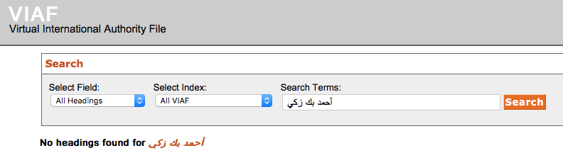
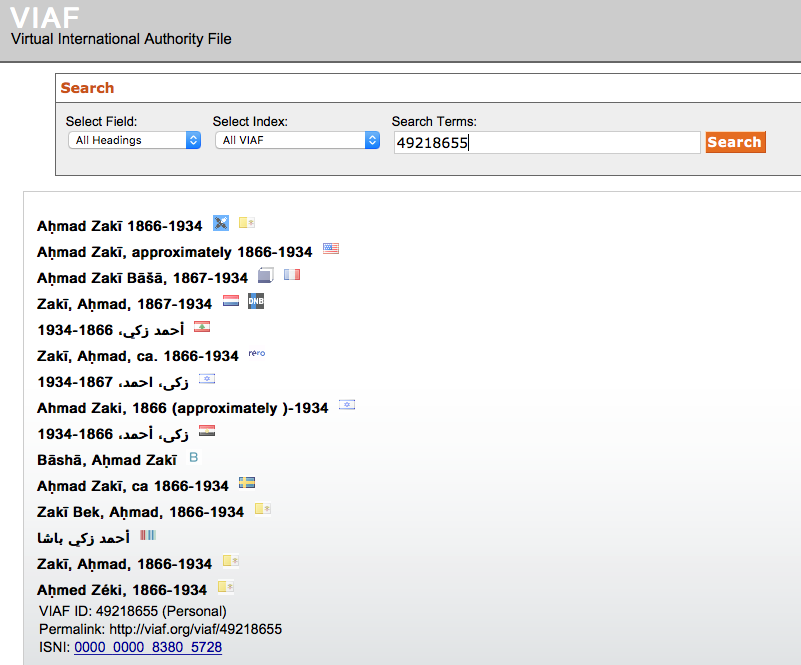

# 1. Introduction
## research questions

- What did they read in late-Ottoman Damascus?
- Who published in late-Ottoman Damascus?

## sources

- Muḥammad Kurd ʿAlī's monthly journal *al-Muqtabas*
- ʿAbd al-Qādir al-Iskandarānī's monthly journal *al-Ḥaqāʾiq*

## possible methodologies

1. manual compilation of works, authors, places
    - read and excerpt some 8000 pages
2. machine-guided analysis

# 2. Preliminary results
## publication places of reviewed / referenced works

## publication places of reviewed / referenced works

<iframe class="size-80" src="../assets/maps/map_muqtabas-reviews.html"></iframe>

<!-- # Who published in late-Ottoman Damascus? -->
## locations in bylines

## locations in bylines

<iframe class="size-80" src="../assets/maps/map_muqtabas-bylines.html"></iframe>

## authors in bylines

<iframe class="size-80" src="../assets/muqtabas_word-cloud.html"></iframe>

# 3. How to get there?
## 3. Workflow

1. Digital edition
2. Clean your data
3. Analyse yuor data

## 3.1 Workflow: digital edition

1. Get a digital text
2. Model the digital text in TEI: -> XML files
3. Mark-up and disambiguation of entities (persons, places, works, dates)

## 3.1 Problems: digital edition

1. conceptual (quasi) standards such as the TEI
    - <!-- available mark-up schemes despite being language agnostic are -->  rooted in the Western episteme
2. technical standards and tools such XML, XPath etc.
    - formally language/script agnostic but rooted in the Western episteme
    - based on Latin scripts

<!-- examples for both cases from other talks -->

## 3.2 Workflow: cleaning the data

- normalization: 
    + unify spelling
    - machine-actionable Gregorian dates
- disambiguation
- Geocode toponyms

## 3.2 Problems: normalization

1. Normalization
    - XPath officially supports *hijrī* dates, but the specification was never implemented
    - all calendars must be normalized with custom code!
2. Disambiguation: Authority files and linke open data (LOD) such as VIAF, GND, GeoNames etc.
    - Western data models
    - many non-Western entities have no entries
    - entries might only be available in transcription
    - automatic matching generates false positives

## 3.2 Problems: normalize names

<!-- Consider  Aḥmad Bey Zakī / أحمد بك زكي

- ](../assets/disambiguation_names-tei.png)
- 
-  -->

Consider this:

- Ḥāfiẓ Ibrāhīm, Ḥāfiẓ Efendi Ibrāhīm, Ḥāfiẓ Ibrāhīm Bey, and Muḥammad Ḥāfiẓ Bey Ibrāhīm all refer to the same person 

](../assets/disambiguation_names-tei-viaf_32410755-1.png)

](../assets/disambiguation_names-tei-viaf_32410755-2.png)

## 3.2 Problems

- non-Western name components: Ḥāfiẓ Efendi Ibrāhīm contains an Ottoman title (*efendi*)
    

- such components must be removed to succesfully query most authority files
    + check against a list of stop words containing all titles
    + or explicit mark-up
    

------------

~~~{.xml}
<persName ref="viaf:32410755" xml:lang="ar">
    <forename xml:lang="ar">حافظ</forename> 
    <surname xml:lang="ar">إبراهيم</surname> 
</persName>

<persName ref="viaf:32410755" xml:lang="ar">
    <forename xml:lang="ar">حافظ</forename> 
    <roleName type="title" xml:lang="ar">أفندي</roleName>
    <surname xml:lang="ar">إبراهيم</surname> 
</persName>

<persName ref="viaf:32410755" xml:lang="ar">
    <forename xml:lang="ar">حافظ</forename> 
    <surname xml:lang="ar">إبراهيم</surname> 
    <roleName type="title">بك</roleName> 
</persName>

<persName ref="viaf:32410755" xml:lang="ar">
    <forename xml:lang="ar">حافظ</forename> 
    <roleName type="title">بك</roleName> 
    <surname xml:lang="ar">إبراهيم</surname> 
</persName>

<persName ref="viaf:32410755" xml:lang="ar">
    <forename xml:lang="ar">محمد</forename>
    <forename xml:lang="ar">حافظ</forename> 
    <roleName type="title">بك</roleName> 
    <surname xml:lang="ar">إبراهيم</surname> 
</persName>
~~

## Workflow 3: analysis

1. Extract bibliographic metadata on the basis of the TEI model as MODS: -> XML files
4. Analyse bibliographic data for patterns
5. Visualise / map patterns

