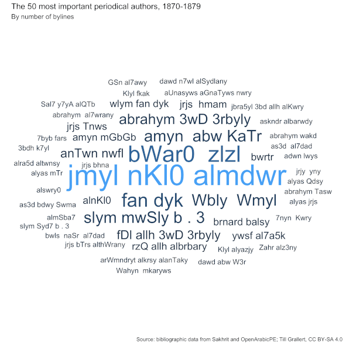

## OpenArabicPE: first attempts to track networks of authors and texts in Arabic periodicals from the late Ottoman Empire

Till Grallert, Orient-Institut Beirut (OIB)

OIB Board Meeting 2019

Slides: [https://OpenArabicPE.github.io/slides/2019-oib-board-meeting/](https://OpenArabicPE.github.io/slides/2019-oib-board-meeting/index.html)

## Outline of today's paper

1. Introduction: the promised wasteland of **digitised** Arabic periodicals
2. OpenArabicPE: making truly **digital** editions
3. First attempts to map the late Ottoman ideosphere of *Bilād al-Shām*

# 1. Introduction: the promised wasteland of *digitised* Arabic periodicals
## 1.1 Importance of mundane texts / periodicals

<!-- add core questions of today's presentation  -->

- They are at the **core** of various discourses
    + Modernity / -ism at the end of empire
    + Arabic renaissance
    + Arab nationalism
    + Islamic reform movement
- They form **large corpora** with an equal distribution along a temporal axis (*al-Muqtabas*: 12 yrs, *al-Manār*: 43 yrs, *al-Muqtaṭaf*: 76 yrs)
    + linguistic analysis
    + historical semantics
    + rich data sets for social history

## 1.2 A two-fold problem

- Preservation:
    + Active **destruction** of cultural artefacts: iconoclasm, neoliberalism
    + **Decay** through neglect: fragile materiality
- Access:
    + Absence / destruction of infrastructure / channels of knowledge transmission: lack of access to institutions, hardware, software, internet connections
    + widely-dispersed collections
    + technologies: absence of reliable OCR
    <!-- + technical skills: lack of basic scripting skills -->

## 1.3 Digitisation as solution

1. Promise: instant **access** to 100s of **digitised** periodicals and 100.000s of issues
2. Expectations: answers to core questions
    - extent of text re-use
    - identify authors
    - track authors across periodicals
2. Reality
    - limited access
    - limited data
    - limited metadata

## 1.3 Digitisation as problem(s)
<!-- elaborate the problems:-->

1. get the data: **labour and resource intensive**
    - text: transcription
    - facsimiles: scanning
    - bibliographic metadata: transcription, validated iterative generation
2. transform the data into a human and machine readable edition: **labour and resource intensive**
    - model the source
    - identify entities and link them to authority files
3. host, share and preserve the data: **labour and resource intensive**

<!-- the following slides are too detailed for many purposes -->

## 1.4.1 state of digitisation: text

- "crowd"-sourced transcriptions / gray online libraries, e.g. [*al-Maktaba al-Shāmila*](http://shamela.ws/index.php/book/26523), [*Mishkāt*](http://almeshkat.net/), [*Ṣayd al-Fawāʾid*](http://saaid.net/), [*al-Waraq*](http://www.alwaraq.net/) etc.
    + lack of / faulty metadata
    + unknown editing principles
    + unknown quality
    + very limited structural mark-up
    + cannot be reliably cited
- OCR layer at HathiTrust

## 1.4.1 state of digitisation: text

<!-- ](../assets/shamela_muqtabas-1.png) -->

](../assets/shamela_muqtabas-annotated.png)

## 1.4.1 state of digitisation: text

](../assets/hathi_muqtabas-ocr-2.png)

## 1.4.2 state of digitisation: facsimiles

Digital imagery, e.g. [Endangered Archives Programme (EAP)](http://eap.bl.uk/project/EAP119), [HathiTrust](http://catalog.hathitrust.org/Record/100658549), [*arshīf al-majallāt al-adabiyya wa-l-thaqafiyya al-ʿarabiyya* (sakhrit)](http://archive.alsharekh.org/newmagazineYears/125)

+ lack of metadata
+ limited licences, paywalls
+ no or very bad text layers

## 1.4.2 state of digitisation: facsimiles

](../assets/eap119-1-4-5-muqtabas-iiif.png)

## 1.4.2 state of digitisation: facsimiles

](../assets/hathi_muqtabas-1.png)

## 1.4.2 state of digitisation: facsimiles

](../assets/hathi_muqtabas-2.png)

## 1.4.2 state of digitisation: "fakesimiles"

<!-- original facsimile: [EAP](http://images.eap.bl.uk/EAP119/EAP119_1_4_4/463.jp2/full/800,/0/gray.jpg) -->

*al-Muqtabas* 5(7), pp.[463](https://openarabicpe.github.io/journal_al-muqtabas/tei/oclc_4770057679-i_54.TEIP5.xml#pb_61.d1e2036)--[466](https://openarabicpe.github.io/journal_al-muqtabas/tei/oclc_4770057679-i_54.TEIP5.xml#pb_64.d1e2045)

<div class="c_width-30">


</div><div class="c_width-30">

<!-- shamela's transcription -->


</div><div class="c_width-30">

<!-- sakhrit's fake facsimile -->


</div>

## 1.4.3 state of digitisation: bibliographic metadata

- needs:
    + reliable bibliographic metadata on the article level
    + across periodicals
- reality:
    + no platform serving machine-actionable bibliographic metadata below the item level

## 1.4.3 state of digitisation: bibliographic metadata

](../assets/eap119-1-4-5-muqtabas-iiif-metadata.png)


# 2. [OpenArabicPE](https://github.com/openarabicpe): making truly *digital* editions
## 2.1 Aims and principles

1. ideas:
    - unite **available** facsimiles and transcriptions in a standard-compliant format
    - harvest, generate, validate and share open metadata
2. aims
    + **validate** the transcription against the facsimiles
    - **improve** the transcription with the help of the "crowd"
    - make everything **citable** for scholars, **linkable** for machines
    - share all data, metadata and tools with the broadest possible licences to facilitate access and re-use
3. principles
    - re-purpose **available** and **established** tools, technologies, and material
    - preference for **open** and **simple** formats and tools

## 2.2 Deliverables: basic components

1. XML/TEI editions with their own [schema for Arabic periodicals](https://github.com/OpenArabicPE/OpenArabicPE_ODD)
    + text links to open-access digital facsimiles
2. Structured bibliographic metadata (MODS, BibTeX)
    + based on XML editions
    + scraped from the web and validated
    + generated through iteration
3. Scripts to
    + scrape full text / bibliographic information from the web
    + convert scraped information into TEI, MODS, BibTeX
    + generate bibliographic through iteration
    + improve the TEI mark-up

## 2.2 Deliverables: Core features

1. Open licences: [CC BY-SA 4.0](http://creativecommons.org/licenses/by-sa/4.0/) (TEI, MODS, BibTeX), MIT license (XSLT, XQuery)
1. Social digital editions hosted on [GitHub](https://github.com): gradually improve transcription and mark-up
2. Releases are archived at [Zenodo](https://zenodo.org): receive a DOI for reliable citation
3. [Static web-view](https://github.com/tillgrallert/tei-boilerplate-arabic-editions)<!--  (doesn't require a permanent internet connection) -->: provides side-by-side view of facsimiles and text
4. Access to bibliographic metadata through a public [Zotero group](https://www.zotero.org/groups/openarabicpe)

<!-- mention: process of cleaning data and disambiguation of entities -->

<!-- ](../assets/boilerplate_muqtabas.png) -->

## 2.3 Summary


# 3. First attempts to map the late Ottoman ideosphere of *Bilād al-Shām*
## 3. research questions

- What are the most important authors?
- What is the reach of journals?
- What are the most important periodicals?
- What did people read?

# 3.1 networks of authors
## 3.1 networks of authors

- methodology:
    + count number of journals, articles, tokens (words) per author
    + count number of articles per writing location
- required data: **bibliographic data** on the article level <!-- including name of author and location of writing-->

## 3.1.1 available data: editions

*al-Ḥasnāʾ* (Beirut), *al-Ḥaqāʾiq* (Damascus), *Lughat al-ʿArab* (Baghdad), *al-Muqtabas* (Cairo, Damascus)

<div class="c_width-50">

### *al-Muqtabas*, 1906--1917/18

|         token          |   total   |  author |     NA    |
|------------------------|-----------|---------|-----------|
| volumes                | 9         |         |           |
| issues                 | 96        |         |           |
| pages                  | c.7,000   |         |           |
| articles (total)       | 2,737     | 323     | 2,414     |
| articles (independent) | 717       | 284     | 433       |
| words                  | 1,953,952 | 625,333 | 1,328,619 |

</div>
<div class="c_width-50">

### *al-Ḥaqāʾiq*, 1910--1913/14

|  token   |  total  | author |    NA   |
|----------|---------|--------|---------|
| volumes  | 3       |        |         |
| issues   | 36      |        |         |
| pages    | 1,446   |        |         |
| articles | 360     | 76     | 284     |
| words    | 300,186 | 40,868 | 259,318 |

</div>

## 3.1.2 quality of data: editions

- data source: bylines and comments in the text
    + many accronyms
    + plurality of name forms
    + **not available** for many articles
- mostly manual mark-up: personal names and toponyms
- mostly manual disambiguation: links to authority files (*semantic web*)
- automatic enriching: from semantic web
    + life dates
    + works
    + geocoded locations

# 3.1.3 authorship statistics
## 3.1.3 authorship statistics: all editions

<!-- Data: four journals, 2019-04-09 -->

| rank |                     viaf                     |          author         | birth | death | articles | journals |
|------|----------------------------------------------|-------------------------|-------|-------|----------|----------|
|    1 |                                              |                         |       |       |     6955 |        4 |
|    2 | [14924300](https://viaf.org/viaf/14924300)   | **معروف الرصافي**       |  1875 |  1945 |       43 |        4 |
|    3 |                                              | كاظم  الدجيلي           |  1884 |  1970 |       27 |        2 |
|    4 | [40250618](https://viaf.org/viaf/40250618)   | **عيسى اسكندر المعلوف** |  1869 |  1956 |       22 |        2 |
|    5 |                                              | إبراهيم حلمي العمر      |  1890 |  1942 |       21 |        2 |
|    6 | [299037057](https://viaf.org/viaf/299037057) | عبد الله مخلص           |  1878 |  1947 |       15 |        2 |
|    7 | [22006374](https://viaf.org/viaf/22006374)   | محمد رضا الشبيبي        |  1889 |  1965 |       11 |        2 |
|    8 |                                              | محمد الهاشمي            |       |       |        6 |        2 |
|    9 | [236524859](https://viaf.org/viaf/236524859) | مصطفى صادق الرافعي      |  1880 |  1937 |        6 |        2 |
|   10 |                                              | أبو الضيا               |       |       |        4 |        2 |
|   11 | [60500457](https://viaf.org/viaf/60500457)   | أحمد محرم               |  1877 |  1945 |        4 |        2 |
|   12 |                                              | محمد باقر الشبيبي       |       |       |        4 |        2 |
|   13 | [63117968](https://viaf.org/viaf/63117968)   | محمد راغب طباخ          |  1877 |  1951 |        4 |        2 |
|   14 |                                              | ا. ج                    |       |       |        3 |        2 |
|   15 | [36771043](https://viaf.org/viaf/36771043)   | ولي الدين  يكن          |  1873 |  1921 |        2 |        2 |

## 3.1.3 authorship statistics: all editions


## 3.1.3 authorship statistics: rolling periods



## 3.1.3 authorship statistics: *al-Muqtabas*

<!-- data set: 2019-04-09 -->

| rank |                     viaf                     |          author         | birth | death | articles |
|------|----------------------------------------------|-------------------------|-------|-------|----------|
|    1 |                                              |                         |       |       |     2630 |
|    2 | [14924300](https://viaf.org/viaf/14924300)   | **معروف الرصافي**       |  1875 |  1945 |       27 |
|    3 | [40250618](https://viaf.org/viaf/40250618)   | **عيسى اسكندر المعلوف** |  1869 |  1956 |       20 |
|    4 | [39370998](https://viaf.org/viaf/39370998)   | ساتسنا                  |  1866 |  1947 |       14 |
|    5 |                                              | يوسف جرجس زخم           |  1880 |       |       13 |
|    6 | [32272677](https://viaf.org/viaf/32272677)   | محمد كرد علي            |  1876 |  1953 |       12 |
|    7 | [19737865](https://viaf.org/viaf/19737865)   | أحمد تيمور              |  1871 |  1930 |        9 |
|    7 |                                              | إبراهيم حلمي العمر      |  1890 |  1942 |        9 |
|    8 | [93607460](https://viaf.org/viaf/93607460)   | جمال الدين القاسمي      |  1866 |  1914 |        8 |
|    9 | [49218655](https://viaf.org/viaf/49218655)   | أحمد زكي                |  1866 |  1934 |        7 |
|    9 | [32410755](https://viaf.org/viaf/32410755)   | حافظ إبراهيم            |  1871 |  1932 |        7 |
|    9 | [28125663](https://viaf.org/viaf/28125663)   | رفيق العظم              |  1865 |  1925 |        7 |
|    9 | [118432135](https://viaf.org/viaf/118432135) | عبد القادر المغربي      |  1867 |  1956 |        7 |
|    9 | [22006374](https://viaf.org/viaf/22006374)   | محمد رضا الشبيبي        |  1889 |  1965 |        7 |


<!-- ## 3.1.3 authorship statistics: *al-Muqtabas*

 -->

## 3.1.3 authorship statistics: *al-Ḥaqāʾiq*

<!-- data set: 2019-04-09 -->

| rank |                     viaf                     |        author        |  birth  |  death  | articles |
|------|----------------------------------------------|----------------------|---------|---------|----------|
|    1 |                                              |                      |         |         | 286      |
|    2 |                                              | عبد الرحمن القصار    | 1863    | c.1931  | 8        |
|    3 |                                              | إبراهيم خليل مردم بك |         |         | 7        |
|    4 | [299025643](https://viaf.org/viaf/299025643) | محمد عارف المنير     | 1847/48 | 1923/24 | 5        |
|    4 | [53094077](https://viaf.org/viaf/53094077)   | محمد فريد وجدي       | 1875    | 1954    | 5        |
|    4 | [58892856](https://viaf.org/viaf/58892856)   | صالح الشريف          | 1869    | 1920    | 4        |
|    4 |                                              | ع                    |         |         | 4        |
|    4 | [51567828](https://viaf.org/viaf/51567828)   | محمد  القاسمي الحلاق | 1843    | 1900    | 4        |
|    4 |                                              | محمد سليم الحنفي     |         |         | 4        |
|    4 | [267054449](https://viaf.org/viaf/267054449) | مختار المؤيد         | 1822    | 1921    | 4        |
|    5 |                                              | أبو الضيا            |         |         | 3        |
|    5 |                                              | أحمد الجوبري         |         |         | 3        |
|    5 |                                              | احمد الباشا          |         |         | 3        |
|    5 |                                              | صلاح الدين الزعيم    |         |         | 3        |
|    6 | ...                                          | ...                  | ...     | ...     | ...      |
|    7 | [14924300](https://viaf.org/viaf/14924300)   | **معروف الرصافي**    | 1875    | 1945    | 1        |

<!-- ## 3.1.3 authorship statistics: *al-Ḥaqāʾiq*

 -->

## 3.1.3 authorship statistics: *al-Ḥasnāʾ*

<!-- data set: 2019-04-09 -->

| rank |                     viaf                     |          author         | birth | death | articles |
|------|----------------------------------------------|-------------------------|-------|-------|----------|
|    1 |                                              |                         |       |       |      106 |
|    2 | [219321857](https://viaf.org/viaf/219321857) | ماري عجمي               |  1888 |  1965 |        5 |
|    3 |                                              | سلوى سلامه              |       |       |        4 |
|    3 |                                              | مريم زكا                |       |       |        4 |
|    4 |                                              | الياس عطا الله          |       |       |        2 |
|    4 |                                              | جرجس توما               |       |       |        2 |
|    4 |                                              | جوليا طعمه              |       |       |        2 |
|    4 |                                              | شحاده شحاده             |       |       |        2 |
|    4 | [40250618](https://viaf.org/viaf/40250618)   | **عيسى اسكندر المعلوف** |  1869 |  1956 |        2 |
|    4 | [14924300](https://viaf.org/viaf/14924300)   | **معروف الرصافي**       |  1875 |  1945 |        2 |
|    4 | [233275351](https://viaf.org/viaf/233275351) | وردة اليازجي            |  1838 |  1924 |        2 |


## 3.1.4 social network: worlds apart


# 3.2 geographic networks
## 3.2.1 Locations by number of bylines: *al-Muqtabas*


<!--  -->

## 3.2.2 Locations by number of bylines: *al-Ḥaqāʾiq*

<!--  -->


## 3.2.3 Locations by number of bylines: *al-Ḥasnāʾ*

<!--  -->


## 3.2.4 Locations by number of bylines: *Lughat al-ʿArab*

<!--  -->


# 3.3 find unknown authors: stylometry
## 3.3.1 stylometry

- aim: authorship attribution through comparison
- how:
    + **computation** of frequency tables for each article
    + **comparison** of each frequency table with every other
    + **ranking** of pairs of texts according to similarity of frequency tables
- limits: cannot establish author names beyond the corpus

## 3.2.2 *al-Muqtabas*: 1000 MFWs, *Jamāl al-Dīn al-Qāsimī*

|                    source                   |                    target                   | weight |
|---------------------------------------------|---------------------------------------------|--------|
| القاسمي-oclc_4770057679-i_61-div_2.d1e1517  | القاسمي-oclc_4770057679-i_62-div_2.d1e1491  |     54 |
| القاسمي-oclc_4770057679-i_62-div_2.d1e1491  | القاسمي-oclc_4770057679-i_61-div_2.d1e1517  |     54 |
| القاسمي-oclc_4770057679-i_61-div_2.d1e1517  | القاسمي-oclc_4770057679-i_63-div_7.d1e1810  |     52 |
| القاسمي-oclc_4770057679-i_63-div_7.d1e1810  | القاسمي-oclc_4770057679-i_61-div_2.d1e1517  |     52 |
| القاسمي-oclc_4770057679-i_49-div_2.d1e1499  | NN-oclc_4770057679-i_48-div_4.d1e1914       |     45 |
| القاسمي-oclc_4770057679-i_62-div_2.d1e1491  | القاسمي-oclc_4770057679-i_63-div_7.d1e1810  |     44 |
| القاسمي-oclc_4770057679-i_63-div_7.d1e1810  | القاسمي-oclc_4770057679-i_62-div_2.d1e1491  |     44 |
| القاسمي-oclc_4770057679-i_52-div_10.d1e2681 | القاسمي-oclc_4770057679-i_53-div_3.d1e3775  |     42 |
| القاسمي-oclc_4770057679-i_53-div_3.d1e3775  | القاسمي-oclc_4770057679-i_52-div_10.d1e2681 |     42 |
| القاسمي-oclc_4770057679-i_50-div_4.d1e2033  | القاسمي-oclc_4770057679-i_63-div_7.d1e1810  |     38 |
| القاسمي-oclc_4770057679-i_63-div_7.d1e1810  | القاسمي-oclc_4770057679-i_50-div_4.d1e2033  |     38 |
| القاسمي-oclc_4770057679-i_49-div_2.d1e1499  | NN-oclc_4770057679-i_47-div_2.d1e1470       |     31 |
| القاسمي-oclc_4770057679-i_55-div_23.d1e4814 | NN-oclc_4770057679-i_2-div_21.d1e2160       |     24 |
| القاسمي-oclc_4770057679-i_49-div_2.d1e1499  | NN-oclc_4770057679-i_87-div_3.d1e696        |     24 |
| القاسمي-oclc_4770057679-i_50-div_4.d1e2033  | NN-oclc_4770057679-i_64-div_2.d1e1188       |     24 |
| القاسمي-oclc_4770057679-i_63-div_7.d1e1810  | NN-oclc_4770057679-i_15-div_3.d1e696        |     18 |
| القاسمي-oclc_4770057679-i_49-div_2.d1e1499  | NN-oclc_4770057679-i_19-div_9.d1e2206       |     17 |
| القاسمي-oclc_4770057679-i_55-div_23.d1e4814 | NN-oclc_4770057679-i_3-div_18.d1e1764       |     16 |
| القاسمي-oclc_4770057679-i_61-div_2.d1e1517  | NN-oclc_4770057679-i_33-div_3.d1e696        |     16 |
| القاسمي-oclc_4770057679-i_39-div_7.d1e2166  | عنحوري-oclc_4770057679-i_54-div_2.d1e1300   |     15 |

## 3.3.3 *al-Muqtabas*: 1000 MFWs, *Maʿrūf al-Ruṣāfī*

|                    source                   |                 target                 | weight |
|---------------------------------------------|----------------------------------------|--------|
| الرصافي-oclc_4770057679-i_10-div_9.d1e1418  | NN-oclc_4770057679-i_94-div_11.d1e5944 |     27 |
| الرصافي-oclc_4770057679-i_24-div_9.d1e1716  | NN-oclc_4770057679-i_2-div_21.d1e2160  |     27 |
| الرصافي-oclc_4770057679-i_36-div_5.d2e3004  | NN-oclc_4770057679-i_2-div_21.d1e2160  |     27 |
| الرصافي-oclc_4770057679-i_20-div_6.d1e1588  | NN-oclc_4770057679-i_2-div_21.d1e2160  |     26 |
| الرصافي-oclc_4770057679-i_19-div_6.d1e1081  | NN-oclc_4770057679-i_2-div_21.d1e2160  |     25 |
| الرصافي-oclc_4770057679-i_28-div_25.d1e3388 | NN-oclc_4770057679-i_2-div_21.d1e2160  |     25 |
| الرصافي-oclc_4770057679-i_37-div_7.d1e1907  | NN-oclc_4770057679-i_2-div_21.d1e2160  |     25 |
| الرصافي-oclc_4770057679-i_40-div_14.d1e2780 | NN-oclc_4770057679-i_94-div_11.d1e5944 |     25 |
| الرصافي-oclc_4770057679-i_13-div_9.d1e1285  | NN-oclc_4770057679-i_2-div_21.d1e2160  |     24 |
| الرصافي-oclc_4770057679-i_14-div_7.d1e1428  | NN-oclc_4770057679-i_2-div_21.d1e2160  |     24 |
| الرصافي-oclc_4770057679-i_22-div_9.d1e1772  | NN-oclc_4770057679-i_2-div_21.d1e2160  |     24 |
| الرصافي-oclc_4770057679-i_31-div_10.d1e2096 | NN-oclc_4770057679-i_2-div_21.d1e2160  |     24 |
| الرصافي-oclc_4770057679-i_39-div_5.d1e1387  | NN-oclc_4770057679-i_2-div_21.d1e2160  |     24 |
| الرصافي-oclc_4770057679-i_41-div_7.d1e3728  | NN-oclc_4770057679-i_2-div_21.d1e2160  |     24 |
| الرصافي-oclc_4770057679-i_25-div_11.d1e2206 | NN-oclc_4770057679-i_2-div_21.d1e2160  |     23 |
| الرصافي-oclc_4770057679-i_29-div_6.d1e1333  | NN-oclc_4770057679-i_2-div_21.d1e2160  |     23 |
| الرصافي-oclc_4770057679-i_40-div_4.d1e832   | NN-oclc_4770057679-i_2-div_21.d1e2160  |     21 |
| الرصافي-oclc_4770057679-i_33-div_5.d1e1329  | NN-oclc_4770057679-i_2-div_21.d1e2160  |     20 |
| الرصافي-oclc_4770057679-i_35-div_3.d1e696   | NN-oclc_4770057679-i_2-div_21.d1e2160  |     20 |
| الرصافي-oclc_4770057679-i_68-div_9.d1e4370  | NN-oclc_4770057679-i_2-div_21.d1e2160  |     20 |

## 3.3.3 *al-Muqtabas*: 1000 MFWs, *ʿĪsā Iskandar al-Maʿlūf*

|                    source                   |                 target                 | weight |
|---------------------------------------------|----------------------------------------|--------|
| المعلوف-oclc_4770057679-i_53-div_2.d1e1568  | NN-oclc_4770057679-i_64-div_3.d1e2089  |     47 |
| المعلوف-oclc_4770057679-i_53-div_2.d1e1568  | NN-oclc_4770057679-i_35-div_6.d1e2205  |     32 |
| المعلوف-oclc_4770057679-i_37-div_10.d1e3397 | NN-oclc_4770057679-i_2-div_21.d1e2160  |     27 |
| المعلوف-oclc_4770057679-i_42-div_9.d1e1281  | NN-oclc_4770057679-i_23-div_25.d1e2996 |     26 |
| المعلوف-oclc_4770057679-i_53-div_2.d1e1568  | NN-oclc_4770057679-i_56-div_2.d1e1398  |     26 |
| المعلوف-oclc_4770057679-i_55-div_10.d1e2970 | NN-oclc_4770057679-i_2-div_21.d1e2160  |     26 |
| المعلوف-oclc_4770057679-i_93-div_8.d1e1268  | NN-oclc_4770057679-i_2-div_21.d1e2160  |     26 |
| المعلوف-oclc_4770057679-i_54-div_5.d1e1854  | NN-oclc_4770057679-i_2-div_21.d1e2160  |     25 |
| المعلوف-oclc_4770057679-i_94-div_11.d1e6080 | NN-oclc_4770057679-i_2-div_21.d1e2160  |     25 |
| المعلوف-oclc_4770057679-i_95-div_51.d1e3324 | NN-oclc_4770057679-i_2-div_21.d1e2160  |     25 |
| المعلوف-oclc_4770057679-i_44-div_6.d1e1798  | NN-oclc_4770057679-i_2-div_21.d1e2160  |     24 |
| المعلوف-oclc_4770057679-i_45-div_8.d1e2304  | NN-oclc_4770057679-i_2-div_21.d1e2160  |     24 |
| المعلوف-oclc_4770057679-i_47-div_6.d1e2816  | NN-oclc_4770057679-i_2-div_21.d1e2160  |     24 |
| المعلوف-oclc_4770057679-i_55-div_22.d1e4313 | NN-oclc_4770057679-i_2-div_21.d1e2160  |     24 |
| المعلوف-oclc_4770057679-i_93-div_7.d1e1147  | NN-oclc_4770057679-i_2-div_21.d1e2160  |     24 |
| المعلوف-oclc_4770057679-i_53-div_33.d1e6920 | NN-oclc_4770057679-i_2-div_21.d1e2160  |     23 |
| المعلوف-oclc_4770057679-i_63-div_30.d1e2971 | NN-oclc_4770057679-i_2-div_21.d1e2160  |     21 |

# 3.4 networks of texts
## 3.4 networks of texts

- methodology:
    + count number of articles and journals that reference a specific text (periodical, book)
- required data:
    + digital editions with mark-up of referenced texts

    ```xml
<div type="article" xml:id="div_40.d1e4386" xml:lang="ar">
    <head xml:id="head_39.d1e4388" xml:lang="ar">أبحاث باحث</head>
        <p xml:id="p_197.d1e4391" xml:lang="ar">نشر <persName xml:id="persName_21.d1e4393"
        xml:lang="fr-Arab-AR" ref="oape:pers:236 viaf:44512503" change="#d2e647"><addName type="honorific">
        المسيو</addName> <forename xml:lang="fr-Arab-AR">لوسين</forename> <surname xml:lang="fr-Arab-AR">
        بوفا</surname> </persName> من المتضلعين من العلوم المشرقية والعارفين بالعربية والفارسية والتركية
         كراسة أشار فيها إلى أبحاثه ومقالاته في المجلات الإفرنجية مثل <title level="j">مجلة العالم
        الإسلامي</title> و<title level="j">المجلة الآسياوية</title> ومجلة <title level="j">السجلات ا
        لمراكشية</title> و<title level="j">المجلة الإسبانية</title> ومعظم هذه الأبحاث مما اشتهر بين أهل
        الأدب والعلم وقدره الباحثون حق قدره فنثني على نشاط صديقنا المشار إليه.</p>
</div>
    ```

## 3.4.1 statistics of referenced periodicals: all editions

<!-- data: three journals, 2019-04-09 -->

| rank |  periodical  |     location     | articles | issues | journals |
|------|--------------|------------------|----------|--------|----------|
|    1 | المقتبس      | Damascus / Cairo |       89 |     62 |        3 |
|    2 | الهلال       | Cairo            |       31 |     28 |        3 |
|    3 | المقتطف      | Cairo            |       26 |     21 |        3 |
|    4 | المنار       | Cairo            |       19 |     17 |        3 |
|    5 | الضياء       | Cairo            |       11 |     11 |        3 |
|    6 | المفيد       | Beirut           |       12 |      9 |        3 |
|    7 | الوطن        | Beirut           |        4 |      4 |        3 |
|    8 | لغة العرب    | Baghdad          |      446 |     89 |        2 |
|    9 | المشرق       | Beirut           |       32 |     30 |        2 |
|   10 | الحقائق      | Damascus         |       43 |     22 |        2 |
|   11 | مجلة المجلات | Paris            |       20 |     17 |        2 |
|   12 | العالم*      |                  |       17 |     17 |        2 |
|   13 | العلم*       |                  |       16 |     15 |        2 |
|   14 | العرفان      | Saida            |       15 |     13 |        2 |
|   15 | الحياة       |                  |       10 |     10 |        2 |
|   16 | الزهور       | Baghdad          |       10 |     10 |        2 |

`*` likely encoding error

## 3.4.1 statistics of referenced periodicals: all editions


## 3.4 *al-Muqtabas*: origin of reviewed works


# Conclusion
## Summary

- **digitised** periodicals are not **digital** periodicals
- machine-guided analysis depends on the **quality of (meta) data**
<!-- - the better and more homogeneously structured the data, the more applications of machine-guided analysis -->
- digital data and editions require a lot of **manual work**
- tools and formats are grounded in the **Western episteme**

## Thank you!

- Contributors to OpenArabicPE: Dimitar Dragnev, Talha Güzel, Hans Magne Jaatun, Jakob Koppermann, Xaver Kretzschmar, Daniel Lloyd, Klara Mayer, Tobias Sick, Manzi Tanna-Händel and Layla Youssef
- Links:
    + Slides: [https://OpenArabicPE.github.io/slides/2019-oib-board-meeting/](https://OpenArabicPE.github.io/slides/2019-oib-board-meeting/index.html)
    + Paper (draft): <https://doi.org/10.5281/zenodo.1413610>
    + Project URLs: [https://www.github.com/OpenArabicPE](https://www.github.com/OpenArabicPE), [https://www.github.com/tillgrallert/digital-muqtabas](https://www.github.com/tillgrallert/digital-muqtabas), [https://www.github.com/OpenArabicPE/digital-haqaiq](https://www.github.com/OpenArabicPE/digital-haqaiq)
    + Project blog: [https://openarabicpe.github.io](https://openarabicpe.github.io)
    + Twitter: @[tillgrallert](https://twitter.com/tillgrallert)
    + Email: <grallert@orient-institut.org>
- Licence: slides and plots are licenced as [CC BY-SA 4.0](http://creativecommons.org/licenses/by-sa/4.0/)