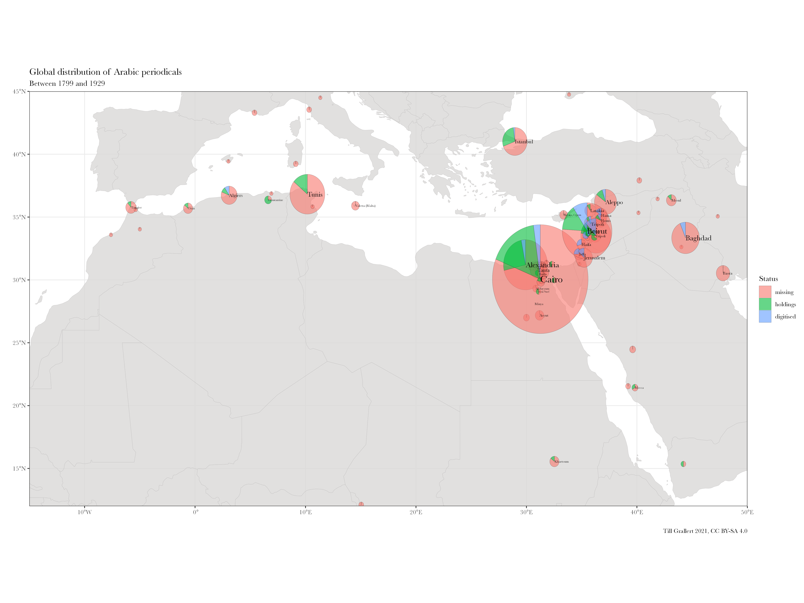

## Who is *ʿAlī Pasha*? <br /> Modelling personal names from the late Ottoman Eastern Mediterranean (c.1850--1920)

Till Grallert,  @[tillgrallert](https://twitter.com/tillgrallert)

Workshop "`<Author><Title><Place>`", Berlin, 27--29 October 2021

Slides: [https://OpenArabicPE.github.io/slides/2021-stabi/](https://OpenArabicPE.github.io/slides/2018-turkologentag/index.html)


<!-- ## Background
### Building infrastructures we need without the help we can't get

:::{.c_width-50}

[Project Jarāʾid](https://projectjaraid.github.io/): crowd-sourced union list of all Arabic periodicals before 1930 (with Adam Mestyan)

{#fig:jaraid-holdings}

:::
:::{.c_width-50}

[Open Arabic Periodical Editions](https://openarabicpe.github.io): a framework for bootstrapped digital scholarly editions of Arabic periodicals

](../assets/boilerplate_muqtabas.png){#fig:webview-muqtabas}

::: -->

# Background: <br/> Contributing to the *digital commons* and building the infrastructures we need without the help we can't get

## [Project Jarāʾid](https://projectjaraid.github.io/) (2012--) <br/>Closing the knowledge `<gap/>`

:::{.c_width-50}

- Collaboration with Adam Mestyan (Duke)
- Crowd-sourced union list of all Arabic periodicals before 1930
    + website and open data sets ([TEI XML](https://tei-c.org/))
    + authority files for c.2700 persons, 220 places, 180 libraries etc.

:::
:::{.c_width-50}

{#fig:map-jaraid}

:::

## Open Arabic Periodical Editions ([OpenArabicPE](https://openarabicpe.github.io), 2015--) <br/>Closing the infrastructural `<gap/>`

Framework for bootstrapped digital scholarly editions outside the global north

Digital editions based on shadow libraries and digital facsimiles (TEI XML), authority files (TEI XML), Bibliographic metadata on the article level (TEI, MODS, RDF, Zotero)


:::{.c_width-60}

| title                                                                               | volumes    | issues    | articles          | words                        |
| ----------------------------------------------------------------------------------- | ---------: | --------: | ----------:       | ---------:                   |
| [al-Ḥaqāʾiq](https://www.github.com/openarabicpe/digital-haqaiq)                    | 3          | 35        | 389               | 298090                       |
| [al-Ḥasnāʾ](https://www.github.com/openarabicpe/journal_al-hasna)                   | 1          | 12        | 201               | NA                           |
| [al-Manār](https://www.github.com/openarabicpe/journal_al-manar)                    | 20         | 387       |                   |                              |
| [al-Muqtabas](https://www.github.com/tillgrallert/digital-muqtabas)                 | 9          | 96        | 2964              | 1981081                      |
| [al-Ustādh](https://www.github.com/openarabicpe/journal_al-ustadh)                  | 1          | 42        | 435               | 221447                       |
| [al-Zuhūr](https://www.github.com/openarabicpe/journal_al-zuhur)                    | 4          | 39        | 436               | 292333                       |
| [Lughat al-ʿArab](https://www.github.com/openarabicpe/journal_lughat-al-arab)       | 3          | 34        | 939               | 373832                       |
| **total**                                                                           | 41         | 645       | 5364<!-- 9664 --> | c. 6 million<!-- 9311376 --> |

Table: The OpenArabicPE corpus until 1918 {#tbl:openarabicpe-corpus}

:::
:::{.c_width-30}

](../assets/boilerplate_muqtabas.png){#fig:webview-muqtabas}

:::

## Background
### Computational periodical studies

:::{.c_width-50}

{#fig:network-periodicals}

:::
:::{.c_width-50}

{#fig:network-authors}

:::

## Aim: identification and disambiguation of named entities

:::{.c_width-50}

- problem 1: historical diversity
	+ multilingual and multiscriptoral societies
	+ multiple cultural practices
	+ use of a name is context dependent
	+ change over a person's life time

:::
:::{.c_width-50}

- problem 2: Western conceptual hegemony over all socio-technical infrastructures
	+ limited support for Arabic script
	+ various Latinizations
	+ hegemonial concepts of "entity names"

:::

## Example: *Nāṣīf Mishāqa*

American consular agent and chancellor-cum-dragoman of the British consulate in Damascus. Eldest son of the famous Mikhāʾīl Mishāqa.

<!-- - حضرة صاحب الدولة المشير عبد الله باشا
- جناب رفعتلو فريد افندي كركبي
- حضرة سعادتلو احمد برهان الدين بك افندي
- جناب عزتلو صبحي بك ابو النصر
- جزائري زاده الامير علي باشا ابن عبد القادر افندي الحسني -->

:::{.c_width-50}

### Periodicals

+ ناصيف افندي مشاقة
+ حضرة المفاضل ناصيف بك مشاقة

:::
:::{.c_width-50}

### Consular archives

<!-- - TNA (UK):  -->
+ Nassif Effendi Meshaka
+ M[onsieur]. Nasif Bey Mishaka
+ Michaka
<!-- - NACP (US) -->
+ Nasif Meshaka

:::

## Example: *Anastās Mārī al-Karmilī*

Famous Iraqi priest and philologist of Lebanese descent. Prolific user of pen names and pseudonyms. Disambiguation is solely provided by Arabic bibliobiographic dictionaries (Ziriklī etc.).

:::{.c_width-30}
### Periodicals

- <persName xml:lang="ar"><roleName type="pseudonym">ساتسنا</roleName></persName>
- <persName xml:lang="ar"><roleName type="pseudonym">صاحب مجلة لغة العرب</roleName></persName>

:::
:::{.c_width-30}
### Authority files


- <persName xml:lang="ar"><roleName type="rank">الأب</roleName> <forename>أنستاس</forename> <forename>ماري</forename> <surname><addName type="nisbah">الكرملي</addName></surname></persName>
- <persName xml:lang="ar"><forename>بطرس</forename> <addName type="nasab">بن <forename>جبرائيل</forename></addName> <forename>يوسف</forename> <surname>عواد</surname></persName>
- <persName xml:lang="fr">Père Anastase-Marie de Saint-Elie</persName>

:::
:::{.c_width-30}
### Scholarly literature

-  (Father) Anastās al-Karmalī
-  Anastase-Marie de Saint-Elie

:::


# Modelling Names in TEI
## What is the Text Encoding Initiative ([TEI](https://tei-c.org/)) ?

- a **community of practice** around a shared goal and shared interest: 
	+ digital textual editing
	+ interchangable formats, tools etc.
- a **hermeneutic tool** and encoding scheme/data model:
	- structural and semantic modelling of textual material based in the Western tradition
- a **technical implementation** and serialisation in a specific data format: 
	+ currently **XML** with the much hated pointy brackets.

## Pointy brackets are everywhere!

:::{.c_width-30}

### EPub (HTML)
```html
<div dir="rtl" id="book-container">
    <hr/>
    <a id='C232'></a>
    <span class="title">صحافة سورية ولبنان</span><br /><span class="red">3 - </span>المجلات<br />هذه مقالتي الثالثة عن صحافة سورية ولبنان. . . ولا يخفى أن للانقلاب العثماني الأخير فضلاً عظيماً على هذه المجلات التي أنا ذاكر. فمل يكن منها قبل إعلان الدستور إلا مجلة المشرق ومجلة المقتبس.<br />أما بقية المجلات فقد صدرت في العامين الأخيرين كما يظهر لك في هذا المقال.<br />وقد اجتهدت، في هذا القسم، أن أذكر تاريخ صدور لهذه المجلات متخيراً أوثق المصادر في ذلك فأقول:<br />
</div>
```
:::
:::{.c_width-30}

### OCR-output (Page XML)
```xml
<TextLine id="r1l5" custom="readingOrder {index:4;}">
    <Coords points="470,548 2191,527 1648,462 470,464"/>
    <Baseline points="480,542 565,540 650,537 735,534 820,533 905,531 990,530 1075,528 1160,528 1245,527 1330,527 1415,527 1500,527 1585,527 1670,528 1755,528 1840,530 1925,531 2010,531 2095,534 2180,536"/>
    <TextEquiv>
        <Unicode>من عسر سنوات مجلة بسائة في الاستارة اعتمد في تحريرها على أقلامهن فزيئها</Unicode>
    </TextEquiv>
</TextLine>
```
:::
:::{.c_width-30}

### Qalamos authority data (MyCoRe XML)
```xml
<def.variantName class="MCRMetaPersonName" heritable="false" notinherit="true">
	<variantName xml:lang="ar" type="gnd" inherited="0">
		<firstname>عبد الله العمري الطرابلسي</firstname>
		<callname>عبد الله العمري الطرابلسي</callname>
		<fullname>عبد الله العمري الطرابلسي</fullname>
	</variantName>
</def.variantName>
<def.identifier class="MCRMetaLangText" heritable="false" notinherit="true">
	<identifier xml:lang="de" type="gnd" inherited="0" form="plain">1221671286</identifier>
</def.identifier>
```
:::

## Why choosing TEI?

- converging goals and interests
- well-established standards (TEI, XML) with mature tools
- required by funding agencies
- community-driven
- open, sustainable formats: XML is plain text!
- I had some experiences working with TEI
- Without a database at the backend, X-Technologies are an extremely powerful tool


# Enter: the Western conceptual and infrastructural hegemony 
## Soualah and Hassoun's proposal for classical Arabic names

[@Soualah+2012] propose to use available elements `<surname>`, `<forename>`, and `<addName>` with a controlled vocabulary of `@type` and `@subtype` attributes.

- `<surname>`: to encode the *laqab* evoking a real or assigned quality
- `<forename>`: for the *ism*
- `<addName>` with `@type`
    + "nasab": patronym introduced by "ibn" or "ibnat"
    + "kunyah": teknonym or a mark of distinction applied to prominent figures to honor them. For example, "Abū Yūsuf" is often used for someone called Yaʿqūb
    + "khitab": an honorific name, which is usually ended by the suffix al-Dīn
    + "nisbah": an adjective formed by using the suffix ī in order to indicate the person origin, his birth place, or his residence. It represents the relationship name, which can be a genealogical, political or ideological affiliation of a person.

## My extended proposal for late Ottoman contexts

I suggest to add the following mark-up for late-Ottoman names

- `<roleName type="title">`: covering the wide range of Ottoman titles, e.g. Pasha, Bey, Efendi that do not necessarily denote a post in an administrative hierarchy
- `<roleName type="rank">`: denoting ranks with a formal, administrative hierarchy
- `<addName type="honorific">`: for the highly regularised honorific addresses and salutations, e.g. *rif'etli*, *saadetli*, *utufetli*, *lizetli*, *devletli*

## Example: ʿAlī Pasha

```xml
<persName xml:lang="ar">دولتلو جزائري زاده الامير علي باشا ابن عبد القادر افندي الحسني</persName>
```

Could be marked-up / modelled as:

```xml
<persName xml:lang="ar">
	<addName type="honorific" xml:lang="ota">دولتلو</addName>
    <addName type="nisbah">جزائري</addName>
    <addName type="honorific" xml:lang="ota">زاده</addName>
    <roleName type="title">الامير</roleName>
    <forename>علي</forename>
    <roleName type="title" xml:lang="ota">باشا</roleName>
    <addName type="nasab">ابن
        <forename><addName type="theophoric">عبد القادر</addName></forename>
        <roleName type="title" xml:lang="ota">افندي</addName>
    </addName>
    <surname type="laqab">الحسني</surname>
</persName>
```

# Automating the mark-up
## Automating the mark-up
### 1. check against authority list of Ottoman components

Allows to identify all titles, ranks, honorific addresses

:::{.c_width-50}
input:

```xml
<persName xml:lang="ar">دولتلو جزائري زاده الامير علي باشا ابن عبد القادر افندي الحسني</persName>
```

:::
:::{.c_width-50}
output:

```xml
<persName xml:lang="ar">
	<addName type="honorific" xml:lang="ota">دولتلو</addName>
	جزائري 
    <addName type="honorific" xml:lang="ota">زاده</addName>
    <roleName type="title">الامير</roleName>
    علي 
    <roleName type="title" xml:lang="ota">باشا</roleName>
    ابن عبد القادر
    <roleName type="title" xml:lang="ota">افندي</addName>
    الحسني
</persName>
```

:::

## Automating the mark-up
### 2. rule-based mark-up of Arabic components

1. *laqab* / surname: final **word** beginning with ال but not ending in ي
2. *nisba*: final **word** beginning with ال and ending in ي
3. *nasab*: **sequence** of words beginning with ابن, بن, بنت etc.
4. *kunya*:  **sequence** of words beginning with `اب(و|ي|ا)` etc.
5. *khiṭāb*: **sequence** of **two** words ending with الدين
6. theophoric: can be *ism* or *laqab*
	- **sequence** of **two** words beginning with عبد
	- **sequence** of **two** words ending with الله

## Automating the mark-up
### 2. rule-based mark-up of Arabic components

:::{.c_width-50}
input:

```xml
جزائري
علي
ابن عبد القادر
الحسني
```

:::
:::{.c_width-50}
output:

```xml
جزائري
علي
<addName type="nasab"><nameLink>ابن</nameLink> <addName type="theophoric">عبد القادر</addName>
<addName type="nisbah">الحسني</addName>
```

:::

## Automating the mark-up
### 3. combined results

:::{.c_width-50}
automated mark-up:

```xml
<persName xml:lang="ar">
	<addName type="honorific" cert="high" xml:lang="ota">دولتلو</addName>
	جزائري 
	<addName type="honorific" cert="high" xml:lang="ota">زاده</addName> 
	<roleName type="honorific" cert="high">الامير</roleName>  
	علي 
	<roleName type="title" cert="high">باشا</roleName>
	<addName type="nasab" cert="medium">
		<nameLink cert="high">ابن</nameLink> 
		<addName type="theophoric" cert="high">عبد القادر</addName> 
		<roleName type="title" cert="high">افندي</roleName> </addName> 
	<addName type="nisbah" cert="high">الحسني</addName>
</persName>
```

:::
:::{.c_width-50}
aim: 

```xml
<persName xml:lang="ar">
	<addName type="honorific">دولتلو</addName>
    <addName type="nisbah">جزائري</addName>
    <addName type="honorific" xml:lang="ota">زاده</addName>
    <roleName type="title">الامير</roleName>
    <forename>علي</forename>
    <roleName type="title" xml:lang="ota">باشا</roleName>
    <addName type="nasab">ابن
        <forename><addName type="theophoric">عبد القادر</addName></forename>
        <roleName type="title" xml:lang="ota">افندي</addName>
    </addName>
    <surname type="laqab">الحسني</surname>
</persName>
```

:::

# Latinization
## Latinization
### approaches

1. rule-based: 
	- vocalisations remain guess work
	- Only Buckwalter (and derivatives) are letter-by-letter equivalents
2. look-up: precomputed authority file of canonical name components

## Latinization
### look-up canonical names

The TEI provides [`<nym>`](https://tei-c.org/release/doc/tei-p5-doc/en/html/ref-nym.html) for enconding multiple forms of a canonical names.

:::{.c_width-50}

```xml
<nym xml:id="nym-T-4">
   <form xml:lang="ar">باشا</form>
   <form xml:lang="ar-Latn-x-ijmes">Bāshā</form>
   <form xml:lang="ar-Latn-x-dmg">Bāšā</form>
   <form xml:lang="de">Pascha</form>
   <form xml:lang="en">Pasha</form>
   <form xml:lang="fr">Pacha</form>
   <form xml:lang="tr">Paşa</form>
</nym>
```

<!-- <nym xml:id="nym-T-1">
	<form xml:lang="ota">بك</form>
	<form xml:lang="ar-Latn-x-ijmes">Bik</form>
	<form xml:lang="en">Bek</form>
	<form xml:lang="ota-Latn-DE">Beg</form>
	<form xml:lang="tr">Bey</form>
</nym> -->

:::
:::{.c_width-50}

```xml
<nym xml:id="nym-F-23">
   <form xml:lang="ar">علي</form>
   <form xml:lang="ar-Latn-x-ijmes">ʿAlī</form>
   <form xml:lang="ar-Latn-x-dmg">ʿAlī</form>
   <form xml:lang="und-Latn">Ali</form>
   <form xml:lang="und_Latn">Aly</form>
</nym>
```

:::

## Latinization
### link name components to nyms

Linking name components allows for script-agnostic identification

:::{.c_width-50}
input: 

```xml
<persName xml:lang="ar">
	<addName type="honorific">دولتلو</addName>
    <addName type="nisbah">جزائري</addName>
    <addName type="honorific" xml:lang="ota">زاده</addName>
    <roleName nymRef="#nym-H-1" type="title">الامير</roleName>
    <forename nymRef="#nym-F-23">علي</forename>
    <roleName nymRef="#nym-T-4" type="title" xml:lang="ota">باشا</roleName>
    <addName type="nasab">
    	<nameLink nymRef="#nym-P-2">ابن</nameLink> 
        <forename><addName type="theophoric">عبد القادر</addName></forename>
        <roleName nymRef="#nym-T-2" type="title" xml:lang="ota">افندي</addName>
    </addName>
    <surname type="laqab">الحسني</surname>
</persName>
```

:::
:::{.c_width-50}
outputs:

- Arabic: دولتلو جزائري زاده الامير علي باشا ابن عبد القادر افندي الحسني
- IJMES: develtli Jazāʾirī zāde al-Amīr ʿAlī Pasha Ibn ʿAbd al-Qādir Efendi al-Ḥusnī

:::

# Link to authority files
## Link to authority files
### normalize the name

:::{.c_width-50}
sort name components to generate a stable sequence of `@nymRef` codes

<!-- - حافظ أفندي إبراهيم
- حافظ بك إبراهيم  -->

- `addName[@type = 'honorific']`
- `forename`
- `roleName[@type = 'title']`
- `roleName[@type = 'rank']`
- `addName[@type = 'khitab']`
- `addName[@type = 'kunyah']`
- `addName[@type = 'nasab']`
- `surname`
- `addName[@type = 'nisbah']`

:::
:::{.c_width-50}
compute minimal versions likely to be found in authority files

- `forename`
- `surname` or `addName[@type = 'nisbah']`
- e.g. 
	+ علي الحسني
	+ علي الجزائري
	+ ʿAlī al-Ḥusnī
	+ ʿAlī al-Jazāʾirī
	+ ʿAlī al-Ǧazāʾirī: will find one of his sons in the [DNB](http://d-nb.info/gnd/1011549166)

:::

## Thank you!

- Contributors to Project Jarāʾid: Hala Auji, Philippe Chevrant, Marina Demetriadou, Lamia Eid, Stacy Fahrenthold, Ulrike Freitag, <!-- Till Grallert,  -->Rana Issa, Nicole Khayat, Peter Magierski, Leyla von Mende, Adam Mestyan, Christian Meier, Daniel Newman, Geoffrey Roper, Sinai Rusinek, Philip Sadgrove, Ola Seif, and Rogier Visser
- Contributors to OpenArabicPE: Jasper Bernhofer, Dimitar Dragnev, Patrick Funk, Talha Güzel, Hans Magne Jaatun, Xaver Kretzschmar, Daniel Lloyd, Klara Mayer, Tobias Sick, Manzi Tanna-Händel, and Layla Youssef

- Links:
    + Slides: [https://OpenArabicPE.github.io/slides/2021-stabi/](https://OpenArabicPE.github.io/slides/2021-stabi/index.html)
    + Project URLs: [https://openarabicpe.github.io](https://openarabicpe.github.io), [https://projectjaraid.github.io]
    + Twitter: @[tillgrallert](https://twitter.com/tillgrallert)
    + Email: <till.grallert@fu-berlin.de>
- Licence: slides and images are licenced as [CC BY-SA 4.0](http://creativecommons.org/licenses/by-sa/4.0/)


