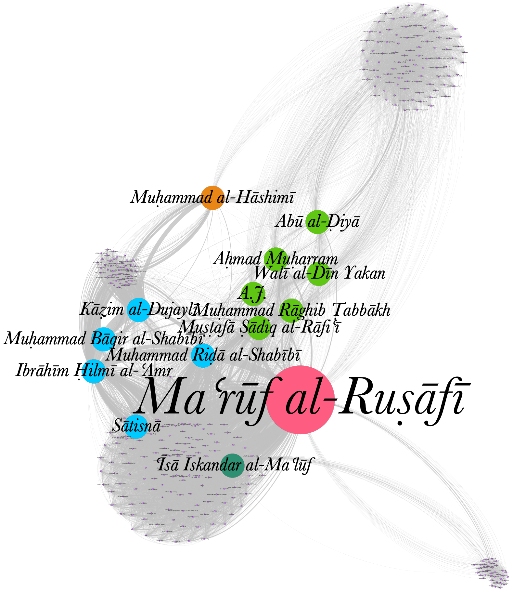

## Open Arabic Periodical Editions ([OpenArabicPE](https://openarabicpe.github.io))

::: columns
:::: wide

- Volunteer-run scholarly editing and infrastructure-building (2015--)
- Digital scholarly editions
    + 6 Arabic magazines from Baghdad, Cairo, Damascus with c.800 issues and more than 9 million words.
    + full text and facsimiles modelled in TEI/XML
    - Bibliographic metadata (MODS, BibTeX, Zotero RDF)
    - Open licenses: [CC BY-SA 4.0](http://creativecommons.org/licenses/by-sa/4.0/)
       <!--  - on the article level for the entire corpus plus 2 additional magazines
        - on the issue level for 7 additional newspapers
        - on the title level for 3300+ periodicals (in collaboration with [Project Jarāʾid](https://projectjaraid.github.io)) -->
- Infrastructure:
    + [TEI Boilerplate]((https://github.com/openarabicpe/tei-boilerplate-arabic-editions)): static websites. No need for backend, database or internet connection
    + [GitHub](https://github.com/openarabicpe) / [Zenodo](https://zenodo.org): free hosting and archiving with DOIs
    - [Zotero group](https://zotero.org/groups/openarabicpe) as gateway to search/browse the corpus
- Workflows and tools

::::
:::: narrow

](../assets/boilerplate_zuhur-v_1-i_1.png){#fig:webview-zuhur}

](../assets/boilerplate_muqtabas-v_3-i_2.png){#fig:webview-muqtabas}

::::
:::

# Why spend the effort? <br/> Shouldn't others do it?
## Why spend the effort?


1. Neo-colonial invisibility of cultural artefacts from the Global South in the digital domain
2. Periodicals are an important local and quotidian source to tell and recover local stories
3. We as scholars have a duty of care and nobody else was doing it

::: notes

- will talk about 1 here
- ad 3: this also manifests itself in a substantial funding gap

:::

## Digitisation bias
### perpetuating biases

::: columns
:::: column

{#fig:holding-map}

::::
:::: column

|      periodicals       | --1918 |       | --1929 |               |
|  :-------------------  | ----:  | ----: | ----:  |     ----:     |
|       published        |  2054  |       |  3550  |               |
|     known holdings     |  540   |       |  775   |               |
|       % of total       |        | 26.29 |        | [21.83]{.red} |
|------------------------|--------|-------|--------|---------------|
| digitized              |    156 |       |    233 |               |
| % of total             |        |  7.59 |        | [6.56]{.red}  |
|------------------------|--------|-------|--------|---------------|
| multiple digitisations |     51 |       |     66 |               |
| % of total             |        |  2.48 |        | 1.86          |
| % of digitised         |        | 32.69 |        | [28.33]{.red} |

Table: Periodical holdings and digitization {#tbl:jaraid-holdings}

::::
:::

::: notes

- biases
    + knowledge
    + collection
    - digitisation
- While the digitization quote of roughly 50% of titles in collections is surprisingly high, it must be kept in mind that we cannot resolve information on the extent of digitization. Even if only a single issue of hundreds published was digitized, the periodical title will be included in this count.
- 66 periodicals or 28,33% have been digitized by multiple institutions and 21 of this subset by three and more.

:::

## Digitisation biases
### Quality of metadata

Bibliographic metadata is faulty throughout, mostly unstructured, and subject to *linguistic imperialism*

::: columns
:::: column

 as it appeared in 2019](https://openarabicpe.github.io/slides/assets/shamela_muqtabas-annotated.png){#fig:muqtabas-6-2-shamela}

::::
:::: column

](../assets/eap119-1-4-5-muqtabas-133_annotated.jpg){#fig:muqtabas-6-2-133-eap}

::::
:::

::: notes

- faulty on shadow libraries and official digitisation efforts
    - publication dates
        + inferred from vol. and issue number: 1 Ṣafar 1329 aH / c. 1 February 1911
        + EAP: March 1911
        + secondary sources: probably delayed by up to four months
    - volume and issue numbers
        + shamela: no.61
        + correct: vol. 6, no. 2
    - pagination:
        + shamela = 45, correct = 133
    - publication place
        + EAP lists Jerusalem
- linguistic imperialism
    + script
    + calendars

:::

## Digitisation biases
### Traditional OCR

>language [is] not currently OCRable.

<cite>Archive.org's item description for [@KurdAli+1923+GharaibAlGharba]</cite>

::: columns
:::: wide


| Font Type          | Sakhr (%)           | ABBYY (%)           | RDI(%)              | Tesseract (%)       |
| -----------------  | -------:            | --------:           | ------:             | -----------:        |
| Traditional Arabic | 48.54               | 67.66               | [**51.88**]{.green} | 47.04               |
| Tahoma             | 10.52               | 69.91               | 26.38               | 38.37               |
| Simplified Arabic  | 52.97               | 67.69               | 44.94               | 46.75               |
| M Unicode Sara     | 36.03               | 59.40               | 25.92               | 33.72               |
| Diwani letter      | [**18.13**]{.red}   | [**18.47**]{.red}   | [**18.13**]{.red}   | [**23.32**]{.red}   |
| DecoType Thuluth   | 36.12               | 37.71               | 24.26               | 32.48               |
| Deco'Type Naskh    | 48.88               | 50.22               | 41.63               | 40.92               |
| Arabic transparent | 51.56               | [**75.19**]{.green} | 46.00               | [**48.61**]{.green} |
| Andalus            | 28.07               | 37.53               | 21.68               | 25.34               |
| AdvertisingBold    | [**57.35**]{.green} | 70.26               | 27.20               | 39.39               |

Table: Evaluation of traditional OCR software for Arabic font types from [@Alghamdi.Teahan+2017+ExperimentalEvaluationArabic, table IV]. Values show percentage of correctly recognised characters {#tbl:ocr-ar-trad}

::::
:::: narrow

<!-- , quality of the OCR layer (requires US IP)](../assets/hathi_muqtabas-ocr-3.png) -->
, quality of the OCR layer](../assets/gpa_bashir-i_487-p_1_ocr.png){#fig:gpa-ocr}

::::
:::

::: notes

- technical problems
    + layout recognition
    + segmentation
    + text recognition
- what do you do if you have none of the resources mentioned in the toot
- problems with platform providers
    + Unstructured text, no APIs, propriertary interfaces
    + Algorithms and evaluation are kept secret
        *  unknown numbers of *false positives* and *false negatives*

:::

## Accessibility
### Catalogue searches

::: columns-3
:::: column

No Arabic script

 for "الجنة"](https://tillgrallert.github.io/slides/assets/jaraid/zdb_janna-ar.png){#fig:zdb-ar}

::::
:::: column

Which Latinized transcription was used?

 for "al-Ǧanna"](https://tillgrallert.github.io/slides/assets/jaraid/zdb_janna-ar-Latn.png){#fig:zdb-dmg}

::::
:::: column

What are the normalization rules for the search algorithm?

 for "Ganna"](https://tillgrallert.github.io/slides/assets/jaraid/zdb_janna-ar-Latn-no-al.png){#fig:zdb-functional}

::::
:::

::: notes

- catalogue could be searched in Arabic but the data is missing
- Latin input is mostly reduced to ASCII
    + Hamza and ʿAyn escape this algorithm on ZDB
- determined article is not automatically removed

:::

## Accessibility
### Interfaces

 project (Bonn). Facsimile of Arabic original on the left. Yellow = English UI; purple = Arabic metadata in DMG transcription;  green = German metadata](../assets/translatio_interface-languages_annotated.png){#fig:translatio-interface}

## Accessibility
### copyright regimes, paywalls, and geo fencing

cataloging rules and algorithmic copyright detection cause further inaccessibilities

::: columns
:::: column

 (Original in Princeton) outside the USA](../assets/hathi_muqtabas-1.png){#fig:hathi-muqtabas-global}

::::
:::: column

![The page from [@fig:hathi-muqtabas-global] with a US-IP](../assets/hathi_muqtabas-2.png){#fig:hathi-muqtabas-us}

::::
:::


::: notes

Beispiel: unklares Enddatum eines Erscheinungsverlaufs im 20. Jahrhundert wird korrekt als 19uu katalogisiert und dann Copyrightstatus sicherheitshalber als 1999 angenommen.

:::

# Contributing to the *digital commons* without the help we can't get
## Contributing to the *digital commons* <br/> without the help we can't get

::: columns
:::: column

### ideas

- unite **existing** gray transcriptions with digital facsimiles
- learn from free and open-source software development
<!-- - model everything to make components citable
- harvest, generate, validate and share open metadata -->

### aims

<!-- + **validate** and **improve** the transcription with the facsimiles
- **train** text and layout recognition algorithms to make the textual heritage accessible to digitisation efforts
- **citable** for scholars, **linkable** for machines to facilitate use and adoption of the resources
- **open licences** to facilitate re-use -->

- make Arabic periodicals **accessible** on a shoestring budget
- **validate** and improve utilization of transcriptions
    + reliablity: content and citations
    + accessibility: for readers and computational analysis
    + ground truth for ML-based OCR/HTR
- establish an open, sustainable **infrastructure** of workflows, models, authority files
<!-- - With the affordances of the Global South -->

::::
:::: column

### minimal computing principles

- build what **we need** with what **we have** at hand
- as **few** as possible, **open** and **established** formats and tools
- running on **our** hardware
- with **our** skills and knowledge
- **free-to-use** platforms without lock-in of data

### our constrains

- funding
- internet connections
- electricity

::::
:::

::: notes

- minimal computing
- meaningful connectivity: focus on practicability instead of principled stance
- result: bootstrapped scholarly editions

:::

# Resulting workflow of OpenArabicPE
## 1. get the data

::: columns
:::: column

- facsimiles
    + link to existing facsimiles from [British Library's "Endangered Archives Programme" (EAP)](http://eap.bl.uk/), <!-- [HathiTrust](http://hathitrust.org/), --> [Translatio Bonn](https://digitale-sammlungen.ulb.uni-bonn.de/topic/view/3085779), [*Arshīf al-majallāt [...] al-ʿarabiyya*](http://archive.alsharekh.org/) etc., preferably through [IIIF](https://iiif.io/)
    + scan/ photograph your physical artefacts (at the lowest sustainable resolution)
- text
    + scrape existing transcriptions from [*shamela.ws*](http://shamela.ws/index.php/book/26523), et al.
    + use [Transkribus](https://transkribus.eu/), [eScripta](https://escripta.hypotheses.org)/[eScriptorium](https://www.https://escriptorium.fr/) for HTR (with our model trained on 1000+ pages from the OpenArabicPE corpus)


::::
:::: column

EPub (HTML) for *al-Zuhūr* 2(4) from shamela.ws

```html
<div dir="rtl" id="book-container">
    <hr/>
    <a id='C232'></a>
    <span class="title">صحافة سورية ولبنان</span><br /><span class="red">3 - </span>المجلات<br />هذه مقالتي الثالثة عن صحافة سورية ولبنان. . . ولا يخفى أن للانقلاب العثماني الأخير فضلاً عظيماً على هذه المجلات التي أنا ذاكر. فمل يكن منها قبل إعلان الدستور إلا مجلة المشرق ومجلة المقتبس.<br />أما بقية المجلات فقد صدرت في العامين الأخيرين كما يظهر لك في هذا المقال.<br />وقد اجتهدت، في هذا القسم، أن أذكر تاريخ صدور لهذه المجلات متخيراً أوثق المصادر في ذلك فأقول:<br />
</div>
```

OCR output from Transkribus for *al-Ḥasnāʾ* (PAGE XML)

```xml
<TextLine id="r1l5" custom="readingOrder {index:4;}">
    <Coords points="470,548 2191,527 1648,462 470,464"/>
    <Baseline points="480,542 565,540 650,537 735,534 820,533 905,531 990,530 1075,528 1160,528 1245,527 1330,527 1415,527 1500,527 1585,527 1670,528 1755,528 1840,530 1925,531 2010,531 2095,534 2180,536"/>
    <TextEquiv>
        <Unicode>من عسر سنوات مجلة بسائة في الاستارة اعتمد في تحريرها على أقلامهن فزيئها</Unicode>
    </TextEquiv>
</TextLine>
```
::::
:::

::: notes

- IIIF allows to set a very low quality to reduce bandwidth and traffic
- what do you need to know
    - HTML
    - XML
    - JSON: for IIIF
    - wget, cURL: for scraping

:::

## 2. model the data

Structure the text string into issues, sections, articles with bylines ...

::: columns
:::: column

- widely accepted standard for textual editions: [Text Encoding Initiative](https://tei-c.org/) (TEI XML)
    - active community
    - pre-requisite for grant funding
    - easy to archive (XML = plain text)
- re-use / adapt domain specific encoding schemas within the TEI
- try to script basic modelling using patterns in your source text:
    + regular expressions
    + XSLT, Python, R, whatever you are most comfortable with
- automatically model derivative bibliographic data: MODS, METS, BibTeX, ...

::::
:::: column

The same section of *al-Zuhūr* 2(4) modelled in TEI

```xml
<body xml:lang="ar">
<pb corresp="../epub/shamela_36534/OEBPS/xhtml/P744.xhtml" ed="shamela" n="n2-p184"/>
<pb ed="print" edRef="#edition_1" facs="#facs_184" n="184"/>
    <div prev="oclc_1034545644-i_13.TEIP5.xml#div_1.d2e2766" subtype="article" type="item" xml:id="div_1.d2e634">
        <head>صحافة <placeName>سورية</placeName> و<placeName>لبنان</placeName></head>
        <div type="section" xml:id="div_3.d2e1200">
            <head> ٣ - المجلات</head>
            <p>هذه مقالتي الثالثة عن صحافة سورية ولبنان. . . ولا يخفى أن للانقلاب العثماني الأخير فضلاً عظيماً على هذه المجلات التي أنا ذاكر. فلم يكن منها قبل إعلان الدستور إلا <bibl>مجلة <title level="j">المشرق</title></bibl>  و<bibl>مجلة <title level="j">المقتبس</title></bibl> .</p>
            <p>أما بقية المجلات فقد صدرت في العامين الأخيرين كما يظهر لك في هذا المقال.</p>
            <p>وقد اجتهدت، في هذا القسم، أن أذكر تاريخ صدور لهذه المجلات متخيراً أوثق المصادر في ذلك فأقول:</p>
        </div>
    </div>
</body>
```

::::
:::

::: notes

- why TEI?
    + I knew it already
    + widely adopted standard in the digital editing world
    + necessary for grant-funding in the Global North
- why not TEI
    + steep learning curve
    + not particularly well-suited to Arabic texts?

:::

## 3. edit the data

::: columns
:::: column

- make use of version control <!-- and stable IDs (e.g. [ORCID](https://orcid.org)) --> for **transparent authorship attribution** and **damage control**:
    + [.git](https://git-scm.com/) is open source and available for all OSs
- plain-text (including XML) editors
    + should be **syntax aware**
    - **RTL**: support in text editors is a mixed bag

](../assets/vscode_zuhur.png){#fig:zuhur-vscode}

<!-- ](../assets/sublime_zuhur.png) -->

<!-- ](../assets/textmate_zuhur.png) -->

::::
:::: column

- XML editors proper
    + should be **schema aware** to validate the encoding
    - **RTL**:
        1. [oXygen XML editor](https://www.oxygenxml.com/) (99 USD) allows to separate content and tags<!-- : [TextGrid Lab](https://textgrid.de/index) -->
        2. [Visual Studio Code](https://code.visualstudio.com/) (free) with the right extensions is a viable second

's  author mode. Styling relies on CSS.](../assets/oxygen_zuhur-author.png){#fig:zuhur-oxygen}

::::
:::

::: notes

- editing tools depend on modelling decisions and file formats

:::

## 4. save and share the data

::: columns
:::: column

- facsimiles: [Internet Archive](https://archive.org) (supports [IIIF](https://iiif.io/))
- working copy of everything else: distributed version control platforms ([GitHub](https://github.com/), [GitLab](https://about.gitlab.com/))
- longterm preservation: publicly-funded, open repository ([Zenodo](https://zenodo.org/))
    + make sure to add [ORCID](https://orcid.org)s for all contributors
- authority data (people, titles, etc.): [Wikidata](https://wikidata.org/)
- provide suitable open licenses for re-use: [Creative Commons](https://creativecommons.org/), [MIT](), Public Domain (CC0)

::::
:::: column

](../assets/zenodo_zuhur.png){#fig:zuhur-zenodo}

::::
:::

## 5. present the data
<!-- ### presentation layers and access for human readers -->

::: columns
:::: column

- Hosting: [GitHub Pages](https://pages.github.com/) can expose your data repository to the web
- Generate static webviews
    + removes need for backend and minimises traffic
    + easy to archive
    - on the fly: XSLT1 ([TEI Boilerplate](http://dcl.slis.indiana.edu/teibp/)) or JS ([CETEICEan](https://github.com/TEIC/CETEIcean)) to render XML files in the client's web browser
    - pre-computed: [GitHub actions](https://github.com/features/actions) give access to virtual machines
- bibliographic database: [Zotero group](https://www.zotero.org/groups/openarabicpe/items/)
    + mitigates against the absent backend
    + **browse** and **search** independent of file structure
- full-text search across the entire corpus: [Google's programmable search engine](https://cse.google.com/cse?cx=012251040084107011117:jof1v_ejndo)

::::
:::: column


": details in mobile view](../assets/zotero-group_openarabicpe-mobile-details_small.png){#fig:zuhur-zotero}

](../assets/boilerplate_zuhur-v_2-i_4_small.png){#fig:zuhur-webview}

<!-- ": search in mobile view](../assets/zotero-group_openarabicpe-mobile-search.png) -->

::::
:::

## Resulting Corpus


| Title                                                                           | Place             | Proprietor                    | DOI                                                                | Volumes  | Issues  | Articles | Words   |
| ------------------------------------------------------------------------------- | ----------------- | ----------------------------- | ------------------------------------------------------------------ | -------: | ------: | -------: | ------: |
| [al-Ḥaqāʾiq](https://www.github.com/openarabicpe/digital-haqaiq)                | Damascus          | Abd al-Qādir al-Iskandarānī   | [10.5281/zenodo.1232016](https://doi.org/10.5281/zenodo.1232016)   | 3        | 35      | 389      | 298090  |
| [al-Ḥasnāʾ](https://www.github.com/openarabicpe/journal_al-hasna)               | Beirut            | Niqūlā Bāz                    | [10.5281/zenodo.3556246](https://doi.org/10.5281/zenodo.3556246)   | 1        | 12      | 201      | NA      |
| [al-Manār](https://www.github.com/openarabicpe/journal_al-manar)                | Cairo             | Muḥammad Rashīd Riḍā          |                                                                    | 35       | 537     | 4300     | 6144593 |
| [al-Muqtabas](https://www.github.com/tillgrallert/digital-muqtabas)             | Cairo, Damascus   | Muḥammad Kurd ʿAlī            | [10.5281/zenodo.597319](https://doi.org/10.5281/zenodo.597319)     | 9        | 96      | 2964     | 1981081 |
| [al-Ustādh](https://www.github.com/openarabicpe/journal_al-ustadh)              | Cairo             | Abdallāh Nadīm al-Idrīsī      | [10.5281/zenodo.3581028](https://doi.org/10.5281/zenodo.3581028)   | 1        | 42      | 435      | 221447  |
| [al-Zuhūr](https://www.github.com/openarabicpe/journal_al-zuhur)                | Cairo             | Anṭūn al-Jumayyil             | [10.5281/zenodo.3580606](https://doi.org/10.5281/zenodo.3580606)   | 4        | 39      | 436      | 292333  |
| [Lughat al-ʿArab](https://www.github.com/openarabicpe/journal_lughat-al-arab)   | Baghdad           | Anastās Mārī al-Karmalī       | [10.5281/zenodo.3514384](https://doi.org/10.5281/zenodo.3514384)   | 3        | 34      | 939      | 373832  |
| **total**                                                                       |                   |                               |                                                                    | 56       | 795     | 9664     | 9311376 |


::: columns
:::: column

- TEI/XML files for each issue with structural mark-up on the article level
- mark-up of named entities in bylines


::::
:::: column

- authority files (TEI/XML)
- bibliographic metadata on the article level (MODS/XML, Zotero RDF, BibTeX)

::::
:::


# Wrapping up
## Fakesimiles are a thing

<!-- original facsimile: [EAP](http://images.eap.bl.uk/EAP119/EAP119_1_4_4/463.jp2/full/800,/0/gray.jpg) -->

*al-Muqtabas* 5(7), pp.[463](https://openarabicpe.github.io/journal_al-muqtabas/tei/oclc_4770057679-i_54.TEIP5.xml#pb_61.d1e2036)--[466](https://openarabicpe.github.io/journal_al-muqtabas/tei/oclc_4770057679-i_54.TEIP5.xml#pb_64.d1e2045)

::: columns-3
:::: column

{#fig:muq-eap}

::::
:::: column

{#fig:muq-shamela}

::::
:::: column

!["fakesimile" from [*arshīf al-majallāt [...] al-ʿarabiyya*](https://archive.alsharekh.org/MagazinePages/Magazine_JPG/AL_moqtabs/Al_moqtabs_1910/Issue_7/605.JPG)](../assets/sakhrit_muqtabas-v_5-i_7-p_605.jpg){#fig:muq-fakesimile}

::::
:::

## tracking intellectual networks

::: columns
:::: column

{#fig:network-authors}

::::
:::: column

{#fig:network-periodicals}

::::
:::

Hypothesis: widespread references to a title/person are an indicator of their importance 

## geographical typology of periodicals

::: columns-3
:::: column

### trans-regional

{#fig:authors-muqtabas-2}

::::
:::: column

### regional

{#fig:authors-hasna}

::::
:::: column

### local

{#fig:authors-haqaiq-2}

::::
:::

Hypothesis: distribution of geographic origin of contributions to a periodical is an indicator for its importance

::: notes

- *al-Muqtabas* turns the saying “Cairo writes, Beirut publishes and Baghdad reads” upside down with Baghdad well ahead of even Damascus.

:::

## Final warning
### All dependencies will eventually break and need repair

::: columns
:::: column

- Reliance on external data providers: link rot
    - links to facsimiles broke twice in four years
- Reliance on free tools and services: link rot
    + URLs to our editions had to be changed once
- XSLT1 in web browsers: will fall victim to JSON and security features
    + over the last 5 years support has markedly decreased
<!-- - Full-text search across issues and periodicals without a backend
    + [Google's programmable search engines](https://cse.google.com/cse?cx=012251040084107011117:jof1v_ejndo): requires internet connection (and Google account!) -->

::::
:::: column

{#fig:components}

::::
:::


::: notes

Bootstrapping relies on the work of others


:::

## Thank you!

- Contributors to [OpenArabicPE](https://openarabicpe.github.io/): Jasper Bernhofer, Dimitar Dragnev, Patrick Funk, Talha Güzel, Hans Magne Jaatun, Daniel Kolland, Jakob Koppermann, Xaver Kretzschmar, Daniel Lloyd, Klara Mayer, Tobias Sick, Manzi Tanna-Händel, and Layla Youssef
- Contributors to [Project Jarāʾid](https://projectjaraid.github.io/): Hala Auji, Philippe Chevrant, Marina Demetriadou, Lamia Eid, Stacy Fahrenthold, Ulrike Freitag, Till Grallert, Rana Issa, Nicole Khayat, Peter Magierski, Leyla von Mende, Adam Mestyan, Christian Meier, Daniel Newman, Geoffrey Roper, Sinai Rusinek, Philip Sadgrove, Ola Seif, and Rogier Visser
- Links:
    + Slides: [https://openarabicpe.github.io/slides/2023-openiti/](https://openarabicpe.github.io/slides/2023-openiti//index.html)
    + Project blog: [https://openarabicpe.github.io](https://openarabicpe.github.io)
    + Papers: <http://digitalhumanities.org/dhq/vol/16/2/000593/000593.html>, <https://doi.org/10/gkhrjr>
    + Mastodon: [\@tillgrallert\@digitalcourage.social](https://digitalcourage.social/@tillgrallert)
    + Email: <till.grallert@fu-berlin.de>, <till.grallert@hu-berlin.de>
- Licence: slides and images are licenced as [CC BY-SA 4.0](http://creativecommons.org/licenses/by-sa/4.0/)

## References {#refs}