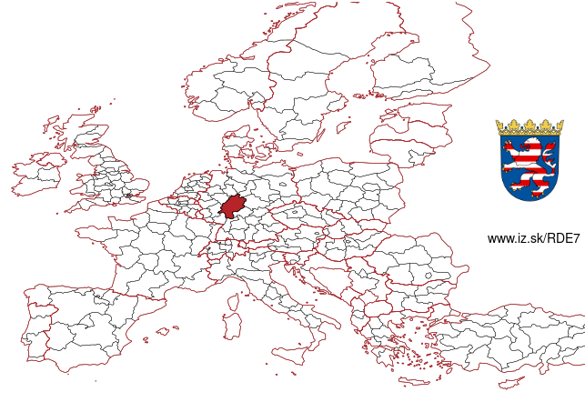
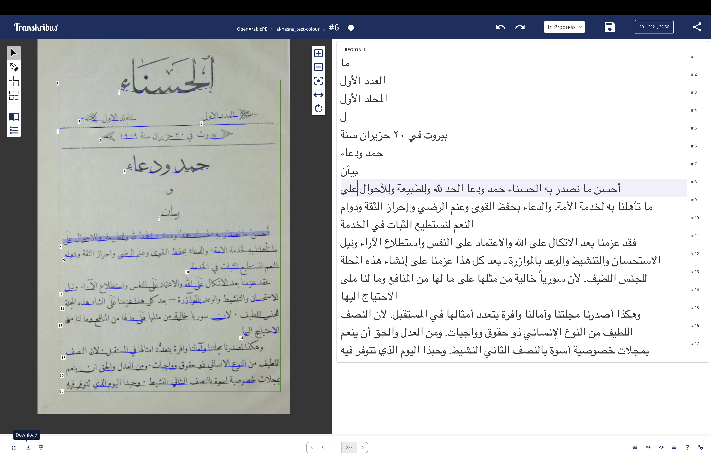

# Introduction
## Summary: Open Arabic Periodical Editions ([OpenArabicPE](https://openarabicpe.github.io))

::: columns
:::: wide

- Volunteer-run scholarly editing and infrastructure-building (mostly 2015--20)
- Digital scholarly editions
    + 6 Arabic magazines from Baghdad, Cairo, Damascus with c.800 issues and more than 9 million words.
    + full text and facsimiles modelled in [TEI/XML][tei]
    - Bibliographic metadata (MODS, BibTeX, Zotero RDF)
    - Open licenses: [CC BY-SA 4.0](http://creativecommons.org/licenses/by-sa/4.0/)
       <!--  - on the article level for the entire corpus plus 2 additional magazines
        - on the issue level for 7 additional newspapers
        - on the title level for 3300+ periodicals (in collaboration with [Project Jarāʾid](https://projectjaraid.github.io)) -->
- Infrastructure:
    + [TEI Boilerplate]((https://github.com/openarabicpe/tei-boilerplate-arabic-editions)): static websites. No need for backend, database or internet connection
    + [GitHub][github] / [Zenodo][zenodo]: free hosting and archiving with DOIs
    - [Zotero group](https://zotero.org/groups/openarabicpe) as gateway to search/browse the corpus
- Workflows and tools

::::
:::: narrow

](../assets/boilerplate_zuhur-v_1-i_1.png){#fig:webview-zuhur}

](../assets/boilerplate_muqtabas-v_3-i_2.png){#fig:webview-muqtabas}

::::
:::

## outline of todays talk

1. *linguistic imperialism* of the socio-technical infrastructures of the digital, or: why should we do it and what are our constraints?
2. a framework for bootstrapped scholarly editions outside the Global North, or: how could one practically do it?
3. the proof is in the pudding, or: what did we achieve?
4. conclusion

# Why spend the effort? <br/> Shouldn't others do it?
## Why spend the effort? <br/> Shouldn't others do it?


1. Neo-colonial invisibility of cultural artefacts from the Global South in the digital domain
2. Periodicals are an important local and quotidian source to tell and recover local stories
3. We as scholars have a duty of care and nobody else was doing it

::: notes

- will talk about 1 here
- ad 3: this also manifests itself in a substantial funding gap

:::

# Arabic textual heritage online
## The long tail of ASCII in discovery systems

::: columns-3
:::: column

How do we search for [[مرآة الشرق]{lang="ar"}](https://www.wikidata.org/wiki/Q124971778)?

- original Arabic: [مرآة الشرق]{lang="ar"}
- original Latin: Meraat al-Sherk
- IJMES: Mirʾāt al-Sharq
- DMG: Mirʾāt aš-Šarq
- Buckwalter: mrMp Alcrq

.](https://images.eap.bl.uk/EAP119/EAP119_1_24_1/1.jp2/full/600,/0/gray.jpg){#fig:mirat}

::::
:::: column

### failure

- Arabic script (data or interface)
- IJMES
- removing or substituting *hamza* and *ʿayn*: `mir'at sarq`

 for "mir'at sarq"](../assets/zdb_mirat-ar-Latn-hamza.png){#fig:zdb-hamza}
 

::::
:::: column

### success

- original Latin title
- DMG
- removing all diacritics and articles: `mirʾat sarq`

 for "Mirʾāt aš-Šarq". Note how this returns a different hit than @fig:zdb-hamza](../assets/zdb_mirat-ar-Latn-x-dmg.png){#fig:zdb-dmg}

::::
:::

::: notes

- catalogue could be searched in Arabic but the data is missing
- catalogues are historical artefacts
    + digitisation of catalogues: NOT re-cataloguing of original material
        * card catalogue
        * ASCII OPAC
        * automated transcription of the card catalogue
        * human cataloguers depend on the technology they have at hand, which means they might be unable to enter the correct string
        * errors perpetuate
- Latin input is mostly reduced to ASCII
    + Hamza and ʿAyn escape this algorithm on ZDB
- determined article is not automatically removed
- The choices are not transparently documented
- no software on-screen keyboards provided
- additional problems
    + catalogues are inherently local documents
    + aggregated, if at all, on a national level
    + frequently accessible only through Web interfaces and not APIs

:::

<!-- # Digitisation bias -->
## Digitisation bias
### Collection biases perpetuated

::: columns
:::: column

{#fig:holding-map}

::::
:::: column

|      periodicals       | --1918 |       | --1929 |                 |
|  :-------------------  | ----:  | ----: | ----:  |      ----:      |
|       published        |  2054  |       |  3550  |                 |
|     known holdings     |  540   |       |  775   |                 |
|       % of total       |        | 26.29 |        |  [21.83]{.red}  |
|------------------------|--------|-------|--------|-----------------|
| digitized              |    156 |       |    233 |                 |
| % of known holdings    |        | 28.89 |        | [30.06]{.green} |
| % of total             |        |  7.59 |        | [6.56]{.red}    |
|------------------------|--------|-------|--------|-----------------|
| multiple digitisations |     51 |       |     66 |                 |
| % of total             |        |  2.48 |        | 1.86            |
| % of digitised         |        | 32.69 |        | [28.33]{.red}   |

Table: Periodical holdings and digitization {#tbl:jaraid-holdings}

::::
:::

::: notes

- collection bias is more of a knowledge bias
- While the digitization quote of roughly 30% of titles in collections is surprisingly high, it must be kept in mind that we cannot resolve information on the extent of digitization. Even if only a single issue of hundreds published was digitized, the periodical title will be included in this count.
- 66 periodicals or 28,33% have been digitized by multiple institutions and 21 of this subset by three and more.

:::

## Digitisation bias
### mind the `<gap/>`!

|             | Arabic periodicals (1798--1918) | [WWI as mirrored by Hessian regional papers](https://hwk1.hebis.de) |
|-------------|---------------------------------|---------------------------------------------------------------------|
| community   | c. 420 million Arabic speakers  | c. 6.2 million inhabitants                                          |
| periodicals | 2054 newspapers and journals    | 125 newspapers                                                      |
| digitized   | 156 periodicals                 | 125 newspapers with more than 1.5 million pages                     |
| type        | mostly facsimiles               | facsimiles and full text                                            |
| access      | paywalls, geo-fencing           | open access                                                         |
| interface   | mostly foreign languages only   | local and foreign languages                                         |

Table: Comparison of digitized periodicals between the Global South and the Global North {#tbl:digitisation}


::: columns
:::: column

](../assets/maps/lMBwUARaIVBp5EUfx5yp4onMAtfAQsgRevtxTopNl98.png.webp){#fig:map-arabic-dialects}

::::
:::: column

{#fig:map-hesse}

::::
:::

::: notes

- price of digitisation is part of the equation
- infrastructures of knowledge creation 
- linguistic imperialism embodied in the technology stack

:::

## mind the `<gap/>`!
### Interfaces

 project (Bonn). Facsimile of Arabic original on the left. Yellow = English UI; purple = Arabic metadata in DMG transcription;  green = German metadata](../assets/translatio_interface-languages_annotated.png){#fig:translatio-interface}

## mind the `<gap/>`!
### copyright regimes, paywalls, and geo fencing

cataloging rules and algorithmic copyright detection cause further inaccessibilities

::: columns
:::: column

 (Original in Princeton) outside the USA](../assets/hathi_muqtabas-1.png){#fig:hathi-muqtabas-global}

::::
:::: column

![The page from [@fig:hathi-muqtabas-global] with a US-IP](../assets/hathi_muqtabas-2.png){#fig:hathi-muqtabas-us}

::::
:::


::: notes

Beispiel: unklares Enddatum eines Erscheinungsverlaufs im 20. Jahrhundert wird korrekt als 19uu katalogisiert und dann Copyrightstatus sicherheitshalber als 1999 angenommen.

:::

## Quality of metadata

Bibliographic metadata is faulty throughout, mostly unstructured, and subject to *linguistic imperialism*

::: columns
:::: column

 as it appeared in 2019](https://openarabicpe.github.io/slides/assets/shamela_muqtabas-annotated.png){#fig:muqtabas-6-2-shamela-2}

::::
:::: column

](../assets/eap119-1-4-5-muqtabas-133_annotated.jpg){#fig:muqtabas-6-2-133-eap-2}

::::
:::

::: notes

- faulty on shadow libraries and official digitisation efforts
    - publication dates
        + inferred from vol. and issue number: 1 Ṣafar 1329 aH / c. 1 February 1911
        + EAP: March 1911
        + secondary sources: probably delayed by up to four months
    - volume and issue numbers
        + shamela: no.61
        + correct: vol. 6, no. 2
    - pagination:
        + shamela = 45, correct = 133
    - publication place
        + EAP lists Jerusalem
- linguistic imperialism
    + script
    + calendars

:::

## mind the `<gap/>`!
### Traditional OCR

>language [is] not currently OCRable.

<cite>Archive.org's item description for [@KurdAli+1923+GharaibAlGharba]</cite>

::: columns
:::: wide


| Font Type          | Sakhr (%)           | ABBYY (%)           | RDI(%)              | Tesseract (%)       |
| -----------------  | -------:            | --------:           | ------:             | -----------:        |
| Traditional Arabic | 48.54               | 67.66               | [**51.88**]{.green} | 47.04               |
| Tahoma             | 10.52               | 69.91               | 26.38               | 38.37               |
| Simplified Arabic  | 52.97               | 67.69               | 44.94               | 46.75               |
| M Unicode Sara     | 36.03               | 59.40               | 25.92               | 33.72               |
| Diwani letter      | [**18.13**]{.red}   | [**18.47**]{.red}   | [**18.13**]{.red}   | [**23.32**]{.red}   |
| DecoType Thuluth   | 36.12               | 37.71               | 24.26               | 32.48               |
| Deco'Type Naskh    | 48.88               | 50.22               | 41.63               | 40.92               |
| Arabic transparent | 51.56               | [**75.19**]{.green} | 46.00               | [**48.61**]{.green} |
| Andalus            | 28.07               | 37.53               | 21.68               | 25.34               |
| AdvertisingBold    | [**57.35**]{.green} | 70.26               | 27.20               | 39.39               |

Table: Evaluation of traditional OCR software for Arabic font types from [@Alghamdi.Teahan+2017+ExperimentalEvaluationArabic, table IV]. Values show percentage of correctly recognised characters {#tbl:ocr-ar-trad}

::::
:::: narrow

<!-- , quality of the OCR layer (requires US IP)](../assets/hathi_muqtabas-ocr-3.png) -->
, quality of the OCR layer](../assets/gpa_bashir-i_487-p_1_ocr.png){#fig:gpa-ocr}

::::
:::

::: notes

- technical problems
    + layout recognition
    + segmentation
    + text recognition
- what do you do if you have none of the resources mentioned in the toot
- problems with platform providers
    + Unstructured text, no APIs, propriertary interfaces
    + Algorithms and evaluation are kept secret
        *  unknown numbers of *false positives* and *false negatives*

:::


## machine-learning approaches to OCR

>For old prints, there's [...] kraken/calamari for coders, Transkribus if you've got money and just want to have the results[,] and OCR-D if you've got an IT department.

<cite>[@Winkler20230307OCR]</cite>

::: columns
:::: narrow

| training set     | *al-Ustādh*        | *al-Muqtabas*    |
| ---------------- | -----------------: | ---------------: |
| words            | 192829             | 11116            |
| lines            | 18732              | 1013             |
| epochs           | 200                | 200              |
| CER train        | 2.01               | 0.07             |
| CER validation   | [**2.09**]{.green} | [**8.40**]{.red} |

Table: Evaluation of my our Transkribus models {#tbl:ocr-ar-ml}

::::
:::: wide

{#fig:transkribus-web-app}

::::
:::

::: notes

- models were trained in late 2019 in collaboration with Sinai Rusinek
- results are great (layout recognition still lacking)
    + *al-Muqtabas* model suffers from over-fitting
    + digitised collections need to be re-processed (expensive)
- OpenITI
    + Mellon fund for model training to re-process Arabic-script material on HathiTrust

:::

# Resulting workflow of OpenArabicPE
## 1. get the data

::: columns
:::: column

- facsimiles
    + link to existing facsimiles from [British Library's "Endangered Archives Programme" (EAP)](http://eap.bl.uk/), <!-- [HathiTrust](http://hathitrust.org/), --> [Translatio Bonn](https://digitale-sammlungen.ulb.uni-bonn.de/topic/view/3085779), [*Arshīf al-majallāt [...] al-ʿarabiyya*](http://archive.alsharekh.org/) etc., preferably through [IIIF](https://iiif.io/)
    + scan/ photograph your physical artefacts (at the lowest sustainable resolution)
- text
    + scrape existing transcriptions from [*shamela.ws*](http://shamela.ws/index.php/book/26523), et al.
    + use [Transkribus](https://transkribus.eu/), [eScripta](https://escripta.hypotheses.org)/[eScriptorium](https://www.https://escriptorium.fr/) for HTR (with our model trained on 1000+ pages from the OpenArabicPE corpus)


::::
:::: column

EPub (HTML) for *al-Zuhūr* 2(4) from shamela.ws

```html
<div dir="rtl" id="book-container">
    <hr/>
    <a id='C232'></a>
    <span class="title">صحافة سورية ولبنان</span><br /><span class="red">3 - </span>المجلات<br />هذه مقالتي الثالثة عن صحافة سورية ولبنان. . . ولا يخفى أن للانقلاب العثماني الأخير فضلاً عظيماً على هذه المجلات التي أنا ذاكر. فمل يكن منها قبل إعلان الدستور إلا مجلة المشرق ومجلة المقتبس.<br />أما بقية المجلات فقد صدرت في العامين الأخيرين كما يظهر لك في هذا المقال.<br />وقد اجتهدت، في هذا القسم، أن أذكر تاريخ صدور لهذه المجلات متخيراً أوثق المصادر في ذلك فأقول:<br />
</div>
```

OCR output from Transkribus for *al-Ḥasnāʾ* (PAGE XML)

```xml
<TextLine id="r1l5" custom="readingOrder {index:4;}">
    <Coords points="470,548 2191,527 1648,462 470,464"/>
    <Baseline points="480,542 565,540 650,537 735,534 820,533 905,531 990,530 1075,528 1160,528 1245,527 1330,527 1415,527 1500,527 1585,527 1670,528 1755,528 1840,530 1925,531 2010,531 2095,534 2180,536"/>
    <TextEquiv>
        <Unicode>من عسر سنوات مجلة بسائة في الاستارة اعتمد في تحريرها على أقلامهن فزيئها</Unicode>
    </TextEquiv>
</TextLine>
```
::::
:::

::: notes

- IIIF allows to set a very low quality to reduce bandwidth and traffic
- what do you need to know
    - HTML
    - XML
    - JSON: for IIIF
    - wget, cURL: for scraping

:::

## 2. model the data

Structure the text string into issues, sections, articles with bylines ...

::: columns
:::: column

- widely accepted standard for textual editions: [Text Encoding Initiative][tei] (TEI/XML)
    - active community
    - pre-requisite for grant funding
    - easy to archive (XML = plain text)
- re-use / adapt domain specific encoding schemas within the TEI
- try to script basic modelling using patterns in your source text:
    + regular expressions
    + XSLT, Python, R, whatever you are most comfortable with
- automatically model derivative bibliographic data: MODS, METS, BibTeX, ...

::::
:::: column

The same section of *al-Zuhūr* 2(4) modelled in TEI

```xml
<body xml:lang="ar">
<pb corresp="../epub/shamela_36534/OEBPS/xhtml/P744.xhtml" ed="shamela" n="n2-p184"/>
<pb ed="print" edRef="#edition_1" facs="#facs_184" n="184"/>
    <div prev="oclc_1034545644-i_13.TEIP5.xml#div_1.d2e2766" subtype="article" type="item" xml:id="div_1.d2e634">
        <head>صحافة <placeName>سورية</placeName> و<placeName>لبنان</placeName></head>
        <div type="section" xml:id="div_3.d2e1200">
            <head> ٣ - المجلات</head>
            <p>هذه مقالتي الثالثة عن صحافة سورية ولبنان. . . ولا يخفى أن للانقلاب العثماني الأخير فضلاً عظيماً على هذه المجلات التي أنا ذاكر. فلم يكن منها قبل إعلان الدستور إلا <bibl>مجلة <title level="j">المشرق</title></bibl>  و<bibl>مجلة <title level="j">المقتبس</title></bibl> .</p>
            <p>أما بقية المجلات فقد صدرت في العامين الأخيرين كما يظهر لك في هذا المقال.</p>
            <p>وقد اجتهدت، في هذا القسم، أن أذكر تاريخ صدور لهذه المجلات متخيراً أوثق المصادر في ذلك فأقول:</p>
        </div>
    </div>
</body>
```

::::
:::

::: notes

- why TEI?
    + I knew it already
    + widely adopted standard in the digital editing world
    + necessary for grant-funding in the Global North
- why not TEI
    + steep learning curve
    + not particularly well-suited to Arabic texts?

:::

## 3. edit the data

::: columns
:::: column

- make use of version control <!-- and stable IDs (e.g. [ORCID](https://orcid.org)) --> for **transparent authorship attribution** and **damage control**:
    + [.git](https://git-scm.com/) is open source and available for all OSs
- plain-text (including XML) editors
    + should be **syntax aware**
    - **RTL**: support in text editors is a mixed bag

](../assets/vscode_zuhur.png){#fig:zuhur-vscode}

<!-- ](../assets/sublime_zuhur.png) -->

<!-- ](../assets/textmate_zuhur.png) -->

::::
:::: column

- XML editors proper
    + should be **schema aware** to validate the encoding
    - **RTL**:
        1. [oXygen XML editor](https://www.oxygenxml.com/) (158 USD [2024]) allows to separate content and tags<!-- : [TextGrid Lab](https://textgrid.de/index) -->
        2. [Visual Studio Code](https://code.visualstudio.com/) (free) with the right extensions is a viable second

's  author mode. Styling relies on CSS.](../assets/oxygen_zuhur-author.png){#fig:zuhur-oxygen}

::::
:::

::: notes

- editing tools depend on modelling decisions and file formats

:::

## 4. save and share the data

::: columns
:::: column

- facsimiles: [Internet Archive][internetarchive] (supports [IIIF][iiif])
- working copy of everything else: distributed version control platforms ([GitHub][github], [GitLab][gitlab])
- longterm preservation: publicly-funded, open repository ([Zenodo][zenodo])
    + make sure to add [ORCID][orcid]s for all contributors
    + provides versioned [DOI][doi]s
- authority data (people, titles, etc.): [Wikidata][wd]
- provide suitable open licenses for re-use: [Creative Commons][cc], [MIT](), Public Domain (CC0)

::::
:::: column

](../assets/zenodo_zuhur.png){#fig:zuhur-zenodo}

::::
:::

## 5. present the data
<!-- ### presentation layers and access for human readers -->

::: columns
:::: column

- Hosting: [GitHub Pages](https://pages.github.com/) can expose your data repository to the web
- Generate static webviews
    + removes need for backend and minimises traffic
    + easy to archive
    - on the fly: XSLT1 ([TEI Boilerplate](http://dcl.slis.indiana.edu/teibp/)) or JS ([CETEICEan](https://github.com/TEIC/CETEIcean)) to render XML files in the client's web browser
    - pre-computed: [GitHub actions](https://github.com/features/actions) give access to virtual machines
- bibliographic database: [Zotero group](https://www.zotero.org/groups/openarabicpe/items/)
    + mitigates against the absent backend
    + **browse** and **search** independent of file structure
- full-text search across the entire corpus: [Google's programmable search engine](https://cse.google.com/cse?cx=012251040084107011117:jof1v_ejndo)

::::
:::: column


": details in mobile view](../assets/zotero-group_openarabicpe-mobile-details_small.png){#fig:zuhur-zotero}

](../assets/boilerplate_zuhur-v_2-i_4_small.png){#fig:zuhur-webview}

<!-- ": search in mobile view](../assets/zotero-group_openarabicpe-mobile-search.png) -->

::::
:::

# Resulting Corpus
## The OpenArabicPE corpus


| Title                                                                           | Place             | Proprietor                    | DOI                                                                | Volumes  | Issues  | Articles | Words   |
| ------------------------------------------------------------------------------- | ----------------- | ----------------------------- | ------------------------------------------------------------------ | -------: | ------: | -------: | ------: |
| [al-Ḥaqāʾiq](https://www.github.com/openarabicpe/journal_al-haqaiq)                | Damascus          | Abd al-Qādir al-Iskandarānī   | [10.5281/zenodo.1232016](https://doi.org/10.5281/zenodo.1232016)   | 3        | 35      | 389      | 298090  |
| [al-Ḥasnāʾ](https://www.github.com/openarabicpe/journal_al-hasna)               | Beirut            | Niqūlā Bāz                    | [10.5281/zenodo.3556246](https://doi.org/10.5281/zenodo.3556246)   | 1        | 12      | 201      | NA      |
| [al-Manār](https://www.github.com/openarabicpe/journal_al-manar)                | Cairo             | Muḥammad Rashīd Riḍā          |                                                                    | 35       | 537     | 4300     | 6144593 |
| [al-Muqtabas](https://www.github.com/openarabicpe/journal_al-muqtabas)             | Cairo, Damascus   | Muḥammad Kurd ʿAlī            | [10.5281/zenodo.597319](https://doi.org/10.5281/zenodo.597319)     | 9        | 96      | 2964     | 1981081 |
| [al-Ustādh](https://www.github.com/openarabicpe/journal_al-ustadh)              | Cairo             | Abdallāh Nadīm al-Idrīsī      | [10.5281/zenodo.3581028](https://doi.org/10.5281/zenodo.3581028)   | 1        | 42      | 435      | 221447  |
| [al-Zuhūr](https://www.github.com/openarabicpe/journal_al-zuhur)                | Cairo             | Anṭūn al-Jumayyil             | [10.5281/zenodo.3580606](https://doi.org/10.5281/zenodo.3580606)   | 4        | 39      | 436      | 292333  |
| [Lughat al-ʿArab](https://www.github.com/openarabicpe/journal_lughat-al-arab)   | Baghdad           | Anastās Mārī al-Karmalī       | [10.5281/zenodo.3514384](https://doi.org/10.5281/zenodo.3514384)   | 3        | 34      | 939      | 373832  |
| **total**                                                                       |                   |                               |                                                                    | 56       | 795     | 9664     | 9311376 |


::: columns
:::: column

- TEI/XML files for each issue with structural mark-up on the article level
- mark-up of named entities in bylines


::::
:::: column

- authority files (TEI/XML and on [Wikidata](https://w.wiki/9Vtq))
- bibliographic metadata on the article level (MODS/XML, Zotero RDF, BibTeX)

::::
:::

# Conclusion
## Final warning
### All dependencies will eventually break and need repair

::: columns
:::: column

- Reliance on external data providers: link rot
    - links to facsimiles broke twice in four years
- Reliance on free tools and services: link rot
    + URLs to our editions had to be changed once
- XSLT1 in web browsers: will fall victim to JSON and security features
    + over the last 5 years support has markedly decreased
<!-- - Full-text search across issues and periodicals without a backend
    + [Google's programmable search engines](https://cse.google.com/cse?cx=012251040084107011117:jof1v_ejndo): requires internet connection (and Google account!) -->

::::
:::: column

{#fig:components}

::::
:::


::: notes

Bootstrapping relies on the work of others


:::
## Thank you!

- Contributors to [OpenArabicPE](https://openarabicpe.github.io/): Jasper Bernhofer, Dimitar Dragnev, Patrick Funk, Talha Güzel, Hans Magne Jaatun, Daniel Kolland, Jakob Koppermann, Xaver Kretzschmar, Daniel Lloyd, Klara Mayer, Tobias Sick, Manzi Tanna-Händel, and Layla Youssef
- Contributors to [Project Jarāʾid](https://projectjaraid.github.io/): Hala Auji, Philippe Chevrant, Marina Demetriadou, Lamia Eid, Stacy Fahrenthold, Ulrike Freitag, Till Grallert, Rana Issa, Nicole Khayat, Peter Magierski, Leyla von Mende, Adam Mestyan, Christian Meier, Daniel Newman, Geoffrey Roper, Sinai Rusinek, Philip Sadgrove, Ola Seif, and Rogier Visser

::: columns
:::: wide

- Links:
    + Slides: <https://openarabicpe.github.io/slides/2024-ias/>
    + Project blog: [https://openarabicpe.github.io](https://openarabicpe.github.io)
    + Papers: <http://digitalhumanities.org/dhq/vol/16/2/000593/000593.html>, <https://doi.org/10/gkhrjr>
    + Mastodon: [\@tillgrallert\@digitalcourage.social](https://digitalcourage.social/@tillgrallert)
    + Email: <till.grallert@fu-berlin.de>, <till.grallert@hu-berlin.de>
- Licence: slides and images are licenced as [CC BY-SA 4.0](http://creativecommons.org/licenses/by-sa/4.0/)

::::
:::: narrow

<svg xmlns="http://www.w3.org/2000/svg" version="1.1" width="328" height="328" viewBox="0 0 328 328" shape-rendering="crispEdges"><rect x="0" y="0" width="328" height="328" fill="#fff"></rect><path fill="#000" d="M32 32h8v8H32V32M40 32h8v8H40V32M48 32h8v8H48V32M56 32h8v8H56V32M64 32h8v8H64V32M72 32h8v8H72V32M80 32h8v8H80V32M96 32h8v8H96V32M104 32h8v8H104V32M136 32h8v8H136V32M144 32h8v8H144V32M168 32h8v8H168V32M176 32h8v8H176V32M200 32h8v8H200V32M240 32h8v8H240V32M248 32h8v8H248V32M256 32h8v8H256V32M264 32h8v8H264V32M272 32h8v8H272V32M280 32h8v8H280V32M288 32h8v8H288V32M32 40h8v8H32V40M80 40h8v8H80V40M96 40h8v8H96V40M104 40h8v8H104V40M120 40h8v8H120V40M136 40h8v8H136V40M144 40h8v8H144V40M160 40h8v8H160V40M176 40h8v8H176V40M184 40h8v8H184V40M192 40h8v8H192V40M200 40h8v8H200V40M208 40h8v8H208V40M240 40h8v8H240V40M288 40h8v8H288V40M32 48h8v8H32V48M48 48h8v8H48V48M56 48h8v8H56V48M64 48h8v8H64V48M80 48h8v8H80V48M96 48h8v8H96V48M112 48h8v8H112V48M120 48h8v8H120V48M136 48h8v8H136V48M144 48h8v8H144V48M152 48h8v8H152V48M160 48h8v8H160V48M192 48h8v8H192V48M208 48h8v8H208V48M224 48h8v8H224V48M240 48h8v8H240V48M256 48h8v8H256V48M264 48h8v8H264V48M272 48h8v8H272V48M288 48h8v8H288V48M32 56h8v8H32V56M48 56h8v8H48V56M56 56h8v8H56V56M64 56h8v8H64V56M80 56h8v8H80V56M112 56h8v8H112V56M120 56h8v8H120V56M144 56h8v8H144V56M152 56h8v8H152V56M160 56h8v8H160V56M176 56h8v8H176V56M184 56h8v8H184V56M192 56h8v8H192V56M208 56h8v8H208V56M240 56h8v8H240V56M256 56h8v8H256V56M264 56h8v8H264V56M272 56h8v8H272V56M288 56h8v8H288V56M32 64h8v8H32V64M48 64h8v8H48V64M56 64h8v8H56V64M64 64h8v8H64V64M80 64h8v8H80V64M96 64h8v8H96V64M104 64h8v8H104V64M112 64h8v8H112V64M120 64h8v8H120V64M136 64h8v8H136V64M152 64h8v8H152V64M160 64h8v8H160V64M168 64h8v8H168V64M200 64h8v8H200V64M208 64h8v8H208V64M216 64h8v8H216V64M240 64h8v8H240V64M256 64h8v8H256V64M264 64h8v8H264V64M272 64h8v8H272V64M288 64h8v8H288V64M32 72h8v8H32V72M80 72h8v8H80V72M104 72h8v8H104V72M112 72h8v8H112V72M128 72h8v8H128V72M136 72h8v8H136V72M144 72h8v8H144V72M152 72h8v8H152V72M160 72h8v8H160V72M184 72h8v8H184V72M200 72h8v8H200V72M208 72h8v8H208V72M224 72h8v8H224V72M240 72h8v8H240V72M288 72h8v8H288V72M32 80h8v8H32V80M40 80h8v8H40V80M48 80h8v8H48V80M56 80h8v8H56V80M64 80h8v8H64V80M72 80h8v8H72V80M80 80h8v8H80V80M96 80h8v8H96V80M112 80h8v8H112V80M128 80h8v8H128V80M144 80h8v8H144V80M160 80h8v8H160V80M176 80h8v8H176V80M192 80h8v8H192V80M208 80h8v8H208V80M224 80h8v8H224V80M240 80h8v8H240V80M248 80h8v8H248V80M256 80h8v8H256V80M264 80h8v8H264V80M272 80h8v8H272V80M280 80h8v8H280V80M288 80h8v8H288V80M120 88h8v8H120V88M128 88h8v8H128V88M136 88h8v8H136V88M152 88h8v8H152V88M160 88h8v8H160V88M216 88h8v8H216V88M224 88h8v8H224V88M32 96h8v8H32V96M56 96h8v8H56V96M64 96h8v8H64V96M72 96h8v8H72V96M80 96h8v8H80V96M88 96h8v8H88V96M96 96h8v8H96V96M104 96h8v8H104V96M112 96h8v8H112V96M120 96h8v8H120V96M160 96h8v8H160V96M168 96h8v8H168V96M224 96h8v8H224V96M232 96h8v8H232V96M256 96h8v8H256V96M272 96h8v8H272V96M280 96h8v8H280V96M288 96h8v8H288V96M40 104h8v8H40V104M96 104h8v8H96V104M112 104h8v8H112V104M120 104h8v8H120V104M136 104h8v8H136V104M144 104h8v8H144V104M152 104h8v8H152V104M168 104h8v8H168V104M176 104h8v8H176V104M184 104h8v8H184V104M192 104h8v8H192V104M208 104h8v8H208V104M216 104h8v8H216V104M256 104h8v8H256V104M264 104h8v8H264V104M272 104h8v8H272V104M32 112h8v8H32V112M48 112h8v8H48V112M56 112h8v8H56V112M64 112h8v8H64V112M72 112h8v8H72V112M80 112h8v8H80V112M88 112h8v8H88V112M128 112h8v8H128V112M136 112h8v8H136V112M152 112h8v8H152V112M208 112h8v8H208V112M216 112h8v8H216V112M224 112h8v8H224V112M240 112h8v8H240V112M256 112h8v8H256V112M264 112h8v8H264V112M272 112h8v8H272V112M280 112h8v8H280V112M288 112h8v8H288V112M32 120h8v8H32V120M40 120h8v8H40V120M48 120h8v8H48V120M72 120h8v8H72V120M88 120h8v8H88V120M96 120h8v8H96V120M104 120h8v8H104V120M112 120h8v8H112V120M120 120h8v8H120V120M136 120h8v8H136V120M152 120h8v8H152V120M176 120h8v8H176V120M192 120h8v8H192V120M208 120h8v8H208V120M248 120h8v8H248V120M272 120h8v8H272V120M32 128h8v8H32V128M80 128h8v8H80V128M120 128h8v8H120V128M136 128h8v8H136V128M168 128h8v8H168V128M184 128h8v8H184V128M200 128h8v8H200V128M208 128h8v8H208V128M224 128h8v8H224V128M232 128h8v8H232V128M248 128h8v8H248V128M256 128h8v8H256V128M40 136h8v8H40V136M48 136h8v8H48V136M56 136h8v8H56V136M64 136h8v8H64V136M96 136h8v8H96V136M104 136h8v8H104V136M128 136h8v8H128V136M136 136h8v8H136V136M144 136h8v8H144V136M168 136h8v8H168V136M176 136h8v8H176V136M184 136h8v8H184V136M192 136h8v8H192V136M208 136h8v8H208V136M240 136h8v8H240V136M248 136h8v8H248V136M32 144h8v8H32V144M48 144h8v8H48V144M64 144h8v8H64V144M80 144h8v8H80V144M88 144h8v8H88V144M104 144h8v8H104V144M112 144h8v8H112V144M128 144h8v8H128V144M152 144h8v8H152V144M176 144h8v8H176V144M184 144h8v8H184V144M192 144h8v8H192V144M200 144h8v8H200V144M208 144h8v8H208V144M240 144h8v8H240V144M264 144h8v8H264V144M272 144h8v8H272V144M32 152h8v8H32V152M40 152h8v8H40V152M56 152h8v8H56V152M72 152h8v8H72V152M88 152h8v8H88V152M96 152h8v8H96V152M104 152h8v8H104V152M112 152h8v8H112V152M136 152h8v8H136V152M144 152h8v8H144V152M160 152h8v8H160V152M192 152h8v8H192V152M216 152h8v8H216V152M224 152h8v8H224V152M232 152h8v8H232V152M248 152h8v8H248V152M264 152h8v8H264V152M272 152h8v8H272V152M288 152h8v8H288V152M40 160h8v8H40V160M64 160h8v8H64V160M80 160h8v8H80V160M112 160h8v8H112V160M144 160h8v8H144V160M152 160h8v8H152V160M192 160h8v8H192V160M208 160h8v8H208V160M216 160h8v8H216V160M224 160h8v8H224V160M232 160h8v8H232V160M240 160h8v8H240V160M248 160h8v8H248V160M256 160h8v8H256V160M264 160h8v8H264V160M32 168h8v8H32V168M48 168h8v8H48V168M56 168h8v8H56V168M64 168h8v8H64V168M88 168h8v8H88V168M104 168h8v8H104V168M120 168h8v8H120V168M128 168h8v8H128V168M152 168h8v8H152V168M160 168h8v8H160V168M168 168h8v8H168V168M184 168h8v8H184V168M192 168h8v8H192V168M208 168h8v8H208V168M240 168h8v8H240V168M256 168h8v8H256V168M272 168h8v8H272V168M288 168h8v8H288V168M32 176h8v8H32V176M40 176h8v8H40V176M56 176h8v8H56V176M72 176h8v8H72V176M80 176h8v8H80V176M88 176h8v8H88V176M104 176h8v8H104V176M120 176h8v8H120V176M128 176h8v8H128V176M136 176h8v8H136V176M144 176h8v8H144V176M152 176h8v8H152V176M160 176h8v8H160V176M168 176h8v8H168V176M176 176h8v8H176V176M184 176h8v8H184V176M192 176h8v8H192V176M216 176h8v8H216V176M232 176h8v8H232V176M240 176h8v8H240V176M248 176h8v8H248V176M264 176h8v8H264V176M272 176h8v8H272V176M288 176h8v8H288V176M40 184h8v8H40V184M48 184h8v8H48V184M72 184h8v8H72V184M88 184h8v8H88V184M96 184h8v8H96V184M104 184h8v8H104V184M112 184h8v8H112V184M152 184h8v8H152V184M184 184h8v8H184V184M192 184h8v8H192V184M208 184h8v8H208V184M256 184h8v8H256V184M264 184h8v8H264V184M272 184h8v8H272V184M32 192h8v8H32V192M48 192h8v8H48V192M80 192h8v8H80V192M88 192h8v8H88V192M96 192h8v8H96V192M112 192h8v8H112V192M128 192h8v8H128V192M152 192h8v8H152V192M160 192h8v8H160V192M176 192h8v8H176V192M184 192h8v8H184V192M208 192h8v8H208V192M224 192h8v8H224V192M232 192h8v8H232V192M248 192h8v8H248V192M264 192h8v8H264V192M280 192h8v8H280V192M32 200h8v8H32V200M40 200h8v8H40V200M48 200h8v8H48V200M56 200h8v8H56V200M72 200h8v8H72V200M112 200h8v8H112V200M120 200h8v8H120V200M128 200h8v8H128V200M136 200h8v8H136V200M144 200h8v8H144V200M216 200h8v8H216V200M224 200h8v8H224V200M256 200h8v8H256V200M264 200h8v8H264V200M272 200h8v8H272V200M32 208h8v8H32V208M80 208h8v8H80V208M104 208h8v8H104V208M112 208h8v8H112V208M128 208h8v8H128V208M144 208h8v8H144V208M168 208h8v8H168V208M184 208h8v8H184V208M192 208h8v8H192V208M216 208h8v8H216V208M232 208h8v8H232V208M256 208h8v8H256V208M264 208h8v8H264V208M272 208h8v8H272V208M280 208h8v8H280V208M288 208h8v8H288V208M32 216h8v8H32V216M56 216h8v8H56V216M96 216h8v8H96V216M104 216h8v8H104V216M144 216h8v8H144V216M152 216h8v8H152V216M168 216h8v8H168V216M176 216h8v8H176V216M184 216h8v8H184V216M192 216h8v8H192V216M208 216h8v8H208V216M224 216h8v8H224V216M232 216h8v8H232V216M240 216h8v8H240V216M256 216h8v8H256V216M272 216h8v8H272V216M288 216h8v8H288V216M32 224h8v8H32V224M40 224h8v8H40V224M72 224h8v8H72V224M80 224h8v8H80V224M88 224h8v8H88V224M96 224h8v8H96V224M112 224h8v8H112V224M120 224h8v8H120V224M144 224h8v8H144V224M160 224h8v8H160V224M216 224h8v8H216V224M224 224h8v8H224V224M232 224h8v8H232V224M240 224h8v8H240V224M248 224h8v8H248V224M256 224h8v8H256V224M264 224h8v8H264V224M288 224h8v8H288V224M96 232h8v8H96V232M120 232h8v8H120V232M144 232h8v8H144V232M152 232h8v8H152V232M160 232h8v8H160V232M168 232h8v8H168V232M176 232h8v8H176V232M224 232h8v8H224V232M256 232h8v8H256V232M272 232h8v8H272V232M32 240h8v8H32V240M40 240h8v8H40V240M48 240h8v8H48V240M56 240h8v8H56V240M64 240h8v8H64V240M72 240h8v8H72V240M80 240h8v8H80V240M96 240h8v8H96V240M104 240h8v8H104V240M120 240h8v8H120V240M128 240h8v8H128V240M136 240h8v8H136V240M144 240h8v8H144V240M152 240h8v8H152V240M168 240h8v8H168V240M184 240h8v8H184V240M192 240h8v8H192V240M208 240h8v8H208V240M216 240h8v8H216V240M224 240h8v8H224V240M240 240h8v8H240V240M256 240h8v8H256V240M272 240h8v8H272V240M32 248h8v8H32V248M80 248h8v8H80V248M96 248h8v8H96V248M104 248h8v8H104V248M120 248h8v8H120V248M168 248h8v8H168V248M176 248h8v8H176V248M184 248h8v8H184V248M192 248h8v8H192V248M200 248h8v8H200V248M208 248h8v8H208V248M216 248h8v8H216V248M224 248h8v8H224V248M256 248h8v8H256V248M264 248h8v8H264V248M272 248h8v8H272V248M280 248h8v8H280V248M32 256h8v8H32V256M48 256h8v8H48V256M56 256h8v8H56V256M64 256h8v8H64V256M80 256h8v8H80V256M96 256h8v8H96V256M104 256h8v8H104V256M112 256h8v8H112V256M128 256h8v8H128V256M152 256h8v8H152V256M160 256h8v8H160V256M168 256h8v8H168V256M192 256h8v8H192V256M208 256h8v8H208V256M216 256h8v8H216V256M224 256h8v8H224V256M232 256h8v8H232V256M240 256h8v8H240V256M248 256h8v8H248V256M256 256h8v8H256V256M280 256h8v8H280V256M32 264h8v8H32V264M48 264h8v8H48V264M56 264h8v8H56V264M64 264h8v8H64V264M80 264h8v8H80V264M96 264h8v8H96V264M104 264h8v8H104V264M120 264h8v8H120V264M160 264h8v8H160V264M176 264h8v8H176V264M200 264h8v8H200V264M216 264h8v8H216V264M224 264h8v8H224V264M232 264h8v8H232V264M248 264h8v8H248V264M272 264h8v8H272V264M288 264h8v8H288V264M32 272h8v8H32V272M48 272h8v8H48V272M56 272h8v8H56V272M64 272h8v8H64V272M80 272h8v8H80V272M120 272h8v8H120V272M128 272h8v8H128V272M136 272h8v8H136V272M152 272h8v8H152V272M168 272h8v8H168V272M176 272h8v8H176V272M184 272h8v8H184V272M192 272h8v8H192V272M200 272h8v8H200V272M208 272h8v8H208V272M216 272h8v8H216V272M224 272h8v8H224V272M248 272h8v8H248V272M256 272h8v8H256V272M272 272h8v8H272V272M280 272h8v8H280V272M288 272h8v8H288V272M32 280h8v8H32V280M80 280h8v8H80V280M112 280h8v8H112V280M136 280h8v8H136V280M144 280h8v8H144V280M176 280h8v8H176V280M184 280h8v8H184V280M192 280h8v8H192V280M208 280h8v8H208V280M224 280h8v8H224V280M232 280h8v8H232V280M240 280h8v8H240V280M248 280h8v8H248V280M256 280h8v8H256V280M264 280h8v8H264V280M272 280h8v8H272V280M280 280h8v8H280V280M288 280h8v8H288V280M32 288h8v8H32V288M40 288h8v8H40V288M48 288h8v8H48V288M56 288h8v8H56V288M64 288h8v8H64V288M72 288h8v8H72V288M80 288h8v8H80V288M96 288h8v8H96V288M112 288h8v8H112V288M120 288h8v8H120V288M128 288h8v8H128V288M152 288h8v8H152V288M168 288h8v8H168V288M184 288h8v8H184V288M224 288h8v8H224V288M240 288h8v8H240V288M248 288h8v8H248V288M256 288h8v8H256V288M264 288h8v8H264V288"></path></svg>

::::
:::


## References {#refs}

[cc]: https://creativecommons.org/
[doi]: https://doi.org/
[github]: https://github.com/
[gitlab]: https://about.gitlab.com/
[iiif]: https://iiif.io/
[internetarchive]: https://archive.org
[orcid]: https://orcid.org
[tei]: https://tei-c.org/
[wd]: https://wikidata.org/
[zenodo]: https://zenodo.org/