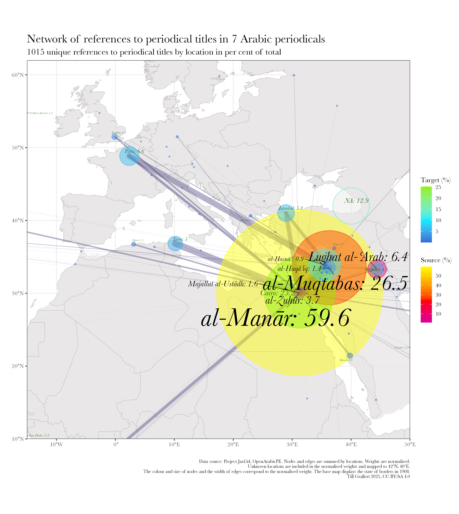
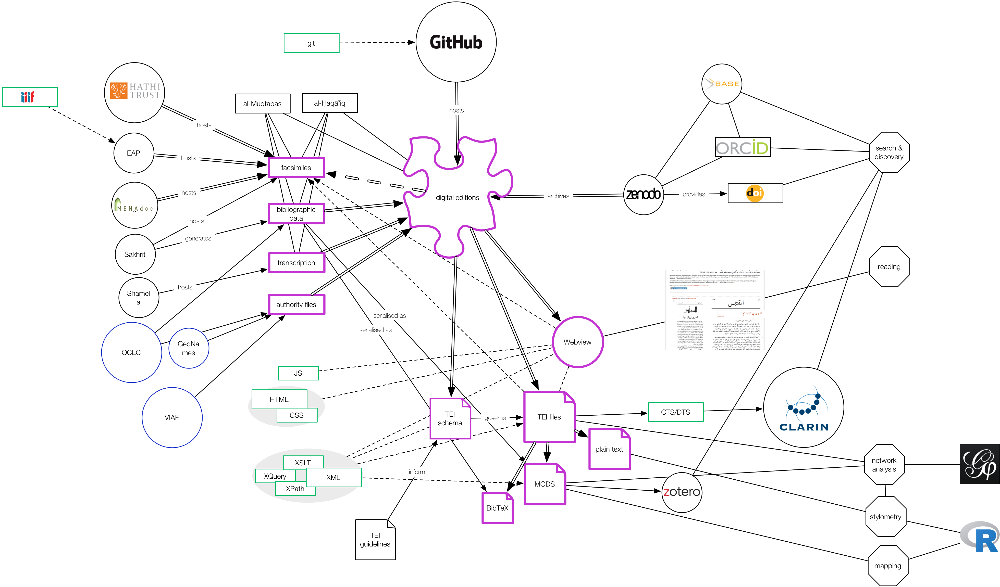

# Introduction
## My background
### Research interest: intellectual networks

::: columns
:::: wide

{#fig:network-authors}

::::
:::: narrow

### Aims

- empirical testing of hypotheses
- evaluate existing literature


::::
:::

::: notes

- very limited overlap between periodicals from the same place
- core network (14 of 319 nodes):
    - absent from the literature
    - suprising set up: many Iraqis (6), few Syrians (2), few Christians (2)
- of the 14, Ayalon mentions only ʿIsā Iskandar al-Maʿlūf 
:::

## My background
### Research interest: intellectual networks

::: columns
:::: column

{#fig:network-periodicals}

::::
:::: column

{#fig:map-referenced}

::::
:::

## My background
### Data requirements


::: columns-3
:::: column

### modelled text

+ e.g. "The newspaper *al-ʿAṣr al-Jadīd* from Damascus reported in its last issue that ..."
+ (semi)automated extraction based on
    * named entity recognition (NER)
+ problems
    * state of OCR/HTR
    * state of Layout recognition
    * state of NER

::::
:::: column

### structured bibliographic metadata

+ e.g. "*Sātisnā* dispatched this report from *al-Shahbāʾ*"
+ (semi)automated extraction based on
    * presence of information in the material artefact
    * a modelled digital surrogate
+ problems
    * absence of explicit information

::::
:::: column

### authority files / norm data

- *Sātisnā*
    + Pseudonym and anagramme of *Anastās al-Karmilī*, editor of *Lughat al-ʿArab* in Baghdad
- *al-Shahbāʾ*, "the grey"
    + one of the epithets of Aleppo
    + geo coordinates: `36.20124, 37.16117`
- problems
    + bias on Global North in form and content

::::
:::

# What we are up against
## Levels of (post)colonial absences

::: columns-3
:::: narrow

 for "[مرآة الشرق]{lang="ar"}"](../assets/zdb_mirat-ar.png){#fig:mirat-ar}

::::
:::: wide

1. limited knowledge of the "original" artefact
2. survival and collection bias leads to digitisation bias
3. networked digital infrastructures and global capitalism
4. *linguistic imperialism* and the digital artefact 
5. digital divides between the global south and the global north

::::
:::: narrow

 (Original in Princeton) outside the USA](../assets/hathi_muqtabas-1.png){#fig:hathi-muqtabas-global}

::::
:::

::: notes

1. limited knowledge of the "original" artefact
2. survival and collection bias leads to digitisation bias
    - jaraid data 
3. digital infrastructures and capitalism
    - minimise cost of digitisation
        + outsourcing to cheap workers without domain knowledge
        + outsourcing to vendors with technology stack is not tailored to the artefact
    - maximise rent: sell to the rich
        + data silos
        + paywalls
        + geofencing
        + no APIs
4. linguistic imperialism and the digital artefact
    - data: 
        - character encoding -> transliteration
        - automated layout and text recognition
        - data models
        - NER
    - interfaces
        + languages of the global north
        + search queries normalised to ASCII
5. digital divide and affordances of the Global South
    - electricity
    - internet connections
    - literacy

>'Linguistic imperialism' is shorthand for a multitude of activities, ideologies, and structural relationships. Linguistic imperialism takes place within an overarching structure of asymmetrical North/ South relations, where language interlocks with other dimensions, cultural (particularly in education, science, and the media), economic and political

<cite>[@Phillipson1997RealitiesAndMyths, 239]</cite>

>The basis for the codes, languages, methodologies, and technical instruments of the digital humanities is English; the written and spoken language of all the main conferences, the most prestigious journals, the institutions that control the discipline, the organizations and international consortia, and the central authorities of knowledge is, with few exceptions, some dialect of British or American English.

<cite>[@Fiormonte2021Taxation, 334-335]</cite>

:::

# Proposal: <br/>contribute to the *digital commons* without the help we can't get
## Contributing to the *digital commons* <br/> without the help we can't get

::: columns
:::: column

### ideas

- unite **existing** gray transcriptions with digital facsimiles
- learn from free and open-source software development
<!-- - model everything to make components citable -->
<!-- - harvest, generate, validate and share open metadata -->

### aims

<!-- + **validate** and **improve** the transcription with the facsimiles -->
<!-- - **train** text and layout recognition algorithms to make the textual heritage accessible to digitisation efforts -->
<!-- - **citable** for scholars, **linkable** for machines to facilitate use and adoption of the resources -->
<!-- - **open licences** to facilitate re-use -->

- make Arabic periodicals **accessible** on a shoestring budget
- **validate** and improve utilization of transcriptions
    + reliablity: content and citations
    + accessibility: for readers and computational analysis
    + ground truth for ML-based OCR/HTR
- establish an open, sustainable **infrastructure** of workflows, models, authority files
<!-- - With the affordances of the Global South -->

::::
:::: column

### minimal computing principles

- build what **we need** with what **we have** at hand
- as **few** as possible, **open** and **established** formats and tools
- running on **our** hardware
- with **our** skills and knowledge
- **free-to-use** platforms without lock-in of data

### our constrains

- funding
- internet connections
- electricity

::::
:::

::: notes

- minimal computing
- meaningful connectivity: focus on practicability instead of principled stance
- result: bootstrapped scholarly editions

:::

# Minimal Computing to the rescue
## Building what **we need** with what **we have** at hand

>minimal computing connotes digital humanities work undertaken in the context of some set of constraints. This could include lack of access to hardware or software, network capacity, technical education, or even a reliable power grid

<cite>[@RisamGil2022Introduction, §3]</cite>

>this implies learning how to produce, disseminate, and preserve digital scholarship ourselves, without the help we can’t get, even as we fight to build the infrastructures we need at the intersection of, with, and beyond institutional libraries and schools.

<cite>[@Gil+2016, 29]</cite>


::: notes

- minimal computing is a result of GO::DH and events and conditions in Cuba
- Alex Gil's ideas resonated with me, upon meeting in Beirut in April 2015

:::

## What do we need?

<!-- We need to digitise the cultural record -->

>Indigenous peoples have the right to revitalize, use, develop and transmit to future generations their histories, languages, oral traditions, philosophies, writing systems and literatures, and to designate and retain their own names for communities, places and persons.

<cite>[@UNDRIP2007, §13]<cite>

::: notes

The human condition, historically, is one of multilinguality. People speak different languages, dialects, sociolects etc. in different contexts: at home, at work, at social gatherings, for worship etc.. Sometimes we share a language with people across geographic distances, just as in this meeting, and sometimes, we do not understand our direct neighbours.

:::

::: columns
:::: column

### Access

- Societies of the Global South have a right to access their own cultural record
- Scholarship can immensely profit from broadening the scope of our sources

### Preservation

- Periodicals are a volatile and dispersed cultural artefact
- libraries, archives, personal collections are under threat of destruction, defunding, neglect

::::
:::: column

{#fig:gaza-mosque}

::::
:::

::: notes

We need to digitise the cultural record

:::


## Centering the *we* in "what do we need?"

::: columns
:::: column

*we* is defined by shared 

- interests
- ethics, e.g.
    + [FAIR](https://www.go-fair.org/fair-principles/) principles
    + [CARE](https://www.gida-global.org/care) principles
    + -> digital commons

::::
:::: column

*we* defines

- the specific context and and working conditions
- our access to skills, methods, labour time, tools, materials ...

::::
:::

::: notes

- FAIR: **F**indability, **A**ccessability, **I**nteroperability, **R**euse
- [CARE](https://www.gida-global.org/care): **C**ollective benefit, **A**uthority to control, **R**esponsibility, **E**thics 
    + developped in the context of indigenous communities

:::


## What about the *minimal* in minimal computing?

<!-- add images -->

::: columns
:::: column

### from a position of privilege

- minimalism as an end in itself
    + destroying resources already at hand
    + fashion
    + purist principles

 selling luxury kitchens](../assets/bulthaupt.png){#fig:bulthaupt}

::::
:::: column

### from a position of exclusion

- minimalism as a means to an end
    + balance our needs against the resources at hand
    + acknowledge the inevitable impact of our actions
    + minimal computing as *meaningful* computing

](../assets/SchutteLihotzky_FrankfurtKitchen_MIA_2004195_001.jpg){#fig:bauhaus}

::::
:::


::: notes

1. minimalism as an end
    - resource-intensive
    - example: Mary Condo
    - example: purist computing infrastructures
        + you got to run your own server and never use evil platforms
2. minimalism as a means to an end 
    + meaningful connectivity
    + original Bauhaus / modernist design:
        * form follows function to 
            - decrease the cost of industrial production
            - increase the material benefits of the expended resources

:::

## Finally, there is computing

::: columns
:::: column

- use what we already know
- use what we can afford long-term
- do not impose unnecessary costs on our users
- do not waste resources to the detriment of our planet

::::
:::: column

- learn techniques new to us
- develop skills

::::
:::

::: columns
:::: column

](../assets/website_dhcc.png){#fig:website-dhcc}

{.c_logo .c_qr .c_right}


::::
:::: column

"](../assets/website_project-endings-principles.png){#fig:endings-principles}

{.c_logo .c_qr .c_right}

::::
:::


::: notes

- first column
    + proven technologies and established standards
    + not the latest framework
        * think of what we do as space travel: Voyager I and II are still functioning with rudimentary computing powers
    + flat technology stacks
    + nothing shiny

:::


# Implementation 1: <br/>Publishing metadata on Wikidata
## The long tail of ASCII in discovery systems

::: columns-3
:::: column

How do we search for [[مرآة الشرق]{lang="ar"}](https://www.wikidata.org/wiki/Q124971778)?

- original Arabic: [مرآة الشرق]{lang="ar"}
- original Latin: Meraat al-Sherk
- IJMES: Mirʾāt al-Sharq
- DMG: Mirʾāt aš-Šarq
- Buckwalter: mrMp Alcrq

.](https://images.eap.bl.uk/EAP119/EAP119_1_24_1/1.jp2/full/600,/0/gray.jpg){#fig:mirat}

::::
:::: column

### failure

- Arabic script (data or interface)
- IJMES
- removing or substituting *hamza* and *ʿayn*: `mir'at sarq`

 for "mir'at sarq"](../assets/zdb_mirat-ar-Latn-hamza.png){#fig:zdb-hamza}
 

::::
:::: column

### success

- original Latin title
- DMG
- removing all diacritics and articles: `mirʾat sarq`

 for "Mirʾāt aš-Šarq"](../assets/zdb_mirat-ar-Latn-x-dmg.png){#fig:zdb-dmg}

::::
:::

::: notes

- catalogue could be searched in Arabic but the data is missing
- catalogues are historical artefacts
    + digitisation of catalogues: NOT re-cataloguing of original material
        * card catalogue
        * ASCII OPAC
        * automated transcription of the card catalogue
        * human cataloguers depend on the technology they have at hand, which means they might be unable to enter the correct string
        * errors perpetuate
- Latin input is mostly reduced to ASCII
    + Hamza and ʿAyn escape this algorithm on ZDB
- determined article is not automatically removed
- The choices are not transparently documented
- no software on-screen keyboards provided
- additional problems
    + catalogues are inherently local documents
    + aggregated, if at all, on a national level
    + frequently accessible only through Web interfaces and not APIs

:::

## 1. Gather the data: [Project Jarāʾid](https://projectjaraid.github.io/) (2012--)

::: columns
:::: column

- Bibliographic record of **all** Arabic periodical titles published between 1798 and 1929
    - websites and open datasets ([TEI/XML][tei]) for more than 3500 periodicals
    - additional authority files for c.2700 persons, 220 places, 180 libraries
- Crowd-sourcing among scholars
- Networking and reconciling existing information: 
    - Integration of holding information from library catalogues such as ZDB, AUB, BnF, HathiTrust
    - Conversions from MARC, MODS, and HTML to 
    - Publish everything as Linked Open Data on [Wikidata](https://w.wiki/9UDd)

### Problems

- Sustainability of dataset and code
    - Unfunded collaboration with Adam Mestyan (Duke)
- Findability
- Usability of static, monolingual website
- Interoperability

::::
:::: column

```xml
<biblStruct source="https://projectjaraid.github.io oape:org:420" subtype="journal" type="periodical">
   <monogr>
      <title level="j" xml:lang="ar">الوقائع المصرية</title>
      <title level="j" source="https://projectjaraid.github.io" xml:lang="ota-Latn-x-ijmes">Veḳāʾiʿ-i Miṣriye</title>
      <title level="j" source="oape:org:420" xml:lang="ota-Latn-x-dmg">Weqāyi'-i miṣrīye</title>
      <title level="j" source="https://projectjaraid.github.io" xml:lang="ar-Latn-x-ijmes">al-Waqāʾiʿ al-Miṣriyya</title>
      <title level="j" source="https://projectjaraid.github.io" xml:lang="ota">وقايع مصرية</title>
      <title type="sub" xml:lang="ar">جريدة رسمية للحكومة المصرية</title>
      <idno type="OCLC">243469010</idno>
      <idno type="OCLC">299999503</idno>
      <!-- ... -->
      <idno type="oape">281</idno>
      <idno type="wiki">Q4703322</idno>
      <idno type="zdb">2457471-5</idno>
      <textLang mainLang="ar"/>
      <editor source="../../../../TEI/oclc_165855925/tei/oclc_165855925-v_3.TEIP5.xml#p_775.d2e5787">
         <persName ref="viaf:96964876 oape:pers:2863 wiki:Q981929" xml:lang="ar">
            <forename xml:lang="ar">رفاعة</forename>
            <surname xml:lang="ar">الطهطاوي</surname>
         </persName>
      </editor>
      <editor source="../../../../TEI/oclc_165855925/tei/oclc_165855925-v_3.TEIP5.xml#p_2236.d2e17318">
         <persName ref="oape:pers:3667 wiki:Q328734" xml:lang="ar">
            <forename>سعد</forename>
            <surname>زغلول</surname>
         </persName>
      </editor>
      <!-- ... -->
      <imprint>
         <date type="onset" when="1828-12-03"/>
         <pubPlace>
            <placeName ref="geon:1146359 jaraid:place:6 oape:place:468" xml:lang="ar">بولاق</placeName>
         </pubPlace>
         <!-- ... -->
      </imprint>
   </monogr>
</biblStruct>
```

::::
:::

## 2. Import data to Wikidata

::: columns-3
:::: column

### Wikidata

- community driven
    - integrated into larger knowledge environments
- multilingual by design
- largest public knowledge graph
    - 5-star *linked open data*
    - FAIR, [CC][cc]0 licenses
- Open software stack

::::
:::: column

### Workflow

1. Create a data model (schema)
1. Import [TEI/XML][tei] in [OpenRefine](https://openrefine.org)
    - [XSL](https://github.com/OpenArabicPE/convert_tei-to-bibliographic-data/xslt/convert_tei-to-wikidata-import_file.xsl) for transforming [TEI/XML][tei]  to custom XML
2. Reconcile entities with [Wikidata][wd] items
4. Create new [Wikidata][wd] items for unreconciled entities
5. Link items and enrich with local data 

::::
:::: column

](../assets/wikidata_Q4703322.png){#fig:wikidata-Q4703322}

::::
:::

::: notes

- reconciliation:
    - suffers from the same problems as any other discovery system: string matching is insufficient
    - allows for complex queries
:::

## 3. Query Wikidata

::: columns-3
:::: column

<iframe src="https://query-chest.toolforge.org/redirect/aDYfGc5U3MCeOaWIg0OcKoYK2MMweuiOo8KGA26yOib" title="Palestinian periodicals before the Nakba: digitised titles"></iframe>

::::
:::: column

### Pros

- Multilingual interface and dataset
- Allows complex queries ([SPARQL][sparql], APIs)

### Cons

- Complex queries require knowledge of [SPARQL][sparql] (click on the links to the left and right)

::::
:::: column

### Sample queries

- [All Arabic periodicals published before 1930, including information on holdings and digitised copies][rq:periodicals-lang_ar-basic]
- [Map of all Arabic periodicals][rq:periodicals-lang_ar-basic-disp_map]
- [Arabic periodicals, ranked by number of digitised collections][rq:count-digitised]
- [Map of Arabic periodicals with kown holdings. Periodicals are mapped to the location of the holding institution][rq:holdings_periodicals-lang_ar-disp_map]
- [Bubble graph of collections of Arabic periodicals][rq:holdings_periodicals-lang_ar-disp_bubble]

::::
:::

## 4. Archive data

[all dependencies will break eventually]{.keyphrase}

::: columns
:::: column

- Everyone can edit Wikidata
- WikiMedia will fold
- One might need to cite a specific version

::::
:::: column

- [SPARQL][sparql] and RESTful APIs to the rescue
    - save a copy local copy of the graph
- `bash` script as a wrapper
- deploy via [GitHub][github], [GitLab][gitlab] actions for periodic runs
- push periodic release to publicly-funded, open repository ([Zenodo][zenodo]) for long-term preservation
    + make sure to add [ORCID][orcid]s for all contributors
    + provides versioned [DOI][doi]s

::::
:::


# Implementation 2: <br/>Workflow for digital scholarly editions ([OpenArabicPE](https://openarabicpe.github.io), 2015--)
## 1. get the data

::: columns
:::: column

- facsimiles
    + link to existing facsimiles from [British Library's "Endangered Archives Programme" (EAP)](http://eap.bl.uk/), <!-- [HathiTrust](http://hathitrust.org/), --> [Translatio Bonn](https://digitale-sammlungen.ulb.uni-bonn.de/topic/view/3085779), [*Arshīf al-majallāt [...] al-ʿarabiyya*](http://archive.alsharekh.org/) etc., preferably through [IIIF](https://iiif.io/)
    + scan/ photograph your physical artefacts (at the lowest sustainable resolution)
- text
    + scrape existing transcriptions from [*shamela.ws*](http://shamela.ws/index.php/book/26523), et al.
    + use [Transkribus](https://transkribus.eu/), [eScripta](https://escripta.hypotheses.org)/[eScriptorium](https://www.https://escriptorium.fr/) for HTR (with our model trained on 1000+ pages from the OpenArabicPE corpus)


::::
:::: column

EPub (HTML) for *al-Zuhūr* 2(4) from shamela.ws

```html
<div dir="rtl" id="book-container">
    <hr/>
    <a id='C232'></a>
    <span class="title">صحافة سورية ولبنان</span><br /><span class="red">3 - </span>المجلات<br />هذه مقالتي الثالثة عن صحافة سورية ولبنان. . . ولا يخفى أن للانقلاب العثماني الأخير فضلاً عظيماً على هذه المجلات التي أنا ذاكر. فمل يكن منها قبل إعلان الدستور إلا مجلة المشرق ومجلة المقتبس.<br />أما بقية المجلات فقد صدرت في العامين الأخيرين كما يظهر لك في هذا المقال.<br />وقد اجتهدت، في هذا القسم، أن أذكر تاريخ صدور لهذه المجلات متخيراً أوثق المصادر في ذلك فأقول:<br />
</div>
```

OCR output from Transkribus for *al-Ḥasnāʾ* (PAGE XML)

```xml
<TextLine id="r1l5" custom="readingOrder {index:4;}">
    <Coords points="470,548 2191,527 1648,462 470,464"/>
    <Baseline points="480,542 565,540 650,537 735,534 820,533 905,531 990,530 1075,528 1160,528 1245,527 1330,527 1415,527 1500,527 1585,527 1670,528 1755,528 1840,530 1925,531 2010,531 2095,534 2180,536"/>
    <TextEquiv>
        <Unicode>من عسر سنوات مجلة بسائة في الاستارة اعتمد في تحريرها على أقلامهن فزيئها</Unicode>
    </TextEquiv>
</TextLine>
```
::::
:::

::: notes

- IIIF allows to set a very low quality to reduce bandwidth and traffic
- what do you need to know
    - HTML
    - XML
    - JSON: for IIIF
    - wget, cURL: for scraping

:::

## 2. model the data

Structure the text string into issues, sections, articles with bylines ...

::: columns
:::: column

- widely accepted standard for textual editions: [Text Encoding Initiative][tei] (TEI/XML)
    - active community
    - pre-requisite for grant funding
    - easy to archive (XML = plain text)
- re-use / adapt domain specific encoding schemas within the TEI
- try to script basic modelling using patterns in your source text:
    + regular expressions
    + XSLT, Python, R, whatever you are most comfortable with
- automatically model derivative bibliographic data: MODS, METS, BibTeX, ...

::::
:::: column

The same section of *al-Zuhūr* 2(4) modelled in TEI

```xml
<body xml:lang="ar">
<pb corresp="../epub/shamela_36534/OEBPS/xhtml/P744.xhtml" ed="shamela" n="n2-p184"/>
<pb ed="print" edRef="#edition_1" facs="#facs_184" n="184"/>
    <div prev="oclc_1034545644-i_13.TEIP5.xml#div_1.d2e2766" subtype="article" type="item" xml:id="div_1.d2e634">
        <head>صحافة <placeName>سورية</placeName> و<placeName>لبنان</placeName></head>
        <div type="section" xml:id="div_3.d2e1200">
            <head> ٣ - المجلات</head>
            <p>هذه مقالتي الثالثة عن صحافة سورية ولبنان. . . ولا يخفى أن للانقلاب العثماني الأخير فضلاً عظيماً على هذه المجلات التي أنا ذاكر. فلم يكن منها قبل إعلان الدستور إلا <bibl>مجلة <title level="j">المشرق</title></bibl>  و<bibl>مجلة <title level="j">المقتبس</title></bibl> .</p>
            <p>أما بقية المجلات فقد صدرت في العامين الأخيرين كما يظهر لك في هذا المقال.</p>
            <p>وقد اجتهدت، في هذا القسم، أن أذكر تاريخ صدور لهذه المجلات متخيراً أوثق المصادر في ذلك فأقول:</p>
        </div>
    </div>
</body>
```

::::
:::

::: notes

- why TEI?
    + I knew it already
    + widely adopted standard in the digital editing world
    + necessary for grant-funding in the Global North
- why not TEI
    + steep learning curve
    + not particularly well-suited to Arabic texts?

:::

## 3. edit the data

::: columns
:::: column

- make use of version control <!-- and stable IDs (e.g. [ORCID](https://orcid.org)) --> for **transparent authorship attribution** and **damage control**:
    + [.git](https://git-scm.com/) is open source and available for all OSs
- plain-text (including XML) editors
    + should be **syntax aware**
    - **RTL**: support in text editors is a mixed bag

](../assets/vscode_zuhur.png){#fig:zuhur-vscode}

<!-- ](../assets/sublime_zuhur.png) -->

<!-- ](../assets/textmate_zuhur.png) -->

::::
:::: column

- XML editors proper
    + should be **schema aware** to validate the encoding
    - **RTL**:
        1. [oXygen XML editor](https://www.oxygenxml.com/) (158 USD [2024]) allows to separate content and tags<!-- : [TextGrid Lab](https://textgrid.de/index) -->
        2. [Visual Studio Code](https://code.visualstudio.com/) (free) with the right extensions is a viable second

's  author mode. Styling relies on CSS.](../assets/oxygen_zuhur-author.png){#fig:zuhur-oxygen}

::::
:::

::: notes

- editing tools depend on modelling decisions and file formats

:::

## 4. save and share the data

::: columns
:::: column

- facsimiles: [Internet Archive][internetarchive] (supports [IIIF][iiif])
- working copy of everything else: distributed version control platforms ([GitHub][github], [GitLab][gitlab])
- longterm preservation: publicly-funded, open repository ([Zenodo][zenodo])
    + make sure to add [ORCID][orcid]s for all contributors
    + provides versioned [DOI][doi]s
- authority data (people, titles, etc.): [Wikidata][wd]
- provide suitable open licenses for re-use: [Creative Commons][cc], [MIT](), Public Domain (CC0)

::::
:::: column

](../assets/zenodo_zuhur.png){#fig:zuhur-zenodo}

::::
:::

## 5. present the data
<!-- ### presentation layers and access for human readers -->

::: columns
:::: column

- Generate static webviews
    + removes need for backend and minimises traffic
    + easy to archive
    - on the fly: XSLT1 ([TEI Boilerplate](http://dcl.slis.indiana.edu/teibp/)) or JS ([CETEICEan](https://github.com/TEIC/CETEIcean)) to render XML files in the client's web browser
    - pre-computed: [GitHub actions](https://github.com/features/actions) give access to virtual machines
- Hosting: [GitHub Pages](https://pages.github.com/) can expose your data repository to the web
- bibliographic database: [Zotero group](https://www.zotero.org/groups/openarabicpe/items/)
    + mitigates against the absent backend
    + **browse** and **search** independent of file structure
- full-text search across the entire corpus: [Google's programmable search engine](https://cse.google.com/cse?cx=012251040084107011117:jof1v_ejndo)

::::
:::: column


": details in mobile view](../assets/zotero-group_openarabicpe-mobile-details_small.png){#fig:zuhur-zotero}

](../assets/boilerplate_zuhur-v_2-i_4_small.png){#fig:zuhur-webview}

<!-- ": search in mobile view](../assets/zotero-group_openarabicpe-mobile-search.png) -->

::::
:::

## Resulting Corpus


| Title                                                                           | Place             | Proprietor                    | DOI                                                                | Volumes  | Issues  | Articles | Words   |
| ------------------------------------------------------------------------------- | ----------------- | ----------------------------- | ------------------------------------------------------------------ | -------: | ------: | -------: | ------: |
| [al-Ḥaqāʾiq](https://www.github.com/openarabicpe/journal_al-haqaiq)                | Damascus          | Abd al-Qādir al-Iskandarānī   | [10.5281/zenodo.1232016](https://doi.org/10.5281/zenodo.1232016)   | 3        | 35      | 389      | 298090  |
| [al-Ḥasnāʾ](https://www.github.com/openarabicpe/journal_al-hasna)               | Beirut            | Niqūlā Bāz                    | [10.5281/zenodo.3556246](https://doi.org/10.5281/zenodo.3556246)   | 1        | 12      | 201      | NA      |
| [al-Manār](https://www.github.com/openarabicpe/journal_al-manar)                | Cairo             | Muḥammad Rashīd Riḍā          |                                                                    | 35       | 537     | 4300     | 6144593 |
| [al-Muqtabas](https://www.github.com/openarabicpe/journal_al-muqtabas)             | Cairo, Damascus   | Muḥammad Kurd ʿAlī            | [10.5281/zenodo.597319](https://doi.org/10.5281/zenodo.597319)     | 9        | 96      | 2964     | 1981081 |
| [al-Ustādh](https://www.github.com/openarabicpe/journal_al-ustadh)              | Cairo             | Abdallāh Nadīm al-Idrīsī      | [10.5281/zenodo.3581028](https://doi.org/10.5281/zenodo.3581028)   | 1        | 42      | 435      | 221447  |
| [al-Zuhūr](https://www.github.com/openarabicpe/journal_al-zuhur)                | Cairo             | Anṭūn al-Jumayyil             | [10.5281/zenodo.3580606](https://doi.org/10.5281/zenodo.3580606)   | 4        | 39      | 436      | 292333  |
| [Lughat al-ʿArab](https://www.github.com/openarabicpe/journal_lughat-al-arab)   | Baghdad           | Anastās Mārī al-Karmalī       | [10.5281/zenodo.3514384](https://doi.org/10.5281/zenodo.3514384)   | 3        | 34      | 939      | 373832  |
| **total**                                                                       |                   |                               |                                                                    | 56       | 795     | 9664     | 9311376 |


::: columns
:::: column

- TEI/XML files for each issue with structural mark-up on the article level
- mark-up of named entities in bylines


::::
:::: column

- authority files (TEI/XML)
- bibliographic metadata on the article level (MODS/XML, Zotero RDF, BibTeX)

::::
:::

## Final warning
### All dependencies will eventually break and need repair

::: columns
:::: column

- Reliance on external data providers: link rot
    - links to facsimiles broke twice in four years
- Reliance on free tools and services: link rot
    + URLs to our editions had to be changed once
- XSLT1 in web browsers: will fall victim to JSON and security features
    + over the last 5 years support has markedly decreased
- Full-text search across issues and periodicals without a backend
    + [Google's programmable search engines](https://cse.google.com/cse?cx=012251040084107011117:jof1v_ejndo): requires internet connection (and Google account!)

::::
:::: column

{#fig:components}

::::
:::


::: notes

Bootstrapping relies on the work of others


:::

# Thank you
## Thank you!

- Contributors to [OpenArabicPE](https://openarabicpe.github.io/): Jasper Bernhofer, Dimitar Dragnev, Patrick Funk, Talha Güzel, Hans Magne Jaatun, Daniel Kolland, Jakob Koppermann, Xaver Kretzschmar, Daniel Lloyd, Klara Mayer, Tobias Sick, Manzi Tanna-Händel, and Layla Youssef
- Contributors to [Project Jarāʾid](https://projectjaraid.github.io/): Hala Auji, Philippe Chevrant, Marina Demetriadou, Lamia Eid, Stacy Fahrenthold, Ulrike Freitag, Till Grallert, Rana Issa, Nicole Khayat, Peter Magierski, Leyla von Mende, Adam Mestyan, Christian Meier, Daniel Newman, Geoffrey Roper, Sinai Rusinek, Philip Sadgrove, Ola Seif, and Rogier Visser
- Links:
    + Project blog: <https://openarabicpe.github.io>
    + Papers: <https://doi.org/10.4324/9781003327677-7>, <https://doi.org/10.46298/transformations.14749>, <http://digitalhumanities.org/dhq/vol/16/2/000593/000593.html>
    + Mastodon: [\@tillgrallert\@digitalcourage.social](https://digitalcourage.social/@tillgrallert)
    + Email: <till.grallert@fu-berlin.de>, <till.grallert@hu-berlin.de>
- Licence: slides and images are licenced as [CC BY-SA 4.0](http://creativecommons.org/licenses/by-sa/4.0/)

## References {#refs}

[cc]: https://creativecommons.org/
[doi]: https://doi.org/
[github]: https://github.com/
[gitlab]: https://about.gitlab.com/
[iiif]: https://iiif.io/
[internetarchive]: https://archive.org
[orcid]: https://orcid.org
[sparql]: https://www.w3.org/TR/sparql11-query/
[tei]: https://tei-c.org/
[wd]: https://wikidata.org/
[zenodo]: https://zenodo.org/

<!-- external IDs -->

[rq:periodicals-lang_ar-filter_ids-hathi]: https://query-chest.toolforge.org/redirect/rLaytNA78qsiw2uAuusEMCwESG8yEwqIOWE2AOwwoIZ
[rq:periodicals-lang_ar-filter_ids-oclc]: https://query-chest.toolforge.org/redirect/kChWMCQzq2YAy6o0SsAikiouKgIMaqWIos0WwkwuCoa


<!-- links -->

[rq:publications-transliterated-title]: https://query-chest.toolforge.org/redirect/dSZmMD4FSCeucOakcKCuKkYSg6wo8GCeyO8YqugMe2z 

[rq:periodicals-holdings-2024-03-18]: https://query-chest.toolforge.org/redirect/eKwMLGU9oGqiEqCI2OUqKw2uy60KoKscqQgsWmwcaU6 

[rq:arabic-periodicals-images]: https://query-chest.toolforge.org/redirect/nNIwitQHCq02U4Ww8MwIGS4EcY4y6qCO2uOWqGwWoGU 


<!-- basic tables -->

[rq:periodicals-lang_ar-basic]: https://query-chest.toolforge.org/redirect/5NZuEN6OBMmiWm0IoYYU6caa2q6AKeqUKEKe0uqy4Ml

[rq:count-collections]: https://query-chest.toolforge.org/redirect/wnhAUtiqI4MQyW0MOsqAyOqOwSuE6iSUcU28oCUAqkY 

[rq:count-digitised]: https://query-chest.toolforge.org/redirect/JwwYdMXGLosUGeSKCucwckW0gMmEqAY2Uosa2MiMYev

<!-- maps -->

[rq:periodicals-lang_ar-basic-disp_map]: https://query-chest.toolforge.org/redirect/KkTnCUlWc4MI6WKwSm6CeY4GM8EGOyScEsi4Sw0oOq4

[rq:map-periodicals-ota-cluster]: https://query-chest.toolforge.org/redirect/wLTnRa9d2GceWkacK6Ek8uSUaWIGaamSsqe8C6kaMCI 

[rq:map-periodicals-all-2024-03-18-cluster]: https://query-chest.toolforge.org/redirect/8K4bVhyOmm6seAwkmiIqsGEEY4yCooU6YMGsKSYQ2Eb 

[rq:map-periodicals-all-2024-08-08-cluster]: https://query-chest.toolforge.org/redirect/mYSKHVP1qQamkCeYQmSsKMWMGwg266UqEayEcYwgUy7 

[rq:map-periodicals-`ar-`2024-03-18-cluster]: https://query-chest.toolforge.org/redirect/LAwIgT9wqucyaW0mCQ0Ms2uKGUmygM6mwcSIuKKKyc0 

[rq:map-periodicals-ar-2024-08-08-cluster]: https://query-chest.toolforge.org/redirect/obqUZJy6sY448EAesSQSaW80kAsYucuIiE8sO8kY2Gd 

[rq:map-periodicals-ota-2024-08-01-cluster]: https://query-chest.toolforge.org/redirect/7c5YPWykbICAWcWaAYqYwMqEo6qUaaou0WaIugIqGYu

<!-- counts -->

[rq:count-arabic-periodicals-2024-03-18]: https://query-chest.toolforge.org/redirect/oYNezk1fgs8UQyCQoKsSemEiWu6oiWSAq0As6k2QISv 

[rq:count-periodicals-all-2024-03-18]: https://query-chest.toolforge.org/redirect/BGlKl7mq24UyuaKyESSwQMYUS4S2qgwgUg4OuuOYksf 

[rq:count-arabic-periodicals-2024-08-08]: https://query-chest.toolforge.org/redirect/eO3ox4S9FwUeY24gs24CU6OOqiI0WiYKiEKmggM46sn 

[rq:periodicals-lang_ar-digitised-count]: https://query-chest.toolforge.org/redirect/RAvRJunsMyIeGyeeIaCo6cCukCi6YCkik8sSIkGkAq9

<!-- languages -->

[rq:periodicals-filter_missing-lang]: https://query-chest.toolforge.org/redirect/xXzyJrwD4qGACuAcayGyGEW4AUE8G8Y8wmCMc8cqKwG

[rq:periodicals-layers_languages-disp_map]: https://query-chest.toolforge.org/redirect/uAOfzguDGgAA6Ma2yseCsOOmGOOmaq8Go6sQQ6YEMWh

[rq:languages-disp_bubble]: https://w.wiki/ArRb

[rq:bubble-lang-2024-03-18]: https://query-chest.toolforge.org/redirect/dMk3vPTaZkuiqe804Wqeqkmi8SooO260qSCmAG08MI7 

[rq:bubble-lang-2024-08-08]: https://query-chest.toolforge.org/redirect/26dFDncq2WMkmei8eg26qwISOKyMAmioq6Co8WwUIKQ 

[rq:periodicals-lang_ar-holdings-filter_count-1]: https://query-chest.toolforge.org/redirect/r9Gn5nKhkWUYgyYwOU08qAk64wWOQO4ycuCcsSi6Syc

[rq:periodicals-lang_ar-holdings-disp_map]: https://query-chest.toolforge.org/redirect/w3zZsU79KQEuYUk8kk2MEwGaQg08w0GkYo2wYSksGGY

[rq:holdings_periodicals-lang_ar-disp_map]: https://query-chest.toolforge.org/redirect/WvUD5eWjtQqKOEC02cQKmCQguM2okyIaAW46giAaGuX

[rq:holdings_periodicals-lang_ar-disp_bubble]: https://query-chest.toolforge.org/redirect/5jePPWeZe42UCWwCmYyIc2mmcW242euOIeaEUiS0O0j

<!-- holdings -->

[rq:periodicals-lang_ar-filter_collection-disp_map]: https://query-chest.toolforge.org/redirect/qmTkCttCikGMoCI8kSkS4Uq8MuyS8EyMKS6KaOQQqsf

[rq:periodicals-lang_ar-holdings-filter_count-1]: https://query-chest.toolforge.org/redirect/r9Gn5nKhkWUYgyYwOU08qAk64wWOQO4ycuCcsSi6Syc

[rq:periodicals-lang_ar-holdings-disp_map]: https://query-chest.toolforge.org/redirect/w3zZsU79KQEuYUk8kk2MEwGaQg08w0GkYo2wYSksGGY

[rq:holdings_periodicals-lang_ar-disp_map]: https://query-chest.toolforge.org/redirect/WvUD5eWjtQqKOEC02cQKmCQguM2okyIaAW46giAaGuX

[rq:holdings_periodicals-lang_ar-disp_bubble]: https://query-chest.toolforge.org/redirect/5jePPWeZe42UCWwCmYyIc2mmcW242euOIeaEUiS0O0j

<!-- specific regions -->

[rq:map-levant-1910-06]: https://query-chest.toolforge.org/redirect/v8e8UlL8s2gM46Ieou4UeMOimUSsyUS40uso0OAaIUL 

[rq:map-levant-1910-06-holdings]: https://query-chest.toolforge.org/redirect/W5asaV1sTwmMoAogKO8ckaoOgyIGU2Aq8QSQKWYkcSS 

[rq:map-levant-1910-06-digitised]: https://query-chest.toolforge.org/redirect/ZtdJnjhGtM4SGUks2GEYwcAmwKGeCmS8icSua0ISkwW 

[rq:palestine-1948_periodicals_map]: https://query-chest.toolforge.org/redirect/WSB7DBbD7oYkIU2k8KoksQkaauOu8ew8cEOs4CCyCID

[rq:palestine-1948_periodicals-holdings_map]: https://query-chest.toolforge.org/redirect/FastY9YqoKky0AAggWsk4mMeQW284SIOkIGGiEEMQKd

[rq:palestine-1948_periodicals-holdings_map-collection]: https://query-chest.toolforge.org/redirect/Bsfc1wk38K2WEaQk84qGkyeOkggEea8kGuSMqgGOEU1

[rq:palestine-1948_periodicals-digitised_map]: https://query-chest.toolforge.org/redirect/aDYfGc5U3MCeOaWIg0OcKoYK2MMweuiOo8KGA26yOib

<!-- editors -->

[rq:editors-disp_imagegrid]: https://query-chest.toolforge.org/redirect/vWy7oAd56GAWYscO0wyQkQ2M4UQmG4m4AMk8MiAcSEw

<!-- images -->
[rq:periodicals-lang_ar-image-disp_graph]: https://query-chest.toolforge.org/redirect/q8HKXkolw8uYgywMEgGsywuqWSMymGWyCEIEoiqku4Z

<!-- dimensions -->
[rq:periodicals-lang_ar-dimensions.rq]: https://query-chest.toolforge.org/redirect/1yFIBRrWui6qQQAGAimCOW8gYg08syeWCmIAkG0sSai