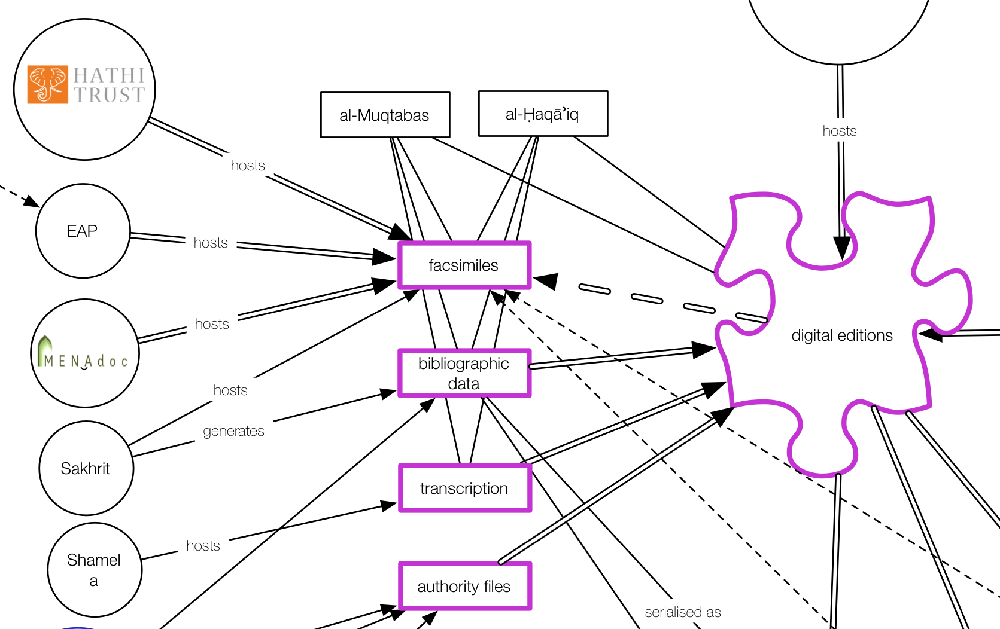
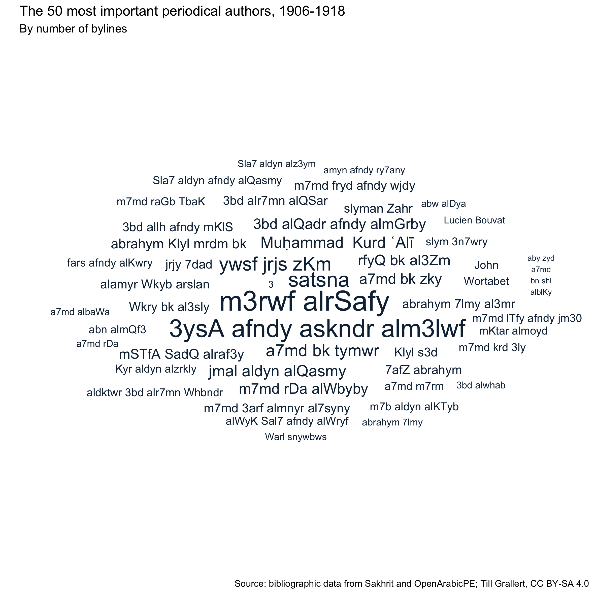
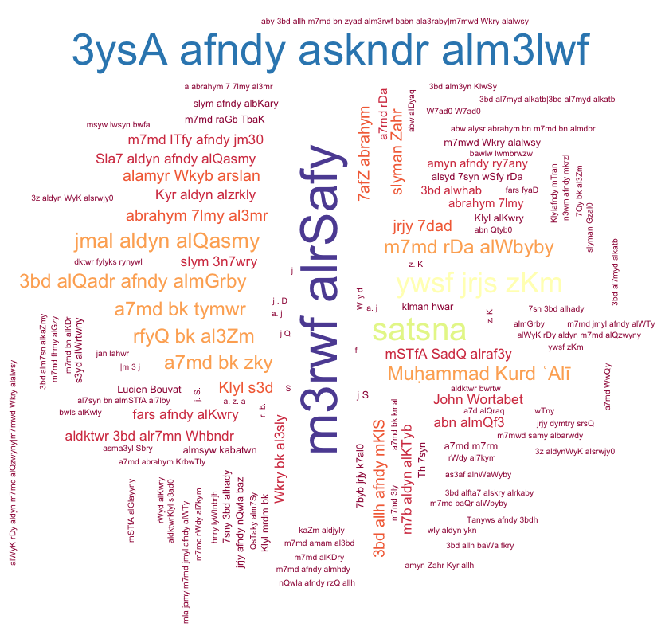
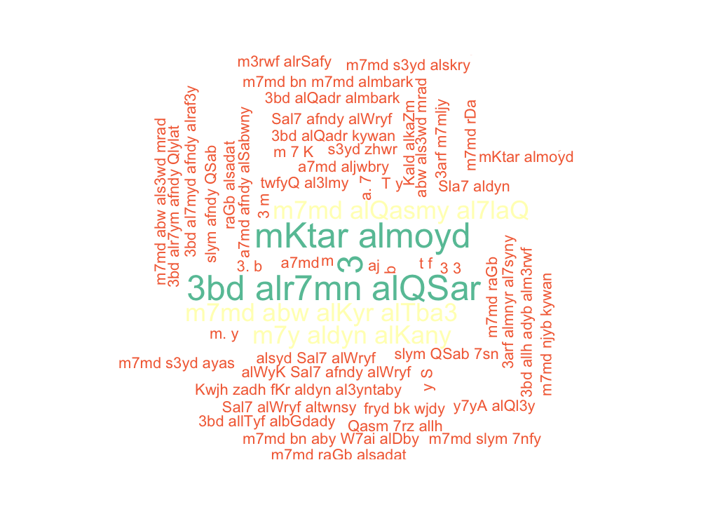
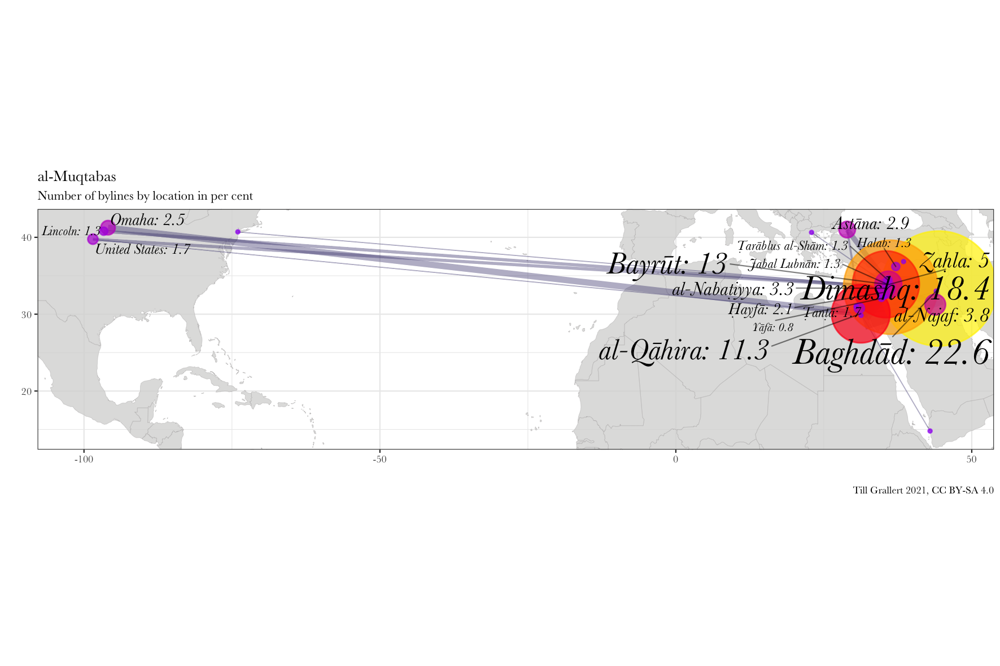
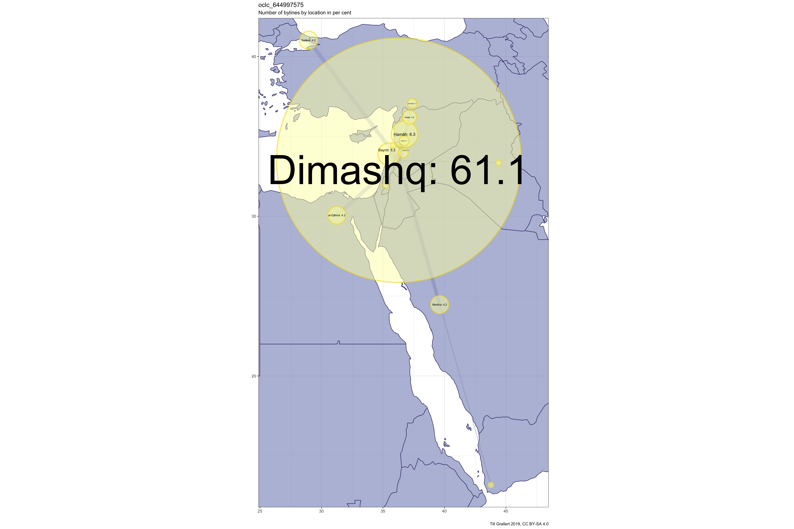
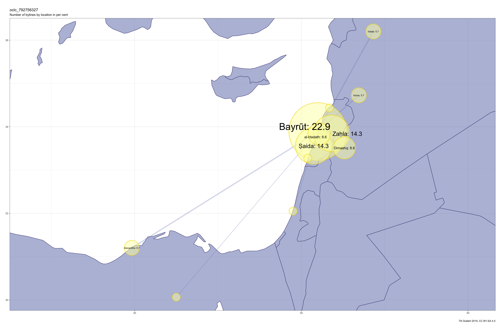
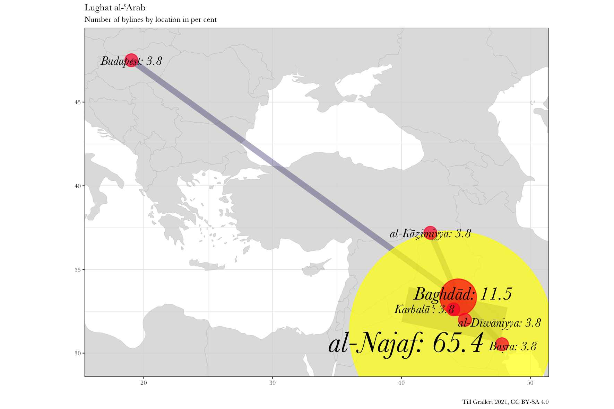
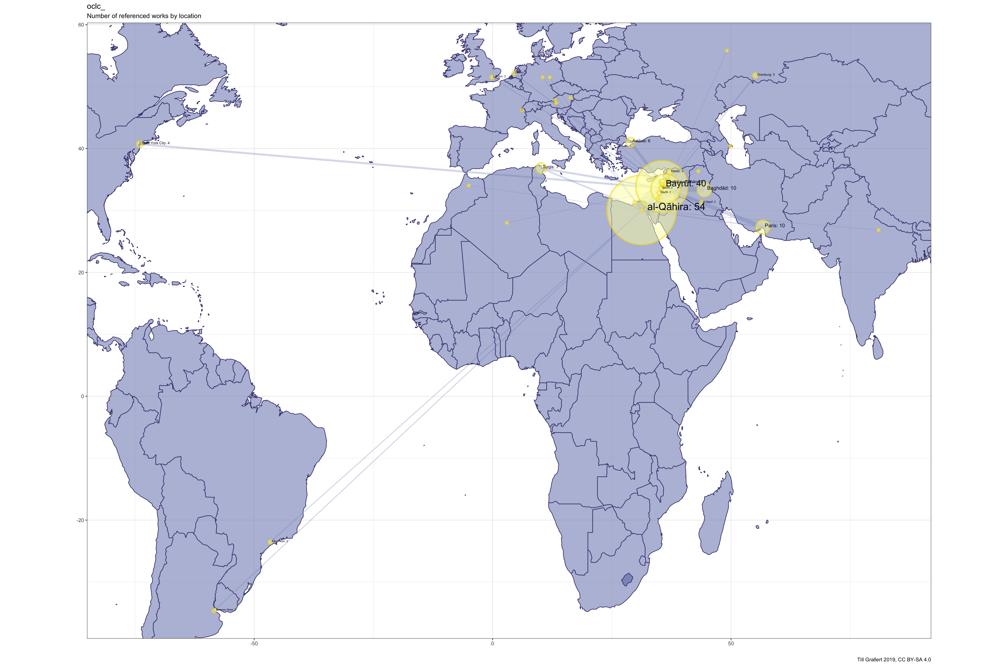

<!-- To do -->
<!-- - comments on collaborations -->


## Title slide

Till Grallert, Orient-Institut Beirut (OIB), @[tillgrallert](https://twitter.com/tillgrallert)

Turkologentag 2018, Bamberg

Slides: [https://OpenArabicPE.github.io/slides/2018-turkologentag/](https://OpenArabicPE.github.io/slides/2018-turkologentag/index.html)

## Outline of today's paper

1. The promised wasteland of *digitised* Arabic periodicals
2. OpenArabicPE: Overview
3. OpenArabicPE: Some details

# 1. The promised wasteland of *digitised* Arabic periodicals
## 1.1 Importance of mundane texts / periodicals

<!-- add core questions of today's presentation  -->

- They are at the core of various discourses
    + Modernity / -ism at the end of empire
    + Arabic renaissance
    + Arab nationalism
    + Islamic reform movement
- They form large corpora with an equal distribution along a temporal axis (*al-Muqtabas*: 12 yrs, *al-Manār*: 43 yrs, *al-Muqtaṭaf*: 76 yrs)
    + linguistic analysis
    + historical semantics
    + rich data sets for social history

## 1.2 A two-fold problem

1. Preservation:
    + Active **destruction** of cultural artefacts: iconoclasm, neoliberalism
    + **Decay** through neglect: fragile materiality
2. Access:
    + Absence / destruction of infrastructure / channels of knowledge transmission: lack of access to institutions, hardware, software, internet connections
    + widely-dispersed collections
    + absence of technologies: OCR
    <!-- + technical skills: lack of basic scripting skills -->

## 1.2 A two-fold problem


## 1.3 Digitisation as solution

1. Promise: instant **access** to 100s of **digitised** periodicals and 100.000s of issues
2. Expectations: answers to core questions
    - extent of text re-use
    - identify authors
    - track authors across periodicals
2. Reality
    - limited access
    - limited data
    - limited metadata


## 1.3 Digitisation as problem(s)
<!-- elaborate the problems:-->

It's **labour and resource intensive**. It really is!

1. get the data
    - text: transcription, train OCR/HTR
    - facsimiles: scanning
    - bibliographic metadata: transcription, validated iterative generation
2. transform the data into a human and machine readable edition
    - model the source
    - identify entities and link them to authority files
3. host, share and preserve the data

## 1.3 Digitisation as problem(s)

](../assets/maps/map_dhcenters.png)

## 1.4 State of digitisation
<!-- This should be a demo session, otherwise one needs screenshots -->
<!-- if the sub slides in this section are used, the content of this slide should be deleted -->

1. Text: "crowd"-sourced transcriptions / gray online libraries, e.g. [*al-Maktaba al-Shāmila*](http://shamela.ws/index.php/book/26523), [*Mishkāt*](http://almeshkat.net/), [*Ṣayd al-Fawāʾid*](http://saaid.net/), [*al-Waraq*](http://www.alwaraq.net/) etc.
    + lack of / faulty metadata
    + unknown editing principles
    + unknown quality
    + very limited structural mark-up
    + cannot be reliably cited
2. Facsimiles: [Endangered Archives Programme (EAP)](http://eap.bl.uk/database/overview_project.a4d?projID=EAP119;r=63), [HathiTrust](http://catalog.hathitrust.org/Record/100658549), [Institut du Monde Arabe](http://ima.bibalex.org/IMA/presentation/periodic/list.jsf?pid=9C82C139F9785E99D30089727B40A269) et al.
    + lack of metadata
    + limited licences, paywalls
    + no or very bad text layers
3. Metadata search within and across periodicals
    + **inexistent**

<!-- the following slides are too detailed for many purposes -->

## 1.4.1 state of digitisation: text

- "crowd"-sourced transcriptions / gray online libraries, e.g. [*al-Maktaba al-Shāmila*](http://shamela.ws/index.php/book/26523), [*Mishkāt*](http://almeshkat.net/), [*Ṣayd al-Fawāʾid*](http://saaid.net/), [*al-Waraq*](http://www.alwaraq.net/) etc.
    + lack of / faulty metadata
    + unknown editing principles
    + unknown quality
    + very limited structural mark-up
    + cannot be reliably cited
- Automated transcriptions (OCR): [HathiTrust](https://www.hathitrust.org/), East View's [Global Press Archive (GPA)](https://www.eastview.com/resources/gpa/crl-mena/)
    + partially hidden behind paywalls, geo-fencing
    + unknown quality but commonly extremly bad
    + no structural mark-up
    + proprietary interfaces, no APIs

## 1.4.1 state of digitisation: text

<div class="c_width-60 c_left">
<!-- ](../assets/shamela_muqtabas-1.png) -->

](../assets/shamela_muqtabas-annotated.png)

</div>
<div class="c_width-30 c_right">

- wrong metadata (volume, issue, page)
- limited structural mark-up

</div>

## 1.4.1 state of digitisation: text

<div class="c_width-50 c_left">

, state of OCR (only visible to US IPs)](../assets/hathi_muqtabas-ocr-3.png)

</div>
<div class="c_width-50 c_right">

, state of OCR](../assets/gpa_bashir-i_487-p_1_ocr.png)

</div>

## 1.4.2 state of digitisation: facsimiles

Digital imagery, e.g. [Endangered Archives Programme (EAP)](http://eap.bl.uk/project/EAP119), [HathiTrust](http://catalog.hathitrust.org/Record/100658549), [*arshīf al-majallāt al-adabiyya wa-l-thaqafiyya al-ʿarabiyya*](http://archive.alsharekh.org/newmagazineYears/125) <!-- formerly sakhrit -->

+ lack of metadata
+ limited licences, paywalls
+ no or very bad text layers

## 1.4.2 state of digitisation: facsimiles

](../assets/eap119-1-4-5-muqtabas-iiif.png)

## 1.4.2 state of digitisation: facsimiles

](../assets/hathi_muqtabas-1.png)

## 1.4.2 state of digitisation: facsimiles

](../assets/hathi_muqtabas-2.png)

## 1.4.2 state of digitisation: "fakesimiles"

<!-- original facsimile: [EAP](http://images.eap.bl.uk/EAP119/EAP119_1_4_4/463.jp2/full/800,/0/gray.jpg) -->

*al-Muqtabas* 5(7), pp.[463](https://openarabicpe.github.io/journal_al-muqtabas/tei/oclc_4770057679-i_54.TEIP5.xml#pb_61.d1e2036)--[466](https://openarabicpe.github.io/journal_al-muqtabas/tei/oclc_4770057679-i_54.TEIP5.xml#pb_64.d1e2045)

<div class="c_width-30">

](../assets/eap_muqtabas-v_5-i_7-p_463.jpg)

</div><div class="c_width-30">

<!-- shamela's transcription -->


</div><div class="c_width-30">

<!-- sakhrit's fake facsimile -->
!["fakesimile" from [*arshīf al-majallāt [...] al-ʿarabiyya*](https://archive.alsharekh.org/MagazinePages/Magazine_JPG/AL_moqtabs/Al_moqtabs_1910/Issue_7/605.JPG)](../assets/sakhrit_muqtabas-v_5-i_7-p_605.jpg)

</div>

## 1.4.3 state of digitisation: bibliographic metadata

- needs:
    + reliable bibliographic metadata on the article level
    + across periodicals
- reality:
    + no platform serving machine-actionable bibliographic metadata below the item level

## 1.4.3 state of digitisation: bibliographic metadata

<div class="c_width-60 c_left">

](../assets/eap119-1-4-5-muqtabas-iiif-metadata.png)

</div>
<div class="c_width-30 c_right">

- *hijri* calendar in the original
- Gregorian calendar in the metadata

</div>

# 2. Open Arabic Periodical Editions (OpenArabicPE): Overview<!-- : Unite facsimile and transcription and generate reliable metadata -->
## 2.1 Aims and principles

1. ideas:
    - unite **available** facsimiles and transcriptions
    - harvest, generate, validate and share open metadata
2. aims
    + **validate** the transcription against the facsimiles
    - **improve** the transcription
    - **train** text and layout recognition algorithms
    - **citable** for scholars, **linkable** for machines
    - share all data, metadata and tools with the broadest possible licences to facilitate access and re-use
3. principles
    - re-purpose **available** and **established** tools, technologies, and material
    - preference for **open**, **free**, and **simple** formats and tools

## 2.2 Deliverables: basic components

1. XML/TEI editions with their own [schema for Arabic periodicals](https://github.com/OpenArabicPE/OpenArabicPE_ODD)
    + text links to open-access digital facsimiles
2. Structured bibliographic metadata (MODS, BibTeX)
    + based on XML editions
    + scraped from the web and validated
    + generated through iteration
3. Scripts to
    + scrape full text / bibliographic information from the web
    + convert scraped information into TEI, MODS, BibTeX
    + generate bibliographic data through iteration
    + improve the TEI mark-up

## 2.2 Deliverables: Core features

1. Open licences: [CC BY-SA 4.0](http://creativecommons.org/licenses/by-sa/4.0/) (TEI, MODS, BibTeX), MIT license (XSLT, XQuery)
1. Social digital editions hosted on [GitHub](https://github.com): gradually improve transcription and mark-up
2. Releases are archived at [Zenodo](https://zenodo.org): receive a DOI for reliable citation
3. [Static web-view](https://github.com/tillgrallert/tei-boilerplate-arabic-editions)<!--  (doesn't require a permanent internet connection) -->: provides side-by-side view of facsimiles and text
4. Access to bibliographic metadata through a public [Zotero group](https://www.zotero.org/groups/openarabicpe)

<!-- mention: process of cleaning data and disambiguation of entities -->

<!-- ](../assets/boilerplate_muqtabas.png) -->

## 2.3 Summary


# 3. OpenArabicPE: some details
## 3. The corpus

| periodical                                                                          | doi                                                                | volumes    | issues    | articles    | words      |
| ----------------------------------------------------------------------------------- | ------------------------------------------------------------------ | ---------: | --------: | ----------: | ---------: |
| [al-Ḥaqāʾiq](https://www.github.com/openarabicpe/journal_al-haqaiq)                    | [10.5281/zenodo.1232016](https://doi.org/10.5281/zenodo.1232016)   | 3          | 35        | 389         | 298090     |
| [al-Ḥasnāʾ](https://www.github.com/openarabicpe/journal_al-hasna)                   | [10.5281/zenodo.3556246](https://doi.org/10.5281/zenodo.3556246)   | 1          | 12        | 201         | NA         |
| [al-Manār](https://www.github.com/openarabicpe/journal_al-manar)                    |                                                                    | 35         | 537       | 4300        | 6144593    |
| [al-Muqtabas](https://www.github.com/openarabicpe/journal_al-muqtabas)                 | [10.5281/zenodo.597319](https://doi.org/10.5281/zenodo.597319)     | 9          | 96        | 2964        | 1981081    |
| [al-Ustādh](https://www.github.com/openarabicpe/journal_al-ustadh)                  | [10.5281/zenodo.3581028](https://doi.org/10.5281/zenodo.3581028)   | 1          | 42        | 435         | 221447     |
| [al-Zuhūr](https://www.github.com/openarabicpe/journal_al-zuhur)                    | [10.5281/zenodo.3580606](https://doi.org/10.5281/zenodo.3580606)   | 4          | 39        | 436         | 292333     |
| [Lughat al-ʿArab](https://www.github.com/openarabicpe/journal_lughat-al-arab)       | [10.5281/zenodo.3514384](https://doi.org/10.5281/zenodo.3514384)   | 3          | 34        | 939         | 373832     |
| **total**                                                                           |                                                                    | 56         | 795       | 9664        | 9311376    |


## 3. Basic components and features


## 3.1 Components: Generate a TEI edition

- scrape the [digital text from *shamela.ws*](http://shamela.ws/index.php/book/26523)
- transform it into [TEI XML](http://www.tei-c.org): semi-automatically (mostly XSLT)
    + documented URI design to reference all elements
- add structural mark-up (sections, articles, heads, authors ...): semi-automatically
- link to digital facsimiles from the [British Library's "Endangered Archives Programme" (EAP)](http://eap.bl.uk/database/overview_item.a4d?catId=809;r=12316) and [HathiTrust](http://catalog.hathitrust.org/Record/100658549) or produce your own imagery: semi-automatically (mostly manually)
- host everything but images on [GitHub](https://www.github.com)
    + distributed version control
    + attribution of authorship
- provide a [CC BY-SA 4.0 licence](http://creativecommons.org/licenses/by-sa/4.0/) for all files

<!--  edit bullet point on licences -->


## 3.1 Basis: TEI files

```xml
<text xml:id="text" xml:lang="ar" type="issue" n="i62">
    <pb ed="print" n="177" facs="#facs_181" xml:id="pb_2.d1e1489"/>
    <front xml:lang="ar" xml:id="front_1.d1e1431">
         <div type="masthead">
            <bibl>
               <tei:biblScope unit="issue" n="3">الجزء 3</tei:biblScope>
               <tei:biblScope unit="volume" n="6">المجلد 6</tei:biblScope><lb/>
               <title level="j" xml:lang="ar">المقتبس</title>
            </bibl>
         </div>
    </front>
    <body xml:id="body_1.d1e1485" xml:lang="ar">
        <pb corresp="file:../epub/26523/OEBPS/xhtml/P4092.xhtml" ed="shamela" n="n62-p1" xml:id="pb_1.d1e1487"/>
        <div type="article" xml:id="div_2.d1e1491" xml:lang="ar">
            <head xml:id="head_1.d1e1493" xml:lang="ar">الفتوى في الإسلام</head>
            <p xml:id="p_15.d1e1496" xml:lang="ar">تابع ل <ref target="oclc_4770057679-i_61.TEIP5.xml#div_2.d1e1517" xml:id="ref_5.d1e1694">ما في الجزء الماضي</ref></p>
            <div type="section" xml:id="div_2.d1e1499" xml:lang="ar">
                <head xml:id="head_2.d1e1501" xml:lang="ar">آداب المستفتي وصفته وأحكامه</head>
                <div type="section" xml:id="div_2.d1e1504" xml:lang="ar">
                    <head xml:id="head_3.d1e1506" xml:lang="ar">الأول</head>
                    <p xml:id="p_16.d1e1509" xml:lang="ar">المستفتي كل من لم يبلغ درجة المفتي فهو فيما يسأل عنه من الأحكام الشرعية مستفت بتقليد من نفسه.</p>
                    <p xml:id="p_17.d1e1512" xml:lang="ar">والمختار في التقليد أنه قبول قول من يجوز عليه الإصرار على الخطاء بغير حجة على عين ما قبل قوله فيه.</p>
                    <p xml:id="p_18.d1e1515" xml:lang="ar">ويجب عليه الاستفتاء إذا نزلت به حادثة يجب عليه علم حكمها.</p>
                    <p xml:id="p_19.d1e1518" xml:lang="ar">فإن لم يجد ببلده من يستفتيه وجب عليه الرحيل إلى من يفتيه وإن بعدت داره وقد رحل خلائق من السلف في المسألة الواحدة الأيام والليالي.</p>
                </div>
            </div>
        </div>
    </body>
</text>
```


<!--
## 3.1 Basis: TEI files


-->

## 3.1 Basis: Is this legal?



## 3.1 Basis: Is this legal?

Copyright depends on the jurisdiction of creators, distributors, etc.

1. text of *al-Muqtabas*
    + is in the **public domain**: transcription and imaging is **legal**.^[even in the US as attested to by HathiTrust]
    + the transcribers do not / cannot claim copyright: copying is **legal**
2. images of *al-Muqtabas*
    + digital files are protected by copyright: use is subject to licence, linking is **legal**
    + download and redistribution: almost certainly **illegal**
3. digital edition of *al-Muqtabas*
    + all our work is licenced as [CC BY-SA 4.0](http://creativecommons.org/licenses/by-sa/4.0/)

## 3.2 Core feature: Continuous improvement

1. Improvements depending on human labour (probably a "crowd")
    - correct the transcription
    - add structural mark-up
    - add semantic mark-up
2. Automatic improvements:
    - provide reliable bibliographic metadata based on the facsimile
    - mark-up of natural entities with link to external reference files (e.g. personal names, toponyms)

## 3.2 Core feature: how to contribute

<div class="c_width-50">

- Go to [GitHub](https://www.github.com) and register a free account
- **Fork** the editions' repositories: e.g. <https://www.github.com/openarabicpe/journal_lughat-al-arab>
- Edit the text (XML)
- Send us a **pull request**
- We will review and merge your changes

</div><div class="c_width-50">


</div>

## 3.3 Core feature: web-view

- **open**, **free-of-charge**, **client-based**
- Adaptation of the [TEI Boilerplate XSLT stylesheets](http://dcl.slis.indiana.edu/teibp/) to (Arabic) periodical editions
- human-readable and static web-view hosted on `gh-pages`
    + generated on-the-fly by the user's browser using XSLT 1 to transform the TEI XML files to HTML.
    + can be run without an internet connection and with local facsimiles.
- parallel display of text and facsimile
    + simple changes to display different facsimiles
- link to metadata on the article level (MODS, BibTeX)
- the code is shared with a [CC BY-SA 4.0 licence](http://creativecommons.org/licenses/by-sa/4.0/) on [GitHub](https://github.com/tillgrallert/tei-boilerplate-arabic-editions)

## 3.3 Core feature: web-view

](../assets/boilerplate_muqtabas.png)

## 3.4 Core feature: Zotero group

": list view](../assets/zotero-group_openarabicpe-search.png)

## 3.4 Core feature: Zotero group

<div class="c_width-50 c_left">

": search in mobile view](../assets/zotero-group_openarabicpe-mobile-search.png)

</div>
<div class="c_width-50 c_right">

": details in mobile view](../assets/zotero-group_openarabicpe-mobile-details.png)

</div>

<!-- the following still needs work -->
## 3.5 Core feature: preservation, DOI

<div class="c_width-50 c_left">

|                                   periodical                                  |                               doi                                |                                                                               release                                                                               |
|-------------------------------------------------------------------------------|------------------------------------------------------------------|---------------------------------------------------------------------------------------------------------------------------------------------------------------------|
| [al-Ḥaqāʾiq](https://www.github.com/openarabicpe/journal_al-haqaiq)              | [10.5281/zenodo.1232016](https://doi.org/10.5281/zenodo.1232016) | [](https://github.com/openarabicpe/journal_al-haqaiq/releases)                 |
| [al-Ḥasnāʾ](https://www.github.com/openarabicpe/journal_al-hasna)             | [10.5281/zenodo.3556246](https://doi.org/10.5281/zenodo.3556246) | [](https://github.com/openarabicpe/journal_al-hasna/releases)             |
| [al-Manār](https://www.github.com/openarabicpe/journal_al-manar)              |                                                                  | <!-- [](https://github.com/openarabicpe/journal_al-manar/releases)  -->   |
| [al-Muqtabas](https://www.github.com/openarabicpe/journal_al-muqtabas)           | [10.5281/zenodo.597319](https://doi.org/10.5281/zenodo.597319)   | [](https://github.com/openarabicpe/journal_al-muqtabas/releases)             |
| [al-Ustādh](https://www.github.com/openarabicpe/journal_al-ustadh)            | [10.5281/zenodo.3581028](https://doi.org/10.5281/zenodo.3581028) | [](https://github.com/openarabicpe/journal_al-ustadh/releases)           |
| [al-Zuhūr](https://www.github.com/openarabicpe/journal_al-zuhur)              | [10.5281/zenodo.3580606](https://doi.org/10.5281/zenodo.3580606) | [](https://github.com/openarabicpe/journal_al-zuhur/releases)             |
| [Lughat al-ʿArab](https://www.github.com/openarabicpe/journal_lughat-al-arab) | [10.5281/zenodo.3514384](https://doi.org/10.5281/zenodo.3514384) | [](https://github.com/openarabicpe/journal_lughat-al-arab/releases) |

</div><div class="c_width-50 c_right">

](../assets/zenodo_muqtabas.png)

</div>

# 4. Use cases
## 4. Use cases: research questions

- What are the most important authors?
- What is the reach of journals?
- What are the most important periodicals?
- What did people read?

# 4.1 networks of authors
## 4.1 networks of authors

- methodology:
    + count number of journals, articles, tokens (words) per author
    + count number of articles per writing location
- required data: **bibliographic data** on the article level <!-- including name of author and location of writing-->

## 4.1.1 available data: editions

<!-- brief note:
| periodical.title | periodical.id.oclc |
|------------------|--------------------|
| al-Muqtabas      |         4770057679 |
| al-Ḥaqāʾiq       |          644997575 |
| al-Ḥasnāʾ         |          792756327 |
| Lughat al-ʿArab  |          472450345 |
-->
*al-Ḥasnāʾ* (Beirut), *al-Ḥaqāʾiq* (Damascus), *Lughat al-ʿArab* (Baghdad), *al-Muqtabas* (Cairo, Damascus)


<div class="c_width-50">

### *al-Muqtabas*, 1906--1917/18

|         token          |   total   |  author |     NA    |
|------------------------|-----------|---------|-----------|
| volumes                | 9         |         |           |
| issues                 | 96        |         |           |
| pages                  | c.7,000   |         |           |
| articles (total)       | 2,737     | 323     | 2,414     |
| articles (independent) | 717       | 284     | 433       |
| words                  | 1,953,952 | 625,333 | 1,328,619 |

</div>
<div class="c_width-50">

### *al-Ḥaqāʾiq*, 1910--1913/14

|  token   |  total  | author |    NA   |
|----------|---------|--------|---------|
| volumes  | 3       |        |         |
| issues   | 36      |        |         |
| pages    | 1,446   |        |         |
| articles | 360     | 76     | 284     |
| words    | 300,186 | 40,868 | 259,318 |

</div>

## 4.1.2 quality of data: editions

- data source: bylines and comments in the text
    + many accronyms
    + plurality of name forms
    + **not available** for many articles
- mostly manual mark-up: personal names and toponyms
- mostly manual disambiguation: links to authority files (*semantic web*)
- automatic enriching: from semantic web
    + life dates
    + works
    + geocoded locations

# 4.1.3 authorship statistics
## 4.1.3 authorship statistics: all editions

<!-- Data: four journals, 2019-04-09 -->

| rank |                author.id.viaf                |       author.name       | author.birth | author.death | article.count | journal.count |
|------|----------------------------------------------|-------------------------|--------------|--------------|---------------|---------------|
|    1 | NA                                           | NA                      | NA           | NA           |          6955 |             4 |
|    2 | [14924300](https://viaf.org/viaf/14924300)   | **معروف الرصافي**       | 1875         | 1945         |            43 |             4 |
|    3 | NA                                           | كاظم  الدجيلي           | 1884         | 1970         |            27 |             2 |
|    4 | [40250618](https://viaf.org/viaf/40250618)   | **عيسى اسكندر المعلوف** | 1869         | 1956         |            22 |             2 |
|    5 | NA                                           | إبراهيم حلمي العمر      | 1890         | 1942         |            21 |             2 |
|    6 | [299037057](https://viaf.org/viaf/299037057) | عبد الله مخلص           | 1878         | 1947         |            15 |             2 |
|    7 | [22006374](https://viaf.org/viaf/22006374)   | محمد رضا الشبيبي        | 1889         | 1965         |            11 |             2 |
|    8 | NA                                           | محمد الهاشمي            | NA           | NA           |             6 |             2 |
|    9 | [236524859](https://viaf.org/viaf/236524859) | مصطفى صادق الرافعي      | 1880         | 1937         |             6 |             2 |
|   10 | NA                                           | أبو الضيا               | NA           | NA           |             4 |             2 |
|   11 | [60500457](https://viaf.org/viaf/60500457)   | أحمد محرم               | 1877         | 1945         |             4 |             2 |
|   12 | NA                                           | محمد باقر الشبيبي       | NA           | NA           |             4 |             2 |
|   13 | [63117968](https://viaf.org/viaf/63117968)   | محمد راغب طباخ          | 1877         | 1951         |             4 |             2 |
|   14 | NA                                           | ا. ج                    | NA           | NA           |             3 |             2 |
|   15 | [36771043](https://viaf.org/viaf/36771043)   | ولي الدين  يكن          | 1873         | 1921         |             2 |             2 |

## 4.1.3 authorship statistics: all editions



## 4.1.3 authorship statistics: *al-Muqtabas*

<!-- data set: 2019-04-09 -->

| rank |                author.id.viaf                |     author.name     | author.birth | author.death | article.count |
|------|----------------------------------------------|---------------------|--------------|--------------|---------------|
|    1 | NA                                           | NA                  | NA           | NA           |          2630 |
|    2 | [14924300](https://viaf.org/viaf/14924300)   | **معروف الرصافي**   | 1875         | 1945         |            27 |
|    3 | [40250618](https://viaf.org/viaf/40250618)   | **عيسى اسكندر المعلوف** | 1869         | 1956         |            20 |
|    4 | [39370998](https://viaf.org/viaf/39370998)   | ساتسنا              | 1866         | 1947         |            14 |
|    5 | NA                                           | يوسف جرجس زخم       | 1880         | NA           |            13 |
|    6 | [32272677](https://viaf.org/viaf/32272677)   | محمد كرد علي        | 1876         | 1953         |            12 |
|    7 | [19737865](https://viaf.org/viaf/19737865)   | أحمد تيمور          | 1871         | 1930         |             9 |
|    7 | NA                                           | إبراهيم حلمي العمر  | 1890         | 1942         |             9 |
|    8 | [93607460](https://viaf.org/viaf/93607460)   | جمال الدين القاسمي  | 1866         | 1914         |             8 |
|   9 | [49218655](https://viaf.org/viaf/49218655)   | أحمد زكي            | 1866         | 1934         |             7 |
|   9 | [32410755](https://viaf.org/viaf/32410755)   | حافظ إبراهيم        | 1871         | 1932         |             7 |
|   9 | [28125663](https://viaf.org/viaf/28125663)   | رفيق العظم          | 1865         | 1925         |             7 |
|   9 | [118432135](https://viaf.org/viaf/118432135) | عبد القادر المغربي  | 1867         | 1956         |             7 |
|   9 | [22006374](https://viaf.org/viaf/22006374)   | محمد رضا الشبيبي    | 1889         | 1965         |             7 |

<!-- ## *al-Muqtabas*: authors by number of bylines

| rank |            name           | words | articles |
|------|---------------------------|-------|----------|
|    1 | Maʿrūf al-Ruṣāfī          | 12437 |       24 |
|    2 | ʿĪsā Iskandar al-Maʿlūf   | 23297 |       20 |
|    3 | Sātsunā                   | 19849 |       14 |
|    4 | Yūsuf Jirjis Zakham       | 21613 |       13 |
|    5 | Jamāl al-Dīn al-Qāsimī    | 38541 |        8 |
|    6 | Muḥammad Kurd ʿAlī        | 42489 |        7 |
|    7 | Aḥmad Zakī                | 40311 |        7 |
|    8 | Muḥammad Riḍā al-Shabībī  | 17894 |        7 |
|    9 | ʿAbd al-Qādir al-Maghribī | 14074 |        7 |
|   10 | Rafīq al-ʿAẓm             | 13237 |        7 |
|   11 | Aḥmad Taymūr              |  7905 |        7 | -->

## 4.1.3 authorship statistics: *al-Muqtabas*



## 4.1.3 authorship statistics: *al-Ḥaqāʾiq*

<!-- data set: 2019-04-09 -->

| rank |                author.id.viaf                |     author.name      | author.birth | author.death | article.count |
|------|----------------------------------------------|----------------------|--------------|--------------|---------------|
|    1 | NA                                           | NA                   | NA           | NA           | 286           |
|    2 | NA                                           | عبد الرحمن القصار    | 1863         | c.1931       | 8             |
|    3 | NA                                           | إبراهيم خليل مردم بك | NA           | NA           | 7             |
|    4 | [299025643](https://viaf.org/viaf/299025643) | محمد عارف المنير     | 1847/48      | 1923/24      | 5             |
|    4 | [53094077](https://viaf.org/viaf/53094077)   | محمد فريد وجدي       | 1875         | 1954         | 5             |
|    4 | [58892856](https://viaf.org/viaf/58892856)   | صالح الشريف          | 1869         | 1920         | 4             |
|    4 | NA                                           | ع                    | NA           | NA           | 4             |
|    4 | [51567828](https://viaf.org/viaf/51567828)   | محمد  القاسمي الحلاق | 1843         | 1900         | 4             |
|    4 | NA                                           | محمد سليم الحنفي     | NA           | NA           | 4             |
|    4 | [267054449](https://viaf.org/viaf/267054449) | مختار المؤيد         | 1822         | 1921         | 4             |
|    5 | NA                                           | أبو الضيا            | NA           | NA           | 3             |
|    5 | NA                                           | أحمد الجوبري         | NA           | NA           | 3             |
|    5 | NA                                           | احمد الباشا          | NA           | NA           | 3             |
|    5 | NA                                           | صلاح الدين الزعيم    | NA           | NA           | 3             |
|    6 | ...                                          | ...                  | ...          | ...          | ...           |
|    7 | [14924300](https://viaf.org/viaf/14924300)   | **معروف الرصافي**    | 1875         | 1945         | 1             |

## 4.1.3 authorship statistics: *al-Ḥaqāʾiq*



## 4.1.3 authorship statistics: *al-Ḥasnāʾ*

<!-- data set: 2019-04-09 -->

| rank |                author.id.viaf                |       author.name       | author.birth | author.death | article.count |
|------|----------------------------------------------|-------------------------|--------------|--------------|---------------|
|    1 | NA                                           | NA                      | NA           | NA           |           106 |
|    2 | [219321857](https://viaf.org/viaf/219321857) | ماري عجمي               | 1888         | 1965         |             5 |
|    3 | NA                                           | سلوى سلامه              | NA           | NA           |             4 |
|    3 | NA                                           | مريم زكا                | NA           | NA           |             4 |
|    4 | NA                                           | الياس عطا الله          | NA           | NA           |             2 |
|    4 | NA                                           | جرجس توما               | NA           | NA           |             2 |
|    4 | NA                                           | جوليا طعمه              | NA           | NA           |             2 |
|    4 | NA                                           | شحاده شحاده             | NA           | NA           |             2 |
|    4 | [40250618](https://viaf.org/viaf/40250618)   | **عيسى اسكندر المعلوف** | 1869         | 1956         |             2 |
|    4 | [14924300](https://viaf.org/viaf/14924300)   | **معروف الرصافي**       | 1875         | 1945         |             2 |
|    4 | [233275351](https://viaf.org/viaf/233275351) | وردة اليازجي            | 1838         | 1924         |             2 |


## 4.1.5 Worlds apart: *al-Muqtabas* and *al-Ḥaqāʾiq*


## 4.1.6 Locations by number of bylines: *al-Muqtabas*




## 4.1.7 Locations by number of bylines: *al-Ḥaqāʾiq*




## 4.1.8 Locations by number of bylines: *al-Ḥasnāʾ*




## 4.1.9 Locations by number of bylines: *Lughat al-ʿArab*




# 4.2 networks of texts
## 4.2 networks of texts

- methodology:
    + count number of articles and journals that reference a specific text (periodical, book)
- required data:
    + digital editions with mark-up of referenced texts

    ```xml
    <div type="article" xml:id="div_40.d1e4386" xml:lang="ar">
        <head xml:id="head_39.d1e4388" xml:lang="ar">أبحاث باحث</head>
            <p xml:id="p_197.d1e4391" xml:lang="ar">نشر <persName xml:id="persName_21.d1e4393" xml:lang="fr-Arab-AR" ref="oape:pers:236 viaf:44512503" change="#d2e647"><addName type="honorific">المسيو</addName> <forename xml:lang="fr-Arab-AR">لوسين</forename> <surname xml:lang="fr-Arab-AR">بوفا</surname> </persName> من المتضلعين من العلوم المشرقية والعارفين بالعربية والفارسية والتركية كراسة أشار فيها إلى أبحاثه ومقالاته في المجلات الإفرنجية مثل <title level="j">مجلة العالم الإسلامي</title> و<title level="j">المجلة الآسياوية</title> ومجلة <title level="j">السجلات المراكشية</title> و<title level="j">المجلة الإسبانية</title> ومعظم هذه الأبحاث مما اشتهر بين أهل الأدب والعلم وقدره الباحثون حق قدره فنثني على نشاط صديقنا المشار إليه.</p>
    </div>
    ```
## 4.2.1 statistics of referenced periodicals: all editions

<!-- data: three journals, 2019-04-09 -->

| rank | periodical.title | publication.location | article.count | issue.count | journal.count |
|------|------------------|----------------------|---------------|-------------|---------------|
|    1 | المقتبس          | Damascus / Cairo     |            89 |          62 |             3 |
|    2 | الهلال           | Cairo                |            31 |          28 |             3 |
|    3 | المقتطف          | Cairo                |            26 |          21 |             3 |
|    4 | المنار           | Cairo                |            19 |          17 |             3 |
|    5 | الضياء           | Cairo                |            11 |          11 |             3 |
|    6 | المفيد           | Beirut               |            12 |           9 |             3 |
|    7 | الوطن            | Beirut               |             4 |           4 |             3 |
|    8 | لغة العرب        | Baghdad              |           446 |          89 |             2 |
|    9 | المشرق           | Beirut               |            32 |          30 |             2 |
|   10 | الحقائق          | Damascus             |            43 |          22 |             2 |
|   11 | مجلة المجلات     | Paris                |            20 |          17 |             2 |
|   12 | العالم*          |                      |            17 |          17 |             2 |
|   13 | العلم*           |                      |            16 |          15 |             2 |
|   14 | العرفان          | Saida                |            15 |          13 |             2 |
|   15 | الحياة           |                      |            10 |          10 |             2 |
|   16 | الزهور           | Baghdad              |            10 |          10 |             2 |

`*` likely encoding error

## 4.2.1 statistics of referenced periodicals: all editions


## 4.2 *al-Muqtabas*: origin of reviewed works



# 5. To do
## ongoing work

- Editorial decisions: TEI schema design
    <!-- + TEI is rooted in the western episteme -->
- Editorial work:
    + correcting transcriptions
    + add non-Arabic words omitted by *shamela.ws*
    + add footnotes
- Web-display:
    + needs some polishing
    + search functions beyond the Zotero group and individual issues
        * [Google's programmable search engines](https://cse.google.com/cse?cx=012251040084107011117:jof1v_ejndo)
        * GitHub Search
- Scanning:

# 5. Experiences
## simple, fast, sustainable

- Simple technologies and relatively little coding needed:
    + Initial project set-up took less than four weeks of after-hour labour
- Hosting, collaborative editing, long-term preservation and DOIs are provided **free of charge**
- Core (but simple) features **cannot** be automated:
    + all c.7000 page were manually tagged
    + does **not** require knowledge of XML, TEI or access to more than a syntax-aware text editor.

<!-- - Collaboration in bootstrapped framework with multiple dependencies  -->
<!--     + it took a part-time intern 4 weeks to tag one volume of 800 pages -->
<!-- - TEI editing
    - requires some training
    - patchy support of Arabic across operating systems, Java versions -->
   <!--  + We set-up the sister project [Digital Ḥaqāʾiq](https://www.github.com/openarabicpe/journal_al-haqaiq) as a digital edition of ʿAbd al-Qādir al-Iskandarānī's monthly journal *al-Ḥaqāʾiq* (1910–12, Damascus) in a single day. -->
    <!-- - Muḥammad Rashīd Riḍā's journal *al-Manār*
        + [full text from shamela](http://shamela.ws/index.php/book/6947): 8605 views
        + [imagery from HathiTrust](http://catalog.hathitrust.org/Record/008882663),[imagery / PDFs from the Internet Archive](https://archive.org/details/almanaralmanar), which are linked from [*al-Maktaba al-Waqfiyya*](http://waqfeya.com/book.php?bid=7374)
    -->

## Workflow

1. get the data
    - facsimiles
        + link to existing facsimiles, preferably through IIIF
        + scan your physical artefacts*
    - text
        + scrape existing transcriptions
        + use [Transkribus](https://transkribus.eu/), [eScripta](https://escripta.hypotheses.org)/[eScriptorium](https://www.https://escriptorium.fr/) for HTR (with our model trained on 1000+ pages from the OpenArabicPE corpus)
2. save and share the data
    - facsimiles: [Internet Archive](https://archive.org) (supports IIIF)
    - working copy of everything else: [GitHub](https://github.com/)
    - longterm preservation: [Zenodo](https://zenodo.org/)
        + make sure to add [ORCID](https://orcid.org)s for all contributors
3. edit the data
    - support for RTL in free text editors varies between OS
    - use open, publicly-funded (web)editors, such as [TextGrid Lab](https://textgrid.de/index)
    - make use of version control and stable IDs (e.g. [ORCID](https://orcid.org)) for **transparent authorship attribution**
4. disseminate the data
    - generate static webviews:
        - XSLT1 to render XML files in the client's web browser
        - [GitHub actions](https://github.com/features/actions) to generate static webpages
    - host webviews, project blogs: [gh-pages](https://pages.github.com/)
    - bibliographic database: [Zotero](https://www.zotero.org/groups/openarabicpe/items/)
    - full-text search: [Google's programmable search engines](https://cse.google.com/cse?cx=012251040084107011117:jof1v_ejndo)

# 6. Conclusion
## Summary: OpenArabicPE

- open scholarly **digital editions** of [*[Majallat] al-Muqtabas*](https://github.com/openarabicpe/journal_al-muqtabas) and [*al-Ḥaqāʾiq*](https://github.com/openarabicpe/journal_al-haqaiq) providing
    + TEI XML files (transcription and links to facsimiles)
    + plain text files
    + MODS and BibTeX files for every article
    + customised version of TEI Boilerplate (XSLT and CSS) with stable URLs for every element
- validated open **bibliographic metadata** (MODS) for
    - [*al-Jinān* (1875--1885)](https://github.com/OpenArabicPE/journal_al-jinan), [*al-Quds* (#1--391, 1908--14)](https://github.com/OpenArabicPE/newspaper_al-quds), [*Ḥadīqat al-Akhbār* (#1--357, 1858--65)](https://github.com/OpenArabicPE/newspaper_hadiqat-al-akhbar), [*Thamarāt al-Funūn* (#1--1695, 1875--1908)](https://github.com/OpenArabicPE/newspaper_thamarat-al-funun)
- within a framework (git, [GitHub](https://github.com/openarabicpe), [Zenodo](https://zenodo.org/), [Zotero](https://www.zotero.org/groups/openarabicpe/items/)) that allows for / provides
    + collaborative, open, version-controlled improvements
    + re-use of the data, metadata and tools
    + long-term preservation and DOIs
    + discovery <!-- in CLARIN -->

## Thank you!

- Contributors to [OpenArabicPE][openarabicpe_website]: Jasper Bernhofer, Dimitar Dragnev, Patrick Funk, Talha Güzel, Hans Magne Jaatun, Daniel Kolland, Jakob Koppermann, Xaver Kretzschmar, Daniel Lloyd, Klara Mayer, Tobias Sick, Manzi Tanna-Händel and Layla Youssef
- Links:
    + Slides: [https://OpenArabicPE.github.io/slides/2018-turkologentag/](https://OpenArabicPE.github.io/slides/2018-turkologentag/index.html)
    <!-- + Paper (draft): <https://doi.org/10.5281/zenodo.1413610> -->
    + Project URLs: [https://www.github.com/OpenArabicPE](https://www.github.com/OpenArabicPE), [https://www.github.com/openarabicpe/journal_al-muqtabas](https://www.github.com/openarabicpe/journal_al-muqtabas), [https://www.github.com/openarabicpe/journal_al-haqaiq](https://www.github.com/openarabicpe/journal_al-haqaiq)
    + Project blog: [https://openarabicpe.github.io](https://openarabicpe.github.io)
    + Twitter: @[tillgrallert](https://twitter.com/tillgrallert)
    + Email: <grallert@orient-institut.org> <till.grallert@fu-berlin.de>
- Licence: slides and images are licenced as [CC BY-SA 4.0](http://creativecommons.org/licenses/by-sa/4.0/)
